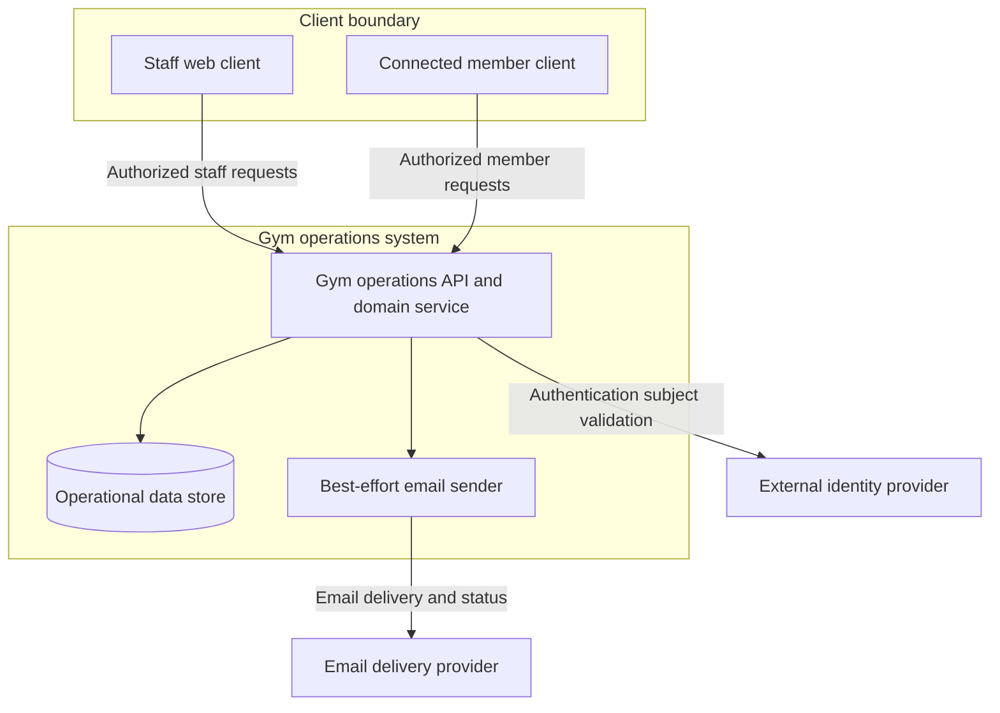
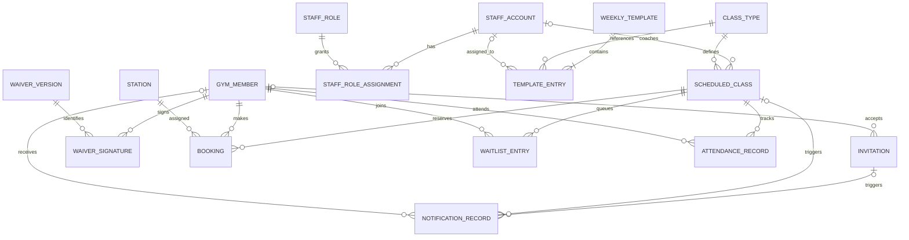
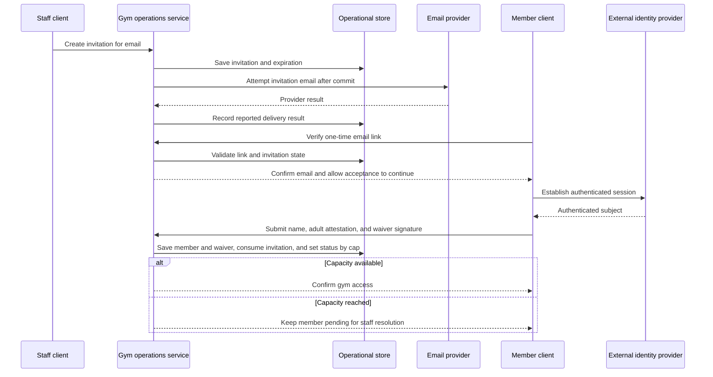
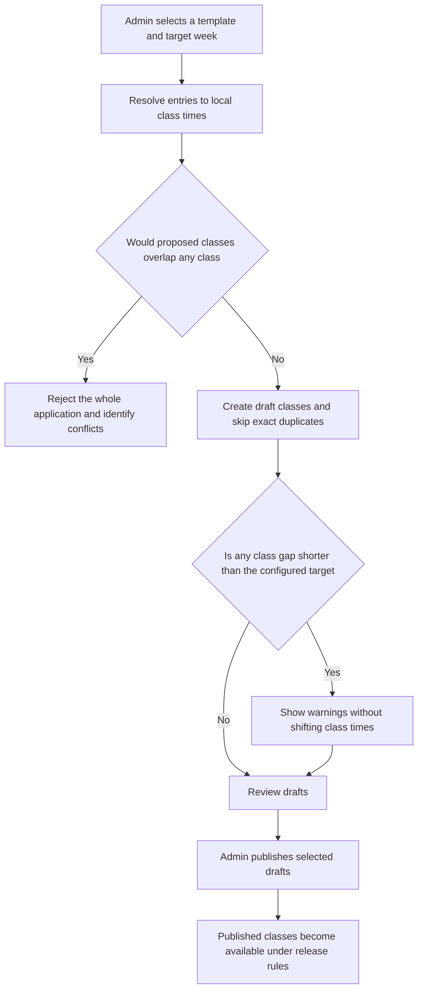
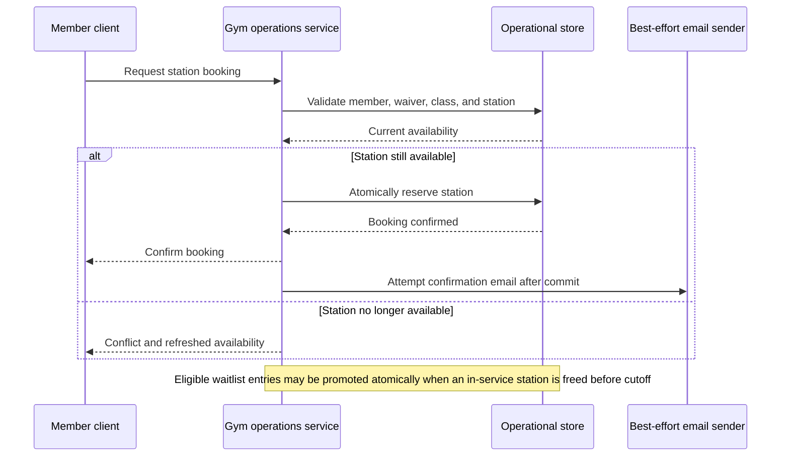
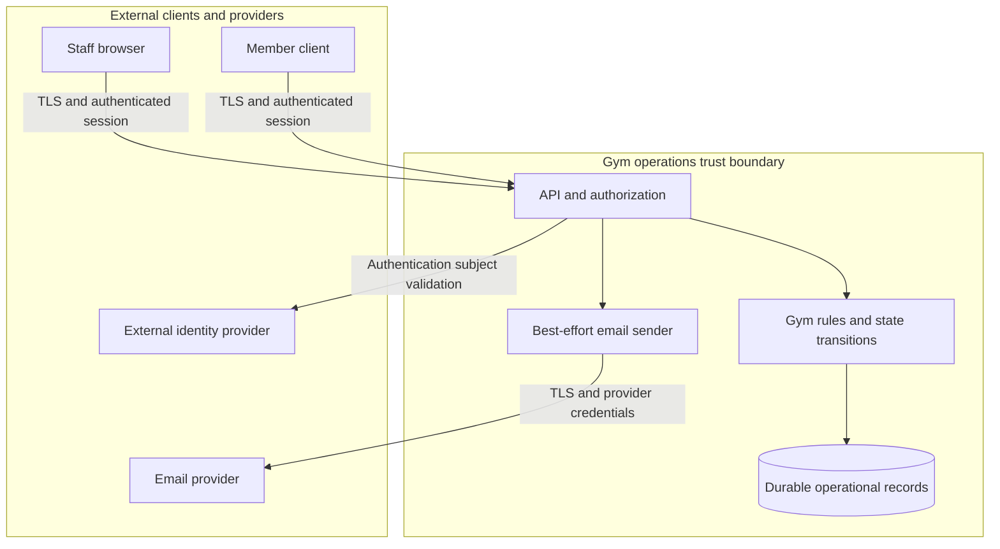
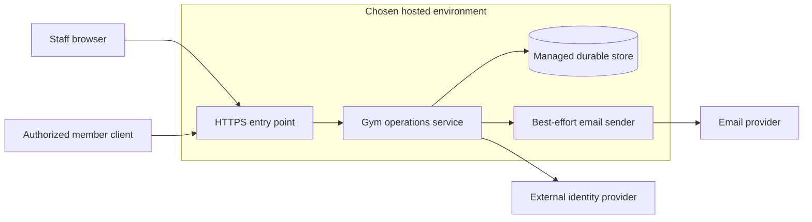

# Fitness Junkie Gym Operations — High-Level Design

## 1. Overview

Fitness Junkie Gym Operations is the system of record for a single-location, free, invite-only rowing-class trial. It manages staff access and roles, gym-owned member profiles, invitations, adult eligibility attestations, versioned waivers, RowErg stations, class definitions and schedules, bookings, waitlists, attendance, and email delivery status. Member-facing screens and workflows are supplied by separate clients and requirements; this system exposes the authorized capabilities those clients need.

The design defines a portable logical architecture rather than binding the product to a particular programming language, cloud, database engine, or deployment platform. It favors one modular gym-operations service and durable transactional storage, with concrete choices reserved for the relevant low-level designs. The member record has a stable internal identifier and is designed to accommodate future profile extensions, but V1 does not store workout metrics. Authentication is an external capability; Gym Operations does not assume a shared member-account service or own passwords. A GitHub Pages proof of concept is a simulated, non-authoritative UI demonstration, not a live gym system.

## 2. Architecture Summary

The staff web client provides role-appropriate operations on desktop and tablet. Connected member-facing clients are separate products: the gym system supplies API capabilities and enforces eligibility and business rules, but does not specify their screens. Gym Operations owns the stable member record and the display name, verified invitation/authentication email, any staff-maintained contact email, adult-attestation evidence, and gym status needed for the trial. The authentication provider and any future link to a mobile or metrics app are separate, undecided integrations.

The API and domain service own gym rules and mediate all changes to operational records. A durable store is required for schedules, reservations, queue order, member profiles, waiver evidence, attendance, and notification outcomes. Email is a best-effort side effect after an operation commits; a provider failure does not undo a confirmed business operation.

## 3. Core Components

### 3.1 Staff web client

Provides the staff interface for Admin, Front Desk, and Coach roles. It presents schedule and roster views, member and invitation management, station-layout visualization, and authorized attendance and reseating actions. The client is not an authority for access control or current booking state; server-confirmed results determine whether operations succeeded.

### 3.2 Gym operations API and domain service

Owns the gym-specific system of record and all business rules. Its logical responsibilities are:

| Capability area | Responsibility |
|-----------------|----------------|
| Access and membership | Invitation lifecycle, gym-owned member profile creation, member status, eligibility checks, configured cap, and staff role enforcement |
| Waivers | Published waiver versions and member signature evidence |
| Stations and class definitions | Station labels, PM5 association, service state and layout; reusable class types. Capacity equals in-service stations; zero-capacity classes cannot be published, and affected existing bookings are flagged rather than moved or cancelled |
| Scheduling | Weekly templates, scheduled-class lifecycle, duplicate handling, overlap rejection, and short-gap warnings |
| Booking and waitlists | Station exclusivity, queue order, eligibility, cancellation outcomes, and promotion cutoff |
| Attendance | Check-in windows, staff correction history, no-show and late-cancel outcomes, and outage reconciliation |
| Coach profiles | Member-visible profile information and staff-only contact details |
| Notifications | Post-commit email attempts, reported delivery status, surfaced failures, and staff-initiated resend |

The service is the enforcement point for authorization, eligibility, atomic booking changes, and class state. A client must not receive a success response for a booking, move, swap, or other state change until the service confirms that change.

### 3.3 Operational data store

Provides durable storage for the gym-owned records described in Section 4. A transactional relational store is the preferred logical fit because class bookings, station assignments, active-member caps, and waitlist promotion require coordinated state changes and uniqueness guarantees. The database product and hosting choice are intentionally left for the corresponding low-level designs.

### 3.4 Best-effort email sender and provider

The email sender attempts delivery after invitations or operational changes have been committed. It records provider-reported success or failure for staff visibility and supports manual resend. Automatic retry and guarantees against losing a notification if the process fails between commit and send are not required by this HLD; the hosted LLD may select stronger delivery guarantees.

### 3.5 External authentication provider

An external provider authenticates members and staff for live deployments. Gym Operations owns the member and staff authorization records and maps authenticated subjects to those records; it does not store passwords. The provider, sign-in arrangement, token/session integration, and any cross-app account-linking contract remain open until selected in an LLD. A future link to a mobile or metrics app must not be assumed to be available in V1. The one-time invitation link verifies control of the invited email address but does not provide ongoing authentication.

### 3.6 Connected member-facing clients

Separate applications use the gym service for invitation acceptance, waiver signing, class discovery, booking, waitlists, and self-check-in. Their screens and personal rowing-log behavior are outside this design. A stable Gym Operations member identifier provides a future extension point for metrics or cross-app linking, but V1 does not collect, calculate, import, display, or associate workout data with a class or station.

## 4. Data Models

### 4.1 Entity Relationships

### 4.2 Key Entities

| Entity | Purpose | Key conceptual attributes and relationships |
|--------|---------|----------------------------------------------|
| **Gym member** | Stable, gym-owned member identity and profile | Internal member ID, external authentication subject mapping, display name, verified invitation/authentication email, optional staff-maintained contact email, pending/active/inactive status, adult-attestation evidence and timestamp; at most one pending or active profile per verified email. Extensible for future profile and metric links without storing metrics in V1. Only active records count toward the cap. |
| **Invitation** | Tracks an invitation lifecycle and acceptance | Verified target email, status, expiration, issue and acceptance details; at most one active invitation per email. Link verification alone does not consume the invitation; it is consumed when acceptance is durably saved with the gym-member record and waiver evidence. |
| **Waiver version** | Published legal text presented for signature | Version identifier, text, publication state and time |
| **Waiver signature** | Evidence of a member signing a particular waiver | Typed name, timestamp, signed version; preserved when later versions are published |
| **Staff account and role assignment** | Gym-owned staff access and fixed-role authorization | Stable staff record mapped to an external authentication subject, active state, one or more Admin, Front Desk, or Coach roles; Coach access is scoped to assigned classes. Credentials are not stored by Gym Operations. |
| **Station** | A RowErg position and the unit of class capacity | Friendly label, current PM5 serial association, in-service state, row-and-column layout position |
| **Class type** | Reusable description of a class | Name, duration, description, difficulty, optional alias and what-to-bring note |
| **Weekly template and entry** | Reusable weekly scheduling pattern | Entries hold weekday, local wall-clock time, class type, and optional coach |
| **Scheduled class** | A particular occurrence of a class type | Start and end, lifecycle state, optional coach, and the class details retained for that scheduled occurrence |
| **Booking** | A member's reservation of one station in one class | Member, class, station, booking state, and relevant cancellation or staff-removal outcome |
| **Waitlist entry** | A member's position in a class queue | Class, member, FIFO position or join order, and lifecycle state; history is retained when entries leave the active queue |
| **Attendance record** | Class-specific attendance outcome and correction history | Member, class, check-in state and time, outcome, and staff corrections; supports manual outage reconciliation without implicitly changing a booking |
| **Notification record** | Outcome of a best-effort email attempt | Event type, recipient, exactly one triggering invitation or operational change (such as a scheduled class), provider-reported result, and failure status; supports staff review and manual resend. Durable queuing, automatic retry, and crash-gap guarantees are left to the LLD. |
| **System settings** | Admin-managed trial and schedule policy | Member cap, invitation expiration, schedule release, inter-class target gap (30-minute default), waitlist and late-cancel cutoffs, and self-check-in window (30 minutes before to 5 minutes after by default) |

### 4.3 Data Lifecycle

Draft classes may be edited or deleted. Published classes remain explicit records and may be edited or cancelled by an Admin; cancelled and completed classes remain in history. Template application creates drafts only, skips exact duplicates, and rejects the entire application if it would create an actual class-time overlap. Shorter-than-target gaps are warnings, not blockers, and template local times remain stable across daylight-saving changes.

An invitation is accepted through a one-time, expiring email link that verifies control of the invited address; it is not an ongoing login session. Verifying the link does not by itself consume the invitation. After authentication, acceptance captures a display name, adult attestation and timestamp, and signature for the current waiver. The service then durably saves the acceptance evidence and gym-owned member record and consumes the invitation as one recoverable logical transition. If this save fails or the flow is interrupted first, the invitee can resume while the invitation remains valid; the LLD defines the concrete retry and token-state handling.

If capacity is available and eligibility requirements are met, the member becomes active. If the active-member cap is full, acceptance is retained as a pending, inactive member for staff resolution; pending records do not count toward the cap and cannot book. Staff may activate the member once capacity and current-waiver requirements are satisfied. The verified invitation/authentication email is distinct from any staff-maintained contact email. Correcting contact details does not change the stable member ID or history; whether an identity email can be changed and how that change is verified or mapped to the authentication provider are LLD decisions. Member deactivation blocks member-facing actions and flags existing bookings and waitlist entries for staff review; it does not silently cancel or reassign them. Publishing a new waiver preserves existing bookings but blocks subsequent booking or check-in until the member signs the current version.

Bookings, waitlist entries, attendance outcomes, waiver signatures, and attendance corrections retain enough history to explain operational outcomes. The member profile remains extensible by stable internal ID, but no metrics payload or workout record is stored in V1. Retention, deletion, and anonymization policy remain open for owner/legal approval before production.

## 5. Data Flows

### 5.1 Invitation acceptance and waiver

An expired, revoked, or already consumed invitation is rejected. Link verification does not consume the invitation; the invitation remains resumable until authenticated acceptance details and the current waiver signature are durably saved with the member record. A failure before that commit leaves the invitation available for a safe retry while valid. The exact safeguards for forwarded links, retry, and matching external identity to the verified invitation address are set in the authentication LLD. The verified invitation/authentication email is distinct from any staff-maintained contact email; changing the identity email and any reverification requirement remain LLD decisions. The pending profile retains the verified invitation email, display name, adult-attestation timestamp, and current waiver signature; it cannot book or check in while pending. If the active-member cap is reached, staff resolve activation after capacity and current-waiver checks. Staff may correct or deny eligibility, and V1 does not collect identity documents. Email delivery is best effort after the invitation is saved; provider-reported failures are visible to staff for manual resend.

### 5.2 Template application and schedule publication

The service evaluates the full proposed set before applying it, preventing partial template application on an overlap. Published changes are explicit. A change to a published class's date, start time, or coach triggers email to booked members; a start-time change waives late-cancel status for cancellations prompted by that change. Cancellation notifies booked and waitlisted members and does not promote anyone.

### 5.3 Booking, station selection, and waitlist promotion

Booking requires an active gym member, accepted invitation, current waiver, published and released class, and a free in-service station. The trial imposes no per-member booking-count limit, and the default schedule-release policy has no advance-booking limit. If another request claims the station first, the service rejects the operation with current availability rather than returning a false success. When a qualifying station becomes free strictly before the waitlist cutoff, the service promotes the first eligible entry and attempts notification after the operation commits. Ineligible entries are skipped for that attempt but retained for staff resolution. At or after the cutoff, freed stations remain open to ordinary booking. Out-of-service stations do not trigger promotion.

Station moves and swaps are server-confirmed. A swap between occupied stations is atomic and requires staff confirmation; it does not trigger waitlist promotion. Staff moves do not automatically notify members.

### 5.4 Check-in, attendance, and service outage

Members may self-check-in only within the configured window (default: 30 minutes before through 5 minutes after class start); no location verification is required. Authorized staff may check in or reverse a check-in at any time, subject to role and class scope. At class end, a still-booked member who has not checked in is recorded as a no-show. Staff may correct outcomes later while preserving correction history.

The system makes a roster available for printing or download during normal operation. If service is unavailable, staff may use it to record attendance manually and reconcile the result after service returns. The roster excludes contact and waiver details. Manual attendance entry does not alter a booking unless staff explicitly corrects it. Offline booking is not supported.

### 5.5 Failure Paths

| Failure | Required behavior |
|---------|--------------------|
| Station claimed concurrently | Reject the losing request with a conflict and refreshed availability; do not report success |
| Email provider reports delivery failure | Preserve the confirmed operation, record the reported failure, and allow staff resend |
| Process fails between commit and email attempt | Delivery may be lost; exact guarantee and any stronger mechanism are left to the hosted LLD |
| Current class layout cannot be loaded | Show an explicit error or stale-state indication; disable map-based reseating until current state is available |
| Move or swap destination changed before confirmation | Reject without changing bookings and refresh class state |
| Gym service outage | Do not support offline booking; use the roster for manual attendance capture and reconcile later |
| Member becomes ineligible before waitlist promotion | Skip that entry for the promotion attempt, retain it for staff resolution, and continue to the next eligible entry |

## 6. Key Design Decisions

### 6.1 A modular service, not a collection of microservices

**Decision:** Keep gym operations behind one logical domain service and one API boundary, with capability areas separated by responsibility.

**Rationale:**
- The requirements describe one location and a bounded trial, not independent services with separate scaling or ownership needs.
- Booking, station capacity, waitlist promotion, eligibility, and attendance depend on consistent operational state.
- A single service is simpler to deploy and reason about while still allowing future extraction if justified.

**Alternatives considered:**

| Alternative | Why not selected |
|-------------|------------------|
| Microservices per domain area | Adds operational and distributed-transaction complexity without a stated scale or independent deployment need |
| Direct client access to the operational database | Bypasses consistent authorization and business-rule enforcement |

### 6.2 Gym-owned member identity with external authentication

**Decision:** Create the gym-owned member record only after the invitee verifies the invitation email and completes authenticated acceptance with the required profile and waiver evidence. Link verification alone does not consume the invitation. Keep a stable internal member ID and minimal profile data in Gym Operations; use an external provider for ongoing member and staff authentication, without storing passwords or assuming a shared app account.

**Rationale:**
- Booking, waiver, and attendance records need a stable gym-owned member identity even though cross-app account synchronization is undecided.
- Authentication and domain membership are separate concerns; the invitation link verifies email ownership but does not establish an ongoing session.
- A stable ID allows future profile or metrics extensions without collecting metrics or inventing a payload format in V1.

**Alternatives considered:**

| Alternative | Why not selected |
|-------------|------------------|
| Assume an existing shared account service | Its availability and synchronization contract with the mobile/metrics app are not established |
| Store passwords in Gym Operations | Avoids external auth integration but unnecessarily makes the operations system responsible for credentials |
| Store metrics in a generic profile payload now | Metrics requirements and format are not specified; V1 requires no workout data |

An accepted invitation creates a member profile with verified invitation/authentication email, display name, adult-attestation evidence, and current waiver signature. When the active-member cap is reached, the member remains pending and inactive for staff resolution and cannot book; pending records do not count toward the cap. A staff-maintained contact email is distinct from the verified identity email and may be corrected without changing the stable member ID. Identity-email changes, including reverification and mapping to the authentication provider, remain LLD decisions. The provider and future cross-app linking remain LLD decisions.

### 6.3 Durable transactional operations

**Decision:** Use a durable store with transactional semantics for reservations, promotion, membership-cap enforcement, and related state changes; prefer a relational model while leaving the actual database selection open.

**Rationale:**
- A station may be booked by at most one member per class.
- Booking races must return an explicit conflict rather than false success.
- Waitlist promotion and swaps require atomic state transitions.

**Alternatives considered:**

| Alternative | Why not selected |
|-------------|------------------|
| In-memory state or browser-only storage | Cannot reliably coordinate staff and member clients or survive service restarts |
| Eventually consistent writes for reservations | Could expose duplicate station assignments or incorrect queue promotion |

### 6.4 Email delivery is best effort after commit

**Decision:** Attempt email delivery after the related operation commits, record provider-reported results, expose reported failures to staff, and support manual resend. Automatic retries and delivery guarantees across process failure are not required by this HLD.

**Rationale:**
- A confirmed booking, cancellation, or promotion must not be reversed by an email outage.
- Staff need visibility when the provider reports failure and a way to resend.
- A more reliable asynchronous mechanism can be selected if justified by the hosted LLD.

**Alternatives considered:**

| Alternative | Why not selected |
|-------------|------------------|
| Send email before committing the operation | Email could announce an operation that later fails |
| Require a durable outbox and automatic retry in the HLD | Stronger delivery guarantees and added infrastructure are deferred to the hosted LLD |

### 6.5 Separate logical architecture from deployment-specific implementations

**Decision:** Specify service boundaries and required data guarantees here; reserve language, hosting, database product, and other concrete platform selections for the corresponding low-level designs.

**Rationale:**
- The GitHub Pages proof of concept is a simulated, non-authoritative UI; the later hosted-system LLD defines live service behavior.
- The requirements do not select a cloud, runtime, database engine, or infrastructure provider.

**Alternatives considered:**

| Alternative | Why not selected |
|-------------|------------------|
| Bind the HLD to a single cloud and language | Would constrain later LLD variants without requirements-based justification |
| Treat the GitHub Pages proof of concept as the operational system | Static hosting cannot enforce authentication, live shared state, durable booking, or atomic promotion |

## 7. Security Architecture

### 7.1 Authentication and Authorization

The gym service authorizes each operation on the server using fixed Admin, Front Desk, and Coach roles. A staff member may hold multiple roles. Coaches are limited to their own assigned classes for roster, attendance, and station operations; Front Desk may act across classes but cannot edit the schedule; Admin has the administrative permissions in the requirements.

Live deployments require an external authentication provider for members and staff; Gym Operations stores no passwords. It owns staff profiles, active status, and role assignments, mapped to external authentication subjects. Prefer a common provider for staff and members if practical, but provider selection and integration details remain open. A one-time invitation link verifies email ownership and is not an ongoing credential.

Gym Operations owns member profiles and stable member IDs. Member-facing operations require an authenticated subject mapped to an active gym-member record, an accepted invitation, and a current waiver signature wherever booking or check-in rules require it. Pending records created when the member cap is reached have no booking access and await staff resolution. The service, not the client, enforces age-attestation, member-cap, waiver, class-release, and station-availability rules. Staff-only contact details are not returned to members. The downloadable roster omits contact and waiver information.

### 7.2 Trust Boundaries

### 7.3 Data Protection

| Data category | At rest | In transit | Access control |
|---------------|---------|------------|----------------|
| Gym member profile and status | Protect using the selected managed store's encryption controls; exact provider deferred | TLS for client and service integrations | Authorized staff and the authenticated member associated with the record |
| Waiver text and signature evidence | Protect using selected store controls; preserve signed version and timestamp | TLS | Admin manages versions; staff can view signature status as permitted |
| Bookings, waitlists, attendance, and corrections | Protect using selected store controls and service authorization | TLS | Staff role and class scope; members access only their authorized operations |
| Staff profile and contact information | Protect using selected store controls | TLS | Contact details staff-only; public profile attributes limited to member-facing class review |
| Invitation and email delivery data | Protect using selected store controls and provider credential management | TLS | Authorized staff; delivery credentials restricted to the email sender |

TLS and managed at-rest encryption are baseline recommendations, not a selected provider configuration. Key management, backup encryption, data-region requirements, retention, account deletion, and audit retention require confirmation in the concrete deployment design. No payment-card data, workout metrics, or identity documents are in scope.

## 8. Deployment Model

### 8.1 Production

The production shape is intentionally platform-neutral:

The requirements do not determine a cloud provider, region, compute platform, scale target, or deployment strategy. A small single-region hosted deployment is a reasonable initial production baseline, with a durable operational store and external authentication. Email is attempted after commit, with provider-reported failures recorded for staff resend. Whether to add a durable queue, automatic retries, or protection against a crash between commit and send is left to the hosted LLD. Numeric availability and recovery targets are not assumed here. The service can initially run as one deployment unit; separate worker capacity is an implementation choice for an LLD.

### 8.2 Local Development and Proof of Concept

Local development should allow the staff client and gym service to be exercised against an isolated development data store, with identity and email dependencies replaced by safe test integrations where practical. The exact local tooling is deferred to the stack-specific LLD.

The GitHub Pages proof of concept serves a static interface with simulated or local demonstration data. It is explicitly non-authoritative: it does not authenticate live users, persist shared bookings, send operational notifications, or enforce server-side gym rules. It must not be used to run classes. The later hosted LLD defines the production service and durable store without changing the logical domain boundaries.

### 8.3 Infrastructure Requirements

| Resource | Purpose | Selection status |
|----------|---------|------------------|
| Browser-hosted staff client | Admin, Front Desk, and Coach operations | Hosting platform deferred |
| Gym operations API/domain service | Enforce rules and provide client integration | Runtime and compute platform deferred |
| Durable transactional data store | Persist operational records and coordinate state changes | Database engine and provider deferred |
| Email sender | Attempt post-commit emails, record provider results, and support staff resend | May share the service deployment initially; no durable queue or automatic retry required by this HLD |
| Email delivery provider | Send required member emails | Provider deferred |
| External identity provider | Authenticate members and staff | Provider and protocol to confirm; gym role/member records remain gym-owned |
| Monitoring and alerting | Surface service health, data-operation failures, and delivery failures | Stack deferred |

No cache, message broker, service mesh, or multi-region deployment is required by the current requirements.

## 9. Technology Choices

| Category | Choice | Rationale and status |
|----------|--------|----------------------|
| Application language and framework | Deferred to the corresponding LLD | No language or framework constraint is present; different LLD targets may choose independently |
| Staff client | Browser-based application; framework deferred | Required staff interface works on desktop and tablet |
| Member client | Separate authorized client integration | Member screens and workflows are specified separately |
| Compute platform | Deferred | Must support an API and durable state-changing operations; GitHub Pages alone is insufficient for live operations |
| Primary data model | Transactional relational model recommended; database product deferred | Fits uniqueness, atomic booking, waitlist promotion, and correction-history needs |
| Cache | None required by v1 | No caching requirement is stated; current availability must be confirmed by the service |
| Background processing | Best-effort email attempt after commit; provider-reported failures recorded for manual resend | Durable queues, automatic retry, and crash-gap guarantees are optional hosted-LLD decisions |
| API style | Authenticated request/response API over HTTPS recommended; protocol details deferred | Serves separate clients while keeping authorization and state changes in the service |
| Identity | External authentication provider; gym-owned member and staff authorization records | No password store or shared-app account assumption; provider, protocol, and cross-app linking deferred |
| Email | External provider integration; provider deferred | Requirements specify email and staff-visible delivery failures |
| Encryption | TLS in transit and managed encryption at rest recommended | Baseline protection for identity, waiver, and attendance records; deployment details deferred |
| Observability | Structured operational logging, health monitoring, and delivery-failure visibility required; provider deferred | Supports service operations and required notification failure handling |
| CI/CD | Deferred to LLD and hosting choice | No repository or hosting pipeline requirement is specified |

## 10. What This Design Defers

- Member mobile-app screens and workflows, including account sign-up/sign-in UX, class discovery, booking, waitlist, self-check-in, in-app notices, and member history.
- Workout capture, personal rowing logs, workout metrics, performance groupings, and workout attribution to a class or station. The stable member ID is an extension point only; no metrics are collected or stored in V1.
- Room hub, live station-level displays, and dedicated coach console.
- A specific programming language, framework, API implementation, database engine, cloud provider, hosting environment, and CI/CD platform.
- A particular identity provider, staff authentication arrangement, authentication integration protocol, and cross-app account-linking workflow.
- Membership fees, pricing, billing, payments, coach pay, and no-show charges.
- Automatic penalties for late cancellations or no-shows.
- Gamification, achievements, levels, SMS, push notifications, location-based check-in, and per-member booking-count limits.
- Live authentication and authoritative gym operations in the GitHub Pages proof of concept; it is a simulated, non-authoritative UI only.
- Offline booking. Attendance can be captured manually during an outage using a roster and reconciled after service recovery.
- Data retention, account-deletion, and anonymization policy; these need owner/legal direction.
- Strong email-delivery guarantees across service failure, including durable outbox, automatic retries, or crash-gap protection; the hosted LLD may choose to add them.
- Numeric availability, recovery-time, and recovery-point targets; the hosted LLD and service owners must determine them.
- Legal wording of the waiver and launch values for the member cap, invitation expiration, waitlist cutoff, and late-cancel cutoff.

## 11. Open Questions

1. **External authentication and invitation security:** Which provider will authenticate members and staff, how will authenticated subjects map to Gym Operations records, and how will redemption bind a subject to the verified invitee while handling forwarded links and interrupted acceptance?
2. **Cross-app linking:** If a mobile or metrics app is introduced or integrated later, how will its account link to the stable Gym Operations member ID without creating duplicate member identities?
3. **Production hosting and operations:** Which hosting provider, region, runtime, availability and recovery targets, backup policy, and operational ownership should the production LLD assume?
4. **Data lifecycle:** What retention, account-deletion, and anonymization rules should apply to member profiles, invitations, waiver signatures, bookings, attendance, and history?
5. **Trial launch configuration:** What values should be set for the active-member cap, invitation expiration, waitlist cutoff, and late-cancel cutoff before launch?
6. **Waiver publication:** Who supplies and approves the initial waiver wording, and what version-publication process is required?
7. **Email reliability:** Is best-effort post-commit delivery with manual resend sufficient for production, or should the hosted LLD add durable queuing, retry, and crash-gap protection?
8. **Audit scope:** Beyond required attendance correction history, which consequential staff changes or data access need an audit trail?
9. **Verified email changes:** What rules should apply to staff-maintained contact-email edits, and how should identity-email changes be verified and mapped to the external authentication subject?

---

*This is a high-level architecture document. Code structure, class design, and implementation details belong in the low-level design documents.*
