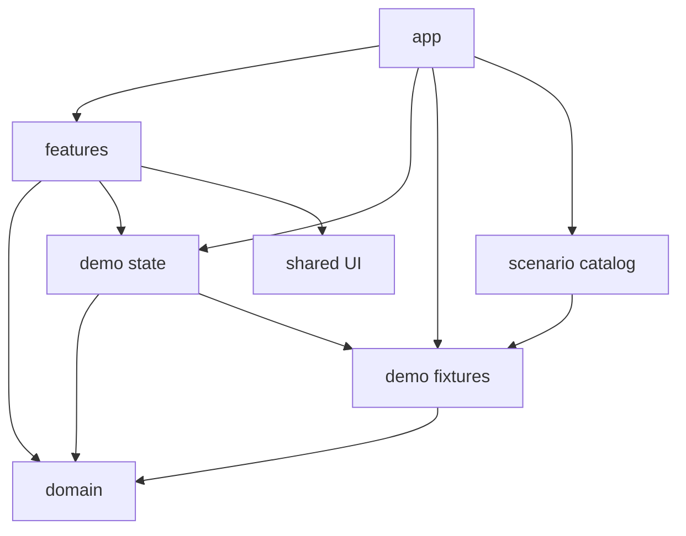
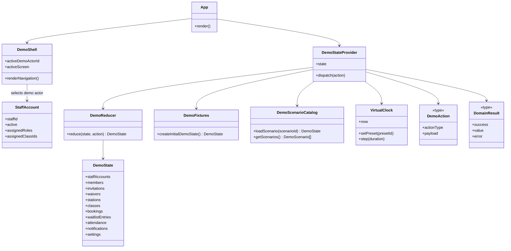
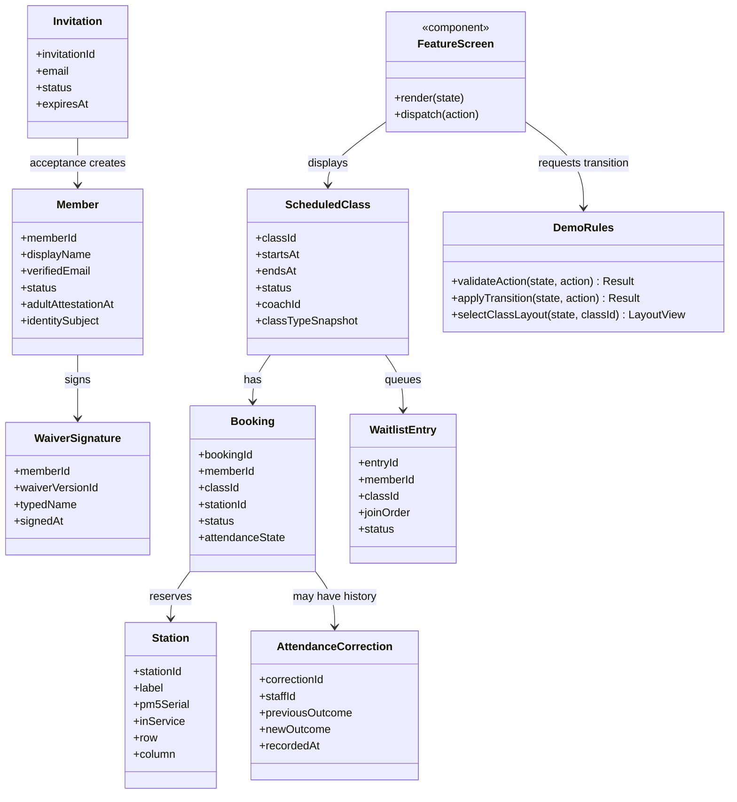
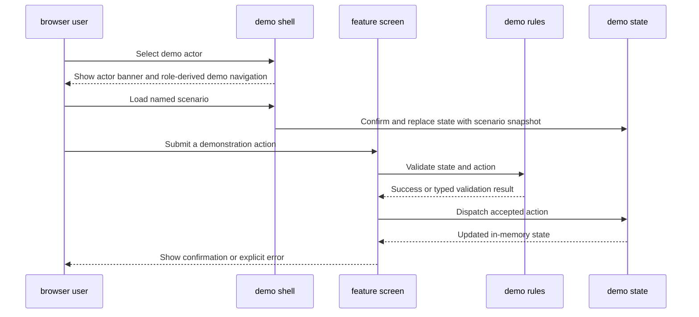
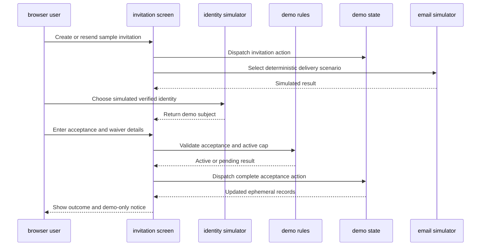
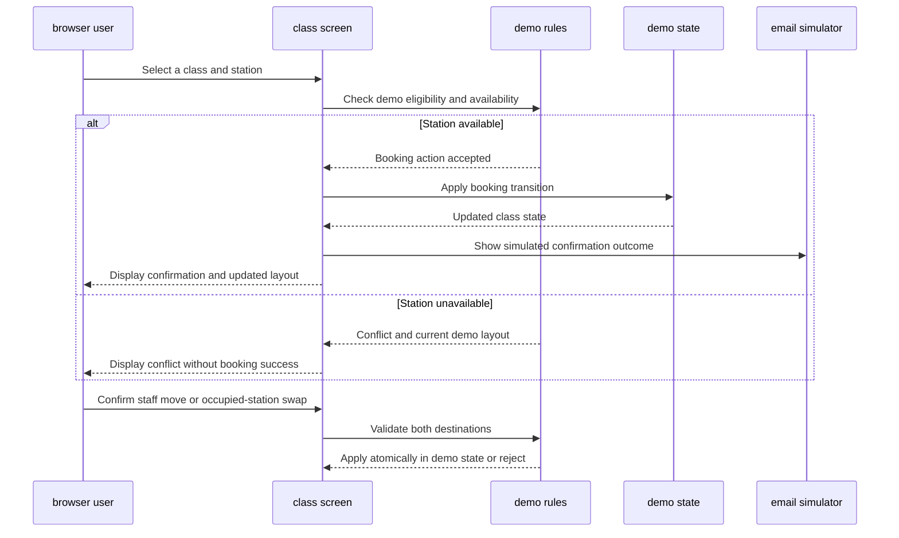
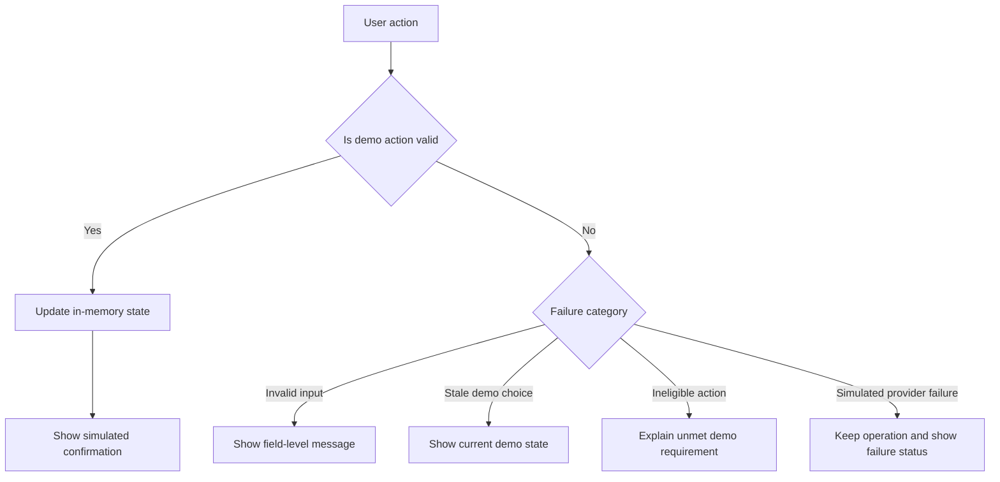
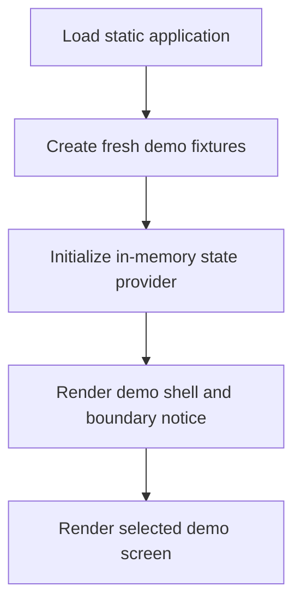

# Fitness Junkie Gym Operations — Low-Level Design

## 1. Overview

This document specifies a proposed Vite, React, and TypeScript implementation for the GitHub Pages proof of concept only. The repository currently contains design documents rather than PoC source code; this is a target design, not a description of an existing implementation.

The prototype is a static, simulated interface using fictional seeded data and in-memory state. It provides interactive Admin, Front Desk, Coach, and Member demonstrations, with persistent role-aware navigation and named scenarios for important edge cases. It does not authenticate real users, call a live Gym Operations API, persist authoritative records, send email, or operate a class. Every screen and simulated result must make this boundary clear. Refreshing the page resets the demo to its seed state.

Production service, database, identity, authorization, concurrency, and delivery behavior remain the responsibility of the hosted system described by the [High-Level Design](gym-operations-high-level-design.md). This LLD does not make the browser a production enforcement point.

**Confirmed implementation direction:** React Context with `useReducer`, pure domain transitions, CSS Modules with a small shared design system, hash-based routes, npm, Vitest with React Testing Library, and Playwright. Role restrictions are shown in the UI as a demonstration only. Use `America/Los_Angeles` for demo class wall-clock semantics, display, and DST fixtures; use UTC for internal instants and comparisons. This user-confirmed illustrative demo zone supersedes the earlier placeholder and New York test-zone proposal; it is not approved gym policy. The actual operational gym timezone remains to be confirmed.

**Prerequisites:**
- [Requirements Document](gym-operations-requirements.md)
- [High-Level Design](gym-operations-high-level-design.md)

## 2. Package/Module Structure

### 2.1 Package Dependency Graph

Dependencies point inward toward shared domain types and the demo state. Domain rules must not import React, UI features, browser storage, or production service clients. No production API or database adapter is part of this PoC.

### 2.2 Package Details

| Package | Purpose | Public exports | Internal dependencies |
|---------|---------|----------------|-----------------------|
| `src/app` | Demo overview, persistent role-aware navigation, hash route selection, boundary notice, and composition root | `App`, `DemoShell`, route definitions | `features`, `demo-state`, `demo-fixtures`, `demo-scenarios`, `shared` |
| `src/domain` | TypeScript domain vocabulary, discriminated unions, selectors, and pure prototype rules | Member, Invitation, Class, Booking, WaitlistEntry, Station, Waiver, Attendance, Notification types; pure validation and transition functions | None |
| `src/demo-fixtures` | Fictional, deterministic records for staff, members, stations, classes, templates, waivers, and email outcomes | `createInitialDemoState`, fixture identifiers | `domain` |
| `src/demo-scenarios` | Named resettable scenarios for baseline, capacity/waitlist, invitation/member cap, schedule conflict, waiver/attendance, and unavailable service/layout states | `DemoScenario`, scenario catalog, scenario loader | `domain`, `demo-fixtures` |
| `src/demo-state` | React Context + `useReducer` in-memory state owner, typed actions, selectors, virtual clock, and reset | `DemoStateProvider`, `useDemoState`, typed actions, selectors, `resetDemo`, `loadScenario` | `domain`, `demo-fixtures`, `demo-scenarios` |
| `src/features` | User workflows grouped by capability: staff access, members/invitations, waivers, stations/layout, classes/schedule, bookings/waitlists, attendance, notifications, coach profiles | Feature screens and workflow components | `domain`, `demo-state`, `shared` |
| `src/shared` | Accessible, domain-neutral controls, tables, dialogs, status indicators, CSS Modules, and error presentation | Reusable UI components and formatting utilities | None |
| `src/test-support` | Builders, seeded scenario helpers, and custom render utilities used only by tests | Test fixtures and render helpers | `domain`, `demo-fixtures`, `demo-state` |
| `e2e` | Playwright browser workflow tests against the built static application | Workflow specs and browser setup | Built static app |

### 2.3 Application and Feature Modules

The first screen is a demo overview with an unmistakable non-operational notice, persona switcher, and links to named scenarios. A role-aware workspace provides persistent navigation and feature pages. The shell selects one demo actor at a time. A staff actor is a selected fictional staff account with one or more assigned roles; the UI derives the visible actions from that account's assigned roles, while the persona switcher never combines independently selected personas. Member interactions begin by selecting a fictional member or outstanding invitation, never by entering credentials. Persona selection and role-derived UI visibility are demonstration conveniences only and must not be presented as authentication or authorization. Member screens demonstrate service-facing interactions from the requirements; they are not a member application implementation.

Feature modules own presentation and user interaction, not persistent data. A feature dispatches a typed demo action, observes the resulting state, and renders a clear confirmation, validation message, or simulated failure. Implement all functional requirements that can be meaningfully represented in a browser, while explicitly identifying external-service behaviors and production guarantees that remain simulated or out of scope. Unavailable role actions are hidden or disabled and accompanied by a clear explanation; this is not authorization.

The shared shell provides a frozen virtual clock with named presets and step controls, scenario selection, and scenario reset. Loading a named scenario replaces demo state and sets its fixed clock and demo actor; if current edits would be discarded, require confirmation. Reset restores initial fixture state and default clock, actor, and scenario, with confirmation. All fixture names, emails, images, and waiver content are fictional.

Seed presentation uses realistic invented full names, natural class descriptions and station labels, and reserved `.invalid` addresses without repetitive Fictional/Demo prefixes. IDs, relationships, clocks, eligibility, and deterministic scenarios remain stable. One compact persistent "Demo · resets on refresh" boundary survives route changes and recovery; focused notices identify simulated identity/email outcomes and non-legal waivers.

Demo controls are initially collapsed at all viewport sizes, with a synchronized persona/clock summary. Mobile navigation uses one role-filtered disclosure list; desktop retains a sidebar. Route selection closes the mobile list and focuses the destination heading. Shared CSS tokens and CSS Modules provide compact spacing, visible focus and 44px touch targets without an external UI framework.

The station schematic retains physical coordinates and local horizontal scrolling. Compact tiles show labels and states; a separate selected-station panel projects coordinates and staff-only names/review flags. View mode only inspects. Active Admins explicitly enter Edit layout to reveal existing metadata, creation, orientation and keyboard/touch placement controls. Finish editing clears an uncommitted pick, not submitted changes. Full replacement or actor/capability changes invalidate editing, selection and drafts; ordinary failures retain useful inputs. Embedded booking layouts remain read-only. Station/row/column removal and dense-table redesign remain outside this refresh.

### 2.4 Domain and Demo State

`domain` defines the shapes needed to demonstrate the requirements. Entities use stable string IDs, explicit lifecycle/status unions, and typed dates/times. Class times and recurring template entries use `America/Los_Angeles` and local wall-clock semantics, so template times remain stable across daylight-saving changes; UTC instants are used for comparisons. The demo timezone is labeled illustrative, not approved gym policy. DST test scenarios use the same illustrative zone and fixed UTC instants, labeled as test fixtures rather than operational configuration.

`demo-state` owns one immutable in-memory state tree initialized from fixtures. React Context and `useReducer` apply validated pure transitions and expose selectors to features. It may demonstrate atomic-looking transitions (such as swaps or waitlist promotion) within one reducer action, but this is not a guarantee of transactionality or concurrency safety. There is no browser localStorage, IndexedDB, service worker cache, or remote persistence.

## 3. Class Diagrams

### 3.1 Application and State Classes

### 3.2 Feature and Domain Classes

### 3.3 Key Type Definitions and Invariants

| Type | Required shape and prototype invariant |
|------|-----------------------------------------|
| `MemberStatus` | `pending`, `active`, or `inactive`; only active demo members may take booking/check-in actions. |
| `StaffRole` | `admin`, `frontDesk`, or `coach`; a staff account may have multiple roles. Demo role selection changes the displayed context, not a security boundary. |
| `StaffAccount` | Stable staff ID, active/inactive status, assigned fixed-role set, coach profile, and assigned class IDs; effective demo capabilities are the union of assigned roles, with Coach operations scoped to assigned classes. |
| `ClassStatus` | `draft`, `published`, `cancelled`, or `completed`; only published and released demo classes are member-visible/bookable. |
| `ClassType` | Stable ID, name, allowed duration (30, 45, or 60 minutes), description, difficulty, and optional alias/what-to-bring note. |
| `ScheduledClass` | Stable ID, local schedule value and resolved UTC start/end instants, lifecycle status, optional coach ID, and immutable class-type snapshot; later class-type edits do not rewrite the snapshot. |
| `WeeklyTemplate` | Stable ID and entries containing weekday, local wall-clock time, class-type ID, and optional coach ID; applying it to a target week creates drafts only and preserves local times through DST. |
| `BookingStatus` | Explicit booked/cancelled/staff-removed lifecycle; late-cancel and no-show are attendance outcomes, not generic deletion. |
| `StationState` | Derived per selected class from service state and booking/check-in state; always includes a non-color text or icon indicator. |
| `AttendanceRecord` | Class/member IDs, current outcome and check-in state/time, plus ordered correction entries; a staff correction changes the current outcome without deleting earlier correction history. |
| `SystemSettings` | Illustrative member cap, invitation expiry, schedule release, inter-class gap, waitlist/late-cancel cutoffs, and check-in window; unresolved launch values are explicitly marked as demo fixtures. |
| `LayoutView` | Selected class ID, layout positions, station state, and role-filtered assigned member labels; unavailable class state is explicit and disables map-based reseating. |
| `NotificationRecord` | Simulated event, recipient, and deterministic provider-result scenario; labeled as simulated and never sent externally. |
| `DemoState` | Complete ephemeral application state; initialized from fixtures on load, updated in memory, and discarded on refresh. |
| `DemoScenario` | Stable scenario ID, display name, complete fixture snapshot, default actor, frozen clock instant, and timezone metadata; loading replaces the full current demo state. |
| `DomainResult<T>` | Either a typed success value or a user-displayable failure category such as validation, unavailable destination, ineligible member, or unsupported action. No exception is silently converted into success. |

The prototype may validate domain workflows to make the demonstration coherent. Such validation is client-side and bypassable; it must never be described as production authorization, durable evidence, or a race-safe booking guarantee.

## 4. Class Interactions

### 4.1 Selecting a Demo Actor and Performing a Staff Action

Role-based UI visibility demonstrates the permission matrix in FR-3.1.1 and FR-3.1.2; it is intentionally not a security control. A rejected action remains visible as an error and does not mutate state.

For staff demonstrations, the selected staff account determines the effective demo capabilities: they are the union of that account's assigned fixed roles. The UI presents one staff account at a time; it does not let a visitor toggle several roles onto an account. The permission matrix is: Admin receives all staff demo actions; Front Desk can manage members, invitations, bookings, waitlists, attendance, and reseating across classes and can view but not edit schedules; Coach can view the schedule and manage attendance, roster, and reseating only for assigned classes, and edit only their own bio/photo. Member-facing actions are available only in the Member persona. These are display rules for the PoC and do not enforce security.

### 4.2 Invitation Acceptance and Waiver Demonstration

The identity and email participants are local controls, not provider integrations. The acceptance flow demonstrates required fields, current-waiver status, cap outcomes, invitation status, and visible delivery results. It does not verify email ownership, establish a session, or create legally reliable evidence.

### 4.3 Booking, Waitlist, and Reseating Demonstration

Waitlist promotion, cutoff handling, and notification outcomes are simulated deterministic state transitions. Multiple browser tabs or users are not coordinated.

### 4.4 Error Propagation

## 5. Data Access Layer

### 5.1 State Interfaces

There is no database or remote repository in the GitHub Pages PoC. The `DemoStateProvider` is the only state access boundary. Feature components read through selectors and submit typed actions; they must not mutate fixture objects or maintain competing copies of domain records. Before dispatch, a feature passes the current state, action, selected demo actor, and virtual time to a pure validation/transition function. That function returns `DomainResult<AcceptedAction>`; failures are rendered by the feature as field-level or alert feedback and are not stored in the domain state. Only accepted actions are passed to the reducer. Reducer dispatch remains `void` and applies deterministic state changes only; reducers do not emit notices, perform side effects, or silently convert invalid requests into success.

| Interface | Contract |
|-----------|----------|
| `createInitialDemoState(): DemoState` | Returns a fresh state graph derived from deterministic fixtures; callers must not share mutable fixture instances. |
| `selectClasses(state, filters): ScheduledClass[]` | Returns matching demo classes in chronological order; excludes unpublished classes from member views. |
| `selectClassLayout(state, classId): LayoutView` | Returns station labels, layout positions, service state, booking state, and role-appropriate member names; identifies missing/stale demo class state explicitly. |
| `validateAction(state, actor, action, now): DomainResult<AcceptedAction>` | Purely validates an attempted transition against current demo state, actor permissions, and virtual time. On failure, returns a typed error for the feature to display and makes no state change. |
| `dispatch(acceptedAction): void` | Applies a validated action through the pure reducer. Dispatch does not return a result; domain validation errors are handled before dispatch and rendered by the feature. |
| `resetDemo(): void` | Replaces current state with a fresh fixture state and displays a confirmation that only local demo state was reset. |

### 5.2 Query and Transition Patterns

| Operation | Pattern | Transaction | Notes |
|-----------|---------|-------------|-------|
| Read schedules, rosters, member lists, settings | Pure selectors over current in-memory state | No | Recomputed from the current demo snapshot. |
| Book or cancel a station reservation | Validate eligibility and availability against current state; dispatch accepted action to update related booking/layout state in one reducer transition | No production transaction | Demonstrates intended outcome only; no cross-user coordination. |
| Promote waitlist member | Select first currently eligible fixture entry, then update entry and booking state together | No production transaction | Skips ineligible entries in the demonstration and retains them for review. |
| Move or swap stations | Validate all destinations before one reducer action | No production transaction | A failed action leaves both bookings unchanged in this browser state. |
| Template application | Expand and validate complete proposal before dispatch | No production transaction | Rejects the whole simulated application on overlap; duplicate and short-gap cases are surfaced. |
| Email or identity interaction | Deterministic local scenario selection | None | Never makes a network request to identity or email providers. |

### 5.3 State Lifecycle and Migration

Initial fixtures load with the static application. All edits are in memory and are reset by reload; there are no migrations, connection pools, retries, offline writes, or synchronization mechanisms. Named scenarios replace all demo state and set their associated virtual time and demo actor, with confirmation if unsaved demo edits would be discarded. The virtual clock is frozen at a named preset until explicitly stepped. Fixture versions should be updated with the TypeScript types and tests in the same change.

Advancing the virtual clock from instant `t0` to `t1`, where `t1` is later than `t0`, is one validated action; time cannot be stepped backward. To return to an earlier time, the user must load a scenario, which replaces the state. For each non-cancelled class whose end instant satisfies `t0 < endsAt <= t1`, the reducer marks the class completed and changes each still-booked, unchecked-in member's unresolved attendance outcome to no-show. The transition is idempotent: later clock advances do not add another outcome or overwrite an existing staff correction. At exactly `endsAt`, the class-end transition has occurred. A staff correction performed after the transition remains current and its correction history is preserved. Advancing time does not simulate email delivery or any background service beyond these explicit demo transitions.

## 6. Error Handling Strategy

### 6.1 Error Categories

| Error category | Produced when | UI response |
|----------------|---------------|-------------|
| `ValidationError` | Required demo input is missing or malformed | Preserve the form, mark the relevant fields, and explain how to correct them. |
| `IneligibleDemoAction` | Simulated role, member status, waiver, class, or timing rule disallows the action | Explain the unmet condition; do not dispatch a successful transition. |
| `DemoConflict` | Station or schedule selection is no longer valid in current in-memory state | Show refreshed demo state and require a new selection. |
| `DemoUnavailableState` | A requested fixture or current layout is absent | Show an explicit unavailable/stale-state message; disable map-based reseating. |
| `SimulatedDeliveryFailure` | User selected a failed email-provider scenario | Keep the underlying demo operation committed and mark notification failure for staff review/resend demonstration. |
| `UnsupportedPrototypeOperation` | Action would require live identity, shared persistence, real email, offline booking, or another production capability | Explain that the PoC does not perform the operation; never suggest it succeeded. |

### 6.2 Error Mapping and Recovery

Validation failures are shown inline; state conflicts and unavailable data use an accessible alert; simulated provider failures remain attached to the notification record and are visible in the notification screen. Unexpected UI errors use a React error boundary with a recovery/reset action and a message that no authoritative data was changed. Do not log real member data or collect real credentials. No retry loop is needed because no network integration exists.

## 7. Configuration & Wiring

### 7.1 Startup Sequence

### 7.2 Dependency Wiring

The composition root is `App`. It creates the demo state provider from `createInitialDemoState`, then renders the shell, navigation, and feature screens. Features receive state and typed dispatch through the provider hook; pure rules are imported directly from `domain`. There are no environment secrets, API base URL, identity SDK, email SDK, server process, or database credentials in the GitHub Pages build.

### 7.3 Configuration Parameters

| Parameter | Type | Demo default | Source |
|-----------|------|--------------|--------|
| Demo mode label | Constant string | `SIMULATED DEMO — NOT FOR OPERATIONS` | Application shell |
| Initial active-member cap | Positive integer | Fixture value selected to show both available and full-cap paths | Demo fixtures |
| Invitation expiration | Duration | Fixture setting; editable only in the Admin demo screen | Demo state |
| Inter-class target gap | Duration | 30 minutes | Demo fixtures |
| Waitlist cutoff | Duration before class | Fixture value, surfaced for editing in settings demo | Demo fixtures |
| Late-cancel cutoff | Duration before class | Fixture value, surfaced for editing in settings demo | Demo fixtures |
| Self-check-in window | Before/after start durations | 30 minutes before and 5 minutes after | Demo fixtures |
| Email outcome | Scenario enum | Success by default; deterministic failure selectable in UI | Local email simulator |
| Identity outcome | Scenario enum | Verified demo subject by default; rejection selectable in UI | Local identity simulator |
| Demo clock | Instant | Frozen named scenario preset | Demo state |
| Demo timezone | IANA timezone identifier | `America/Los_Angeles`, illustrative and not approved gym policy | Demo scenario settings |
| DST test scenario zone | IANA timezone identifier | `America/Los_Angeles` for illustrative tests only | Test scenario fixture |
| Routes | Hash route strings | Feature route per selected workspace screen | Application configuration |
| Static asset base path | Build-time string | GitHub Pages repository path | Vite configuration |

Launch values that remain undecided in the requirements must be labeled as illustrative fixture values, not represented as approved gym policy.

### 7.4 Build and Deployment

Use Vite to build static assets with React and TypeScript, npm with a committed `package-lock.json`, and hash-based routing so deep links work on GitHub Pages without server-side rewrites. CSS Modules and a small shared design system provide styling. GitHub Actions runs lint, TypeScript checks, Vitest/React Testing Library, the defined Playwright smoke suite, and the production build on pull requests. The blocking Playwright smoke suite covers app startup/reset, staff permission boundaries, invitation and waiver acceptance, whole-template overlap rejection, booking conflict and waitlist promotion, clock-driven class-end no-show, keyboard station-grid operation and compact responsive view/edit layouts. Main pushes and manual branch dispatches run the complete browser workflow suite before uploading checked `dist`. Only successful main pushes or dispatched branch refs publish; PRs, automatic non-main pushes, dispatched tags and unsuccessful checks do not. Checks retain read-only permissions; Pages/OIDC writes are scoped to deployment. One cross-branch concurrency group serializes publication without cancelling a running deploy; pending jobs may be replaced and ordering is not guaranteed. All branches replace one Pages site. The owner selects Actions as the Pages source, bootstraps the dispatch-capable workflow on the default branch and allows the selected branch in the `github-pages` environment. No local verification triggers deployment or changes remote settings. The build must contain no live identity/email credentials or production API endpoints.

## 8. Testing Strategy

Testing validates that the static prototype faithfully demonstrates selected requirements and never claims to perform unavailable live operations. Tests do not establish production security, data durability, transactional behavior, or real email/authentication compliance.

### 8.1 Unit and Component Tests

| Module | Test cases | Requirements |
|--------|------------|--------------|
| `demo-role` selectors and shell | One demo actor is active at a time; a multi-role staff account receives the union of its assigned capabilities; Admin, Front Desk, and Coach permission boundaries are table-tested; UI always identifies simulated mode | FR-3.1.1, FR-3.1.2 |
| Invitation/member rules | Invite create, resend, revoke, expiration, duplicate email, verified demo acceptance, required adult attestation, pending-at-cap, activation/deactivation, and retained identity/history behavior | FR-3.2.1, FR-3.2.2, FR-3.2.3 |
| Waiver selectors and transitions | Version publish preserves old signatures/bookings; current signature gates simulated booking/check-in; typed name and timestamp are represented | FR-3.3.1 |
| Station and layout rules | Capacity derived from in-service stations; zero-capacity class blocked from publish/booking; service changes flag bookings; occupied-cell drop swaps positions only; layout state and role-specific names render accessibly | FR-3.4.1, FR-3.4.2 |
| Class type rules | Required fields and allowed durations; future class type changes do not rewrite class snapshots | FR-3.4.3 |
| Template and schedule rules | Local weekday/time expansion, exact duplicate skip, whole-proposal overlap rejection, short-gap warning, draft-only creation, lifecycle transitions, notifications for relevant edits, release policy outcomes, and DST test fixtures using explicit zone/instants | FR-3.5.1, FR-3.5.2, FR-3.5.3 |
| Booking and waitlist rules | Eligibility, station exclusivity, stale station conflict, unlimited trial booking count, FIFO ordering, rejoin-to-tail, cutoff, skip ineligible entry, no promotion for out-of-service station/class cancellation/swap | FR-3.6.1, FR-3.6.2, FR-3.6.3 |
| Attendance and virtual clock | Self-check-in window boundaries, staff correction history, idempotent class-end no-show transition when advancing across or to the end instant, late-cancel distinction, staff-removal outcome, manual correction independent of booking | FR-3.7.1, FR-3.9.1 |
| Notification simulator | Post-operation event types, provider-reported outcomes, failed-send visibility, resend action, no state rollback, and no actual network request | FR-3.8.1 |
| Coach profile selectors | Coach self-edit is limited to own bio/photo in simulated UI; Admin fields and staff-only contact visibility; history derives from past classes | FR-3.10.1 |
| Demo state and error components | Fresh fixtures are isolated; reset/reload behavior is documented; typed validation failures render before dispatch; invalid or stale actions do not mutate state; error messages are accessible | FR-3.1.1, FR-3.2.1, FR-3.4.2, FR-3.6.1, FR-3.6.3, FR-3.9.1 |

### 8.2 Integration and Browser Workflow Tests

Each test uses the deterministic fixture state, runs against the static client bundle, and asserts visible outcomes plus in-memory state changes. External integrations are replaced by local scenario controls.

| Test | Requirement | Setup and exercise | Assertions |
|------|-------------|-------------------|------------|
| Staff role demo | FR-3.1.1, FR-3.1.2 | Select each fictional staff account, including a multi-role account; attempt each role/action boundary | Multi-role account receives the union of its assigned roles; Front Desk schedule remains read-only; Coach actions are restricted to assigned classes; inactive staff cannot act; one persona is active at a time and no real authentication is claimed. |
| Invitation and acceptance demo | FR-3.2.1, FR-3.2.2, FR-3.2.3 | Invite/resend/revoke, choose verified/rejected identity scenarios, accept with complete/incomplete fields, exercise cap-full and capacity-available fixtures | Duplicate active invite/profile paths are blocked in the demo; accepted invite yields active or pending state; pending cannot book/check in; email verification and subject mapping are labeled simulated; stable ID/history remains associated through profile correction. |
| Waiver version demo | FR-3.3.1 | Publish a new version and use members with old/current signatures | Existing booking remains; old signature is preserved; missing current signature blocks further booking and check-in; staff can inspect signature version. |
| Station layout demo | FR-3.4.1, FR-3.4.2 | Change station service state and grid position; operate grid by keyboard using arrow keys, Enter/Space, and Escape; load different classes and roles | Capacity and station states update; keyboard placement/swap changes only layout coordinates; Escape cancels selection; station identity, status, bookings, and capacity remain unchanged; state uses text/icon in addition to color; member view omits assigned names; unavailable class state disables reseating. |
| Class type demo | FR-3.4.3 | Edit duration and descriptive fields on a class type with existing and future classes | Invalid duration is rejected; future class uses changed details; existing snapshot remains unchanged. |
| Weekly template demo | FR-3.5.1 | Apply template with exact duplicate, overlap, short gap, alternating week, and daylight-saving boundary fixtures using `America/Los_Angeles` and fixed instants | Exact duplicate is skipped; any overlap rejects the full application; warning-only gap is shown; only drafts are created; template remains at the same local wall-clock time across the DST change while UTC instants reflect the changed offset; scenario zone is labeled illustrative. |
| Publish and lifecycle demo | FR-3.5.2, FR-3.5.3 | Publish batch, edit time/date/coach, cancel class, and vary release policy | Only published/released classes appear to member view; relevant changes and cancellation produce simulated notification records; start-time change marks late-cancel waiver; date-only/coach edit does not; class states remain in history. |
| Booking and waitlist demo | FR-3.6.1, FR-3.6.2 | Book free station, attempt a stale selection, fill capacity, queue members, cancel/remove/move, and cross cutoff | Confirmed demo booking appears once; conflict does not show success; FIFO eligible promotion and skip behavior are shown; out-of-service station, occupied swap, and class cancellation do not promote; cutoff stops promotion; rejoin is last. |
| Cancellation and reseating demo | FR-3.6.3 | Member cancel before/after start; staff removal; move and confirmed swap; change destination before confirmation | Outcomes remain distinct; late cancel is marked only per cutoff; move/swap preserve check-in and attendance history; invalid destination leaves both assignments unchanged; no member notification is emitted for staff reseating. |
| Attendance and virtual clock demo | FR-3.7.1 | Exercise before/within/after self-check-in window; advance frozen clock to and across class end; repeat an advance; perform staff correction after no-show | Boundary behavior matches configured window; at exact class end unresolved booked/unchecked members become no-shows once; repeated clock advancement is idempotent; staff correction remains current and history is preserved; post-end staff action does not reopen check-in. |
| Email scenario demo | FR-3.8.1 | Trigger invite, booking, promotion, cancellation, and class-change events with success/failure scenarios; resend | Each supported event records deterministic status after the simulated operation; failures remain visible; resend is available; no message is actually transmitted and operation state is not rolled back. |
| Outage roster demo | FR-3.9.1 | Download/print roster, simulate unavailable layout data, manually record attendance then reconcile | Roster contains member and station only; no contact/waiver data; stale layout disables map reseating; manual attendance does not alter booking unless explicitly corrected; UI disclaims offline booking. |
| Coach profile demo | FR-3.10.1 | Edit coach bio/photo as Coach and Admin; inspect class view and staff profile | Coach edits only own demo profile; Admin can edit admin-owned details; member class view omits contact details and shows public profile/history. |

### 8.3 Requirements Traceability Matrix

| Requirement | Unit/component tests | Integration/browser tests | Prototype boundary |
|-------------|----------------------|---------------------------|--------------------|
| FR-3.1.1 | Role-derived capability selector and permission matrix | Staff role demo | One active demo actor; UI simulation only, no server authorization. |
| FR-3.1.2 | Multi-role account and inactive-staff presentation | Staff role demo | No external provider, credentials, or real staff account. |
| FR-3.2.1 | Invitation lifecycle and acceptance validation | Invitation and acceptance demo | Link verification and authentication are simulated. |
| FR-3.2.2 | Cap, status, and deactivation transitions | Invitation and acceptance demo | Cap is illustrative fixture state. |
| FR-3.2.3 | Stable ID and profile correction selectors | Invitation and acceptance demo | No real provider-subject association or app linking. |
| FR-3.3.1 | Waiver version and current-signature rules | Waiver version demo | No legally authoritative signatures. |
| FR-3.4.1 | Capacity and service-state rules | Station layout demo | No physical equipment or PM5 integration. |
| FR-3.4.2 | Layout placement, privacy, and keyboard interactions | Station layout demo | Static schematic only; not a live room view. |
| FR-3.4.3 | Class type validation and snapshots | Class type demo | Presentation and local state only. |
| FR-3.5.1 | Template expansion, duplicate, overlap, gap, and DST rules | Weekly template demo | Uses illustrative test timezone; no durable schedule. |
| FR-3.5.2 | Class lifecycle and notification-event rules | Publish and lifecycle demo | No operational email. |
| FR-3.5.3 | Release-policy selector | Publish and lifecycle demo | Release policy is simulated in browser. |
| FR-3.6.1 | Booking eligibility and station conflict rules | Booking and waitlist demo | No multi-user coordination or authoritative reservation. |
| FR-3.6.2 | FIFO promotion and cutoff rules | Booking and waitlist demo | No concurrent waitlist processing. |
| FR-3.6.3 | Cancellation/reseat outcome rules | Cancellation and reseating demo | Atomicity is demonstrated in one local state update only. |
| FR-3.7.1 | Check-in windows, class-end no-show clock transition, and correction history | Attendance and virtual clock demo | No automatic production scheduler or durable attendance. |
| FR-3.8.1 | Event selection and failure outcome rules | Email scenario demo | Email is never sent. |
| FR-3.9.1 | Roster privacy and manual-correction rules | Outage roster demo | No offline booking or offline state synchronization. |
| FR-3.10.1 | Profile ownership and visibility selectors | Coach profile demo | No real profile media upload or persistent account. |

### 8.4 Test Infrastructure

**Test tools:** Vitest and React Testing Library for domain, reducer, and component tests; Playwright for browser-level workflow tests against the built static application. The GitHub Actions pull-request gate runs lint, TypeScript checks, unit/component tests, core Playwright workflows, and the production build. Test every domain transition and important boundary; no global coverage percentage is set before implementation.

**Test doubles and fixtures:**

| Dependency | Double | Purpose |
|------------|--------|---------|
| Identity provider | Deterministic local identity simulator | Select verified, rejected, and mismatched demo-subject outcomes without credentials or network calls. |
| Email provider | Deterministic local email simulator | Select reported delivery success/failure and exercise staff visibility/resend without sending email. |
| Demo data | Fresh fixture factory and scenario builders | Produce predictable class, capacity, member, waiver, role, and timing conditions. |
| Browser clock | Fixed/controlled time in tests | Verify invitation expiry, release, late-cancel, waitlist, and check-in boundaries. |

No containers or test database are required. Browser tests must start from reset fixture state and must not depend on persistent browser storage. The PR-blocking Playwright smoke suite is the named set in Section 7.4; the complete browser workflow suite runs on main pushes and manual branch dispatches. Responsive checks measure document/local-map overflow, first-viewport headings and 44px targets at 320, 390, 768 and 1440px, exercise touch placement and role-filtered details, and capture view/edit screenshots. Automated axe checks run on representative collapsed/expanded controls, station modes and dialogs. WCAG 2.2 AA is an accessibility target, but automated scans alone do not establish conformance; the PoC must not claim conformance based only on axe results. The station grid supports arrow-key navigation, Enter/Space to select and place or swap, and Escape to cancel; the coach photo selector uses a bundled fictional avatar gallery. Performance testing is limited to static asset loading and responsive rendering for a single-location fixture dataset; it does not imply production capacity or availability.

## 9. Open Questions

1. **Demo fixture launch values:** What member cap, invitation expiration, waitlist cutoff, and late-cancel cutoff should the demonstration display? Until decided, fixture values must be labeled illustrative.
2. **Operational gym timezone:** What IANA timezone should the hosted gym system use? The POC uses the user-confirmed illustrative `America/Los_Angeles` zone for both demo schedules and DST tests, without approving it as operational gym policy. Schedule semantics remain local wall-clock values with UTC instants for comparisons.
3. **Visual and content assets:** Final branding, fictional coach avatars, and fictional waiver wording must be selected before the demo is shared. No real member data or real legal waiver should be placed in the public static demo.

---

*This LLD is scoped only to the non-authoritative GitHub Pages proof of concept. It is consistent with the [requirements](gym-operations-requirements.md) and [high-level design](gym-operations-high-level-design.md), but it does not specify the hosted production system. All interactions and test assertions describe local simulation, not live gym operations.*
