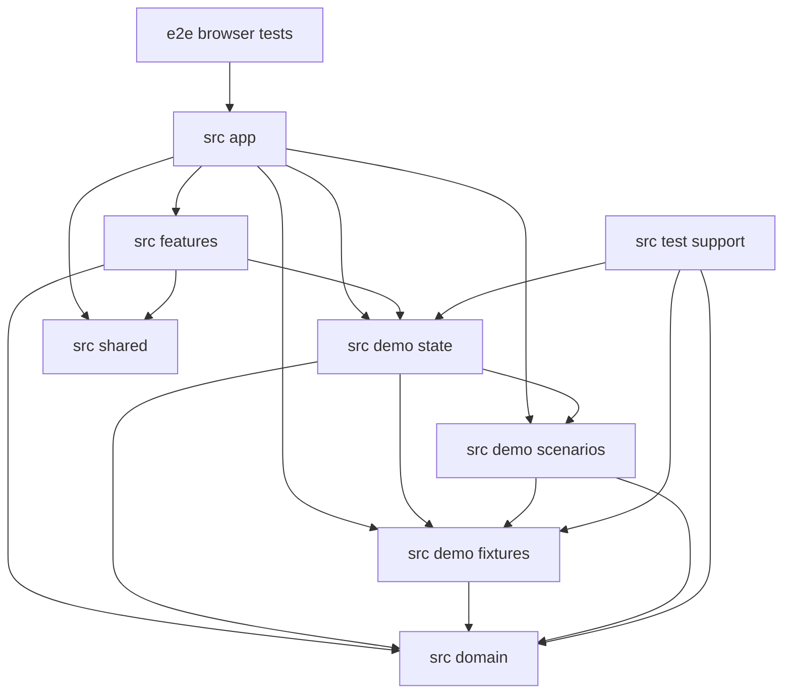

# Fitness Junkie Gym Operations POC — Implementation Plan

This plan turns the POC low-level design into implementable tasks. The target is a static, simulated Vite/React/TypeScript application; it is not the hosted operational system. The repository currently contains design documents rather than application source, so the first task establishes the application scaffold.

**Primary design:** `design\gym-operations-poc-low-level-design.md`\
**Requirements reference:** `design\gym-operations-requirements.md`\
**Architecture reference:** `design\gym-operations-high-level-design.md`\
**Total Tasks:** 34\
**Batches:** 9\
**Critical Path Length:** 13 tasks\
**Max Parallel Tracks:** 10 (Batch 6)\
**Estimated Parallel Speedup:** Approximately 2.6x under an equal-task-duration model (34 serial task units / 13 critical-path units); peak concurrency is 10, but package integration and batch barriers limit realized speedup.

All route, source, and test paths below are proposed paths from the low-level design. Implementations must not add live authentication, a production API, durable browser persistence, or real email. Use the demo boundary notice on every relevant screen, fictional fixture data, and in-memory state reset on refresh.

---

## Package Dependency Graph



`src/domain` remains framework- and browser-independent. `src/demo-state` owns only ephemeral application state, while `src/demo-fixtures` and `src/demo-scenarios` provide deterministic fictional data. Features consume domain rules, state, and shared UI. The app composes these packages; browser tests exercise the built static app. `src/test-support` render helpers are added only after `src/demo-state` exists. Do not add database, API, identity-provider, email-provider, or local-storage adapters.

---

## Batch Execution Overview

```text
Batch 1: Application scaffold
  Track A (serial): Task 1.1                              [repository tooling]
  >>> Commit checkpoint: Vite app, npm scripts, test runners, and baseline checks work.

Batch 2: Shared contracts and UI foundation
  Track A (serial): Task 2.1                              [src/domain]
  Track B (serial): Task 2.2                              [src/shared]
  ─── Tracks A and B: PARALLEL; no shared files ───
  >>> Commit checkpoint: domain vocabulary and reusable accessible UI primitives compile.

Batch 3: Pure domain rules and unit tests
  Track A: Task 3.1                                        [membership]
  Track B: Task 3.2                                        [stations and layout]
  Track C: Task 3.3                                        [scheduling]
  Track D: Task 3.4                                        [booking after member, station, class, schedule, waiver rules]
  Track E: Task 3.5                                        [attendance and virtual time]
  Track F: Task 3.6 → Task 3.10                           [roles → coach profiles]
  Track G: Task 3.7                                        [waivers]
  Track H: Task 3.8                                        [class types]
  Track I: Task 3.9                                        [notifications]
  ─── Tasks 3.1–3.3, 3.5–3.9 can start independently; 3.4 joins member/station/schedule/role/waiver/class rules; 3.10 follows 3.6 ───
  >>> Commit checkpoint: every pure domain transition is tested and exports are integrated.

Batch 4: Fictional fixtures and named scenarios
  Track A (serial): Task 4.1 → Task 4.2                    [fixtures → scenarios]
  >>> Commit checkpoint: fresh seed state and resettable edge-case scenarios are available.

Batch 5: In-memory state owner
  Track A (serial): Task 5.1 → Task 5.2 → Task 5.3         [reducer → provider → test helpers]
  >>> Commit checkpoint: validated state, reset/clock, and React test render helpers are available.

Batch 6: Feature workflows
  Track A: Task 6.1                                        [staff access]
  Track B: Task 6.2                                        [members and invitations]
  Track C: Task 6.3                                        [waivers]
  Track D: Task 6.4                                        [stations and layout]
  Track E: Task 6.5                                        [classes and schedule]
  Track F: Task 6.6                                        [bookings and waitlists]
  Track G: Task 6.7                                        [attendance and outage roster]
  Track H: Task 6.8                                        [notifications]
  Track I: Task 6.9                                        [coach profiles]
  Track J: Task 6.10                                       [settings]
  ─── Tracks A-J: PARALLEL; feature directories and tests are separate ───
  >>> Commit checkpoint: each capability screen uses shared state and displays explicit outcomes.

Batch 7: App shell and composition
  Track A (serial): Task 7.1                              [src/app]
  >>> Commit checkpoint: overview, persona/scenario controls, navigation, and all feature routes work.

Batch 8: Browser workflow coverage
  Track A: Task 8.1                                        [role, invitation, waiver workflows]
  Track B: Task 8.2                                        [station layout and schedule workflows]
  Track C: Task 8.3                                        [booking, waitlist, attendance workflows]
  Track D: Task 8.4                                        [notifications, outage, coach, accessibility]
  ─── Tracks A-D: PARALLEL; separate Playwright spec files ───
  >>> Commit checkpoint: all specified browser workflows pass against the built static application.

Batch 9: CI, Pages release boundary, and final verification
  Track A (serial): Task 9.1                              [GitHub Actions and repository documentation]
  >>> Commit checkpoint: PR checks, default-branch full browser suite, and Pages build meet the LLD.
```

**Batch barriers:** Batch 3 requires Task 2.1. Batch 4 requires all Batch 3 domain tasks. Batch 5 requires Tasks 4.1–4.2. Batch 6 requires Batch 5 and Task 2.2. Batch 7 requires all Batch 6 screens. Batch 8 requires the integrated app. Batch 9 requires all browser specs. Tracks within a batch are parallel only where stated; tasks in a serial track must not overlap.

---

## Batch 1: Application Scaffold

### Track A: Repository tooling [repository root]

#### Task 1.1: Establish the static app and test toolchain

**Prerequisites:** None\
**Conflicts with:** None\
**Parallel with:** None\
**Package:** repository root

**Objective:** Create the empty-but-runnable Vite, React, and TypeScript project foundation and the baseline scripts used by subsequent tasks.

**Instructions:**
1. Add the npm project and committed lockfile, Vite entry point, React/TypeScript configuration, and minimal static app under `src/app`.
2. Configure CSS Modules, hash-based routes as the intended routing mode, Vitest with React Testing Library, Playwright with `@axe-core/playwright`, and Luxon for IANA-zone schedule values. Add lint and TypeScript-check scripts. Keep `package.json`, lockfile, Vite config, TypeScript config, test configs, and starter application files limited to this task.
3. Set the build base path from configuration for a GitHub Pages repository path; do not add API endpoints or secrets. Configure the demo timezone as `America/Los_Angeles`; do not leave a placeholder.
4. Create the minimal GitHub Actions workflow skeleton only if it can run existing baseline checks; leave the full PR/default-branch suite wiring to Task 9.1.
5. Reference: Low-Level Design §§2, 7.4, 8.4.

**Verification:**
- `npm ci`
- `npm run lint`, `npm run typecheck`, `npm test -- --run`, and `npm run build` succeed on the starter.
- Playwright can launch the built static app using its documented local web-server configuration.

**Requirements covered:** —

---

## Batch 2: Shared Contracts and UI Foundation

### Track A: Domain vocabulary [src/domain]

#### Task 2.1: Define domain types and typed action/result contracts

**Prerequisites:** Task 1.1\
**Conflicts with:** None. Tasks 3.1–3.10 depend on this stable type/export contract and use separate rule/test files.\
**Parallel with:** Task 2.2\
**Package:** `src/domain`

**Objective:** Define stable TypeScript entities and discriminated unions required by fixtures, rules, state, and feature screens.

**Instructions:**
1. Create `src/domain/types.ts` with the LLD vocabulary and stable string identifiers for staff, members, invitations, waiver versions/signatures, stations, class types, weekly templates/entries, scheduled classes, bookings, waitlist entries, attendance/corrections, notifications, settings, and complete `DemoState`.
2. Represent `MemberStatus`, `StaffRole`, `ClassStatus`, booking/queue/attendance/notification states as explicit unions. Include `StaffAccount` role set and assigned class IDs; `ScheduledClass` with local schedule/timezone data, resolved UTC instants, and class-type snapshot; and `DemoScenario` metadata.
3. Include the `DemoAction` discriminated union, `DomainResult<T>` success/failure union, typed domain failure categories from §6.1, `AcceptedAction`, `LayoutView`, and `SystemSettings`. Do not use `any` or imply UI role checks are security.
4. Keep signatures/shape definitions here; implement pure behavior in the separate capability rule modules in Batch 3. Publish stable exports from `src/domain/index.ts` in this task so rule modules can be developed without editing a shared barrel.
5. Reference: Low-Level Design §§2.4, 3.1–3.3, 5.1, 6.1.

**Verification:**
- `npm run typecheck` succeeds with compile-time fixture examples or type-focused tests.
- Types distinguish current attendance outcome from correction history; late-cancel/no-show outcomes from booking status; and internal UTC instants from local wall-clock schedule inputs.

**Requirements covered:** FR-3.1.1, FR-3.1.2, FR-3.2.1, FR-3.2.2, FR-3.2.3, FR-3.3.1, FR-3.4.1, FR-3.4.2, FR-3.4.3, FR-3.5.1, FR-3.5.2, FR-3.5.3, FR-3.6.1, FR-3.6.2, FR-3.6.3, FR-3.7.1, FR-3.8.1, FR-3.9.1, FR-3.10.1

### Track B: Shared accessible UI [src/shared]

#### Task 2.2: Build shared controls and status/error presentation

**Prerequisites:** Task 1.1\
**Conflicts with:** None; feature tasks import these exports but do not modify shared component files.\
**Parallel with:** Task 2.1\
**Package:** `src/shared`

**Objective:** Provide reusable, accessible UI primitives for feature screens without introducing domain-specific workflows.

**Instructions:**
1. Add CSS Modules and a small design system under `src/shared`: buttons/links, form fields, dialogs/confirmation, tables/lists, status indicators, alerts, loading/unavailable-state presentation, and formatting utilities as needed.
2. Ensure station states and other status indicators have text or icons in addition to color. Add accessible labels, focus handling, and keyboard operation for reusable controls.
3. Implement reusable error presentation for field validation, alerts, and unsupported prototype operations. A top-level React error boundary may be included in the app-shell task instead.
4. Export via `src/shared/index.ts`. Keep controls domain-neutral; do not add feature screens or routes.
5. Reference: Low-Level Design §§2.2, 4.4, 6.2, 8.4.

**Verification:**
- `npm run lint`, `npm run typecheck`, and targeted Testing Library tests pass.
- Representative controls expose labels/status text to accessible queries and are keyboard operable.

**Requirements covered:** FR-3.4.2, FR-3.9.1

---

## Batch 3: Pure Domain Rules and Unit Tests

All tasks depend on Task 2.1 and own separate rule/test modules; they can run in parallel except where a listed task explicitly reuses another module. Domain functions are pure, return typed results, and leave state unchanged on failure.

### Track A: Membership [src/domain]

#### Task 3.1: Implement invitation and member lifecycle rules

**Prerequisites:** Task 2.1\
**Conflicts with:** None; use `src/domain/membership.ts` and its test only.\
**Parallel with:** Tasks 3.2–3.3, 3.5–3.10\
**Package:** `src/domain`

**Objective:** Implement invitation lifecycle, verified demo acceptance, member cap/status, and stable profile rules.

**Instructions:**
1. Add invitation create/resend/revoke/expiry, duplicate-email guards, acceptance fields and adult-attestation timestamp, stable member IDs, profile correction, activation/deactivation, and cap-full pending state. Acceptance input must include evidence that the current waiver was signed.
2. Enforce that pending/inactive members cannot book/check in; retain affected bookings and queue records for staff resolution rather than silently changing them.
3. Test invitation lifecycle, duplicate email, acceptance validation, cap boundaries, reactivation, deactivation, and stable history.
4. Reference: Low-Level Design §§3.2–3.3, 4.2, 8.1.

**Verification:**
- `npm test -- --run src/domain/membership.test.ts`
- Invalid and expired actions return typed failures and leave input state unchanged.

**Requirements covered:** FR-3.2.1, FR-3.2.2, FR-3.2.3

### Track B: Station rules [src/domain]

#### Task 3.2: Implement station capacity and layout rules

**Prerequisites:** Task 2.1\
**Conflicts with:** None; use `src/domain/stations.ts` and its test only.\
**Parallel with:** Tasks 3.1, 3.3, 3.5–3.10\
**Package:** `src/domain`

**Objective:** Implement station service state, capacity, layout coordinates, and class-layout selectors.

**Instructions:**
1. Derive capacity from in-service stations; reject publishing/booking for zero-capacity classes and flag existing bookings when a station goes out of service without cancelling or moving them.
2. Implement row/column layout placement; occupied-cell drop swaps positions only, without changing station identity, status, capacity, or bookings. Retain out-of-service station positions.
3. Build class-layout selectors with current/future non-cancelled class selection, explicit unavailable/stale state, station state labels, and role-filtered member names (never member names in the member-facing layout).
4. Test capacity, outage flags, layout invariants, role-filtered data, and unavailable-state results.
5. Reference: Low-Level Design §§3.2–3.3, 8.1.

**Verification:**
- `npm test -- --run src/domain/stations.test.ts`
- Layout-only movement leaves station service and booking data unchanged.

**Requirements covered:** FR-3.4.1, FR-3.4.2

### Track C: Templates and schedules [src/domain]

#### Task 3.3: Implement weekly template expansion and schedule lifecycle rules

**Prerequisites:** Task 2.1\
**Conflicts with:** None if limited to `src/domain/scheduling.ts` and `src/domain/scheduling.test.ts`.\
**Parallel with:** Tasks 3.1–3.2, 3.5–3.10\
**Package:** `src/domain`

**Objective:** Implement timezone-aware weekly schedule expansion, duplicate handling, overlap rejection, warning-only short gaps, publishing, and class lifecycle transitions.

**Instructions:**
1. Expand recurring entries using the configured `America/Los_Angeles` timezone and local wall-clock semantics with Luxon; use resolved UTC instants for interval comparisons. Keep DST handling to the library’s ordinary zone behavior and verify representative transitions with fixed fixtures.
2. Applying templates creates drafts only, skips exact duplicates, validates the complete proposal before applying, rejects the whole application on any overlap, and reports short gaps without shifting class times.
3. Implement draft/published/cancelled/completed lifecycle, optional coach assignment, release-policy visibility, and rules for published date/time/coach changes and cancellation notification events. Only start-time change carries the late-cancel waiver marker.
4. Unit-test alternating weeks, DST local-time retention, duplicates, whole-batch rejection, warning gaps including zero gap, class lifecycle, and release-policy selection.
5. Reference: Low-Level Design §§3.2–3.3, 4.1, 8.1.

**Verification:**
- `npm test -- --run src/domain/scheduling.test.ts`
- A conflict in any proposed class yields no partial template additions.

**Requirements covered:** FR-3.5.1, FR-3.5.2, FR-3.5.3

### Track D: Booking, waitlist, and reseating [src/domain]

#### Task 3.4: Implement booking, FIFO promotion, cancellation, and reseating rules

**Prerequisites:** Tasks 2.1, 3.1–3.3, 3.6–3.8\
**Conflicts with:** None if limited to `src/domain/booking.ts` and `src/domain/booking.test.ts`.\
**Parallel with:** Tasks 3.5, 3.9–3.10 after prerequisites complete\
**Package:** `src/domain`

**Objective:** Implement pure state transitions for eligible station booking, cancellations, queue promotion, staff removal, and atomic-looking local move/swap demonstrations.

**Instructions:**
1. Validate active membership, accepted invitation, current waiver, released published class, and free in-service station. Return conflict/current availability when selection is stale; do not impose a booking-count limit.
2. Implement FIFO waitlist, leave/rejoin-at-tail, eligibility checks at promotion, skipping but retaining ineligible entries, strict-before-cutoff promotion, and no promotion for out-of-service stations, class cancellation, or occupied-station swaps.
3. Keep member cancellation, late cancel, staff removal, and attendance/no-show outcomes distinct. Implement staff move/swap destination checks and atomic validation; preserve booking/check-in/attendance/correction state and avoid notification events for reseating.
4. Unit-test all boundaries, including station exclusivity, cutoff equality, waitlist promotion after qualifying move/removal, no-promotion cases, and failed move/swap state invariance.
5. Reference: Low-Level Design §§3.2–3.3, 4.3, 5.2, 8.1.

**Verification:**
- `npm test -- --run src/domain/booking.test.ts`
- A stale or invalid booking/reseat returns an explicit typed failure without changing the supplied state.

**Requirements covered:** FR-3.6.1, FR-3.6.2, FR-3.6.3

### Track E: Attendance and virtual time [src/domain]

#### Task 3.5: Implement check-in, attendance corrections, and class-end transitions

**Prerequisites:** Task 2.1\
**Conflicts with:** None if limited to `src/domain/attendance.ts` and `src/domain/attendance.test.ts`.\
**Parallel with:** Tasks 3.1–3.4, 3.6–3.10\
**Package:** `src/domain`

**Objective:** Implement check-in windows, staff corrections, outage reconciliation, and idempotent clock-driven completion/no-show behavior.

**Instructions:**
1. Validate member self-check-in against configured lead/grace windows and booking/current-waiver eligibility. Staff may check in or reverse at any time, but after class end must correct outcomes without creating/reopening a check-in event.
2. Record booked, attended, late-cancel, no-show, staff-removal, and manual outage outcomes distinctly. Corrections update current outcome and append history; manual attendance does not mutate a booking absent an explicit correction.
3. Implement forward-only virtual-clock advancement. For each non-cancelled class with `t0 < endsAt <= t1`, mark completed and unresolved booked/unchecked members no-show exactly once; preserve later staff corrections.
4. Unit-test window edges, earlier-class overlap, exact class-end instant, crossing end instant, repeated advancement, correction persistence, and manual attendance/booking independence.
5. Reference: Low-Level Design §§3.2–3.3, 5.3, 8.1.

**Verification:**
- `npm test -- --run src/domain/attendance.test.ts`
- Repeating or extending a clock advance does not duplicate outcomes or overwrite corrections.

**Requirements covered:** FR-3.6.3, FR-3.7.1, FR-3.9.1

### Track F: Role capability selectors [src/domain]

#### Task 3.6: Implement demo role capability selectors

**Prerequisites:** Task 2.1\
**Conflicts with:** None; use `src/domain/roles.ts` and its test only.\
**Parallel with:** Tasks 3.1–3.5, 3.7–3.9\
**Package:** `src/domain`

**Objective:** Implement Admin staff-account transitions and derive visible demo capabilities from one selected account and its assigned roles/classes.

**Instructions:**
1. Allow Admin demo actions to create/update/deactivate fictional staff accounts and assign fixed roles. Union capabilities for assigned roles; scope Coach actions to assigned classes; prevent inactive staff actions. Actor selection itself remains in `src/app`.
2. Test staff-account changes, Admin/Front Desk/Coach, multi-role, inactive-account, and class-scope cases.
3. Reference: Low-Level Design §§3.2–3.3, 4.1, 8.1.

**Verification:**
- `npm test -- --run src/domain/roles.test.ts`

**Requirements covered:** FR-3.1.1, FR-3.1.2

### Track G: Waiver rules [src/domain]

#### Task 3.7: Implement waiver version and signature rules

**Prerequisites:** Task 2.1\
**Conflicts with:** None; use `src/domain/waivers.ts` and its test only.\
**Parallel with:** Tasks 3.1–3.6, 3.8–3.9\
**Package:** `src/domain`

**Objective:** Implement waiver publication, typed-name signature evidence, and current-version checks.

**Instructions:**
1. Publish versioned waiver text and record member, typed name, signed timestamp, and waiver version.
2. Preserve existing signature and booking records when a new version is published; require the current version for new booking and check-in.
3. Test current/old signature status, evidence retention, and booking/check-in gates.
4. Reference: Low-Level Design §§3.2–3.3, 4.2, 8.1.

**Verification:**
- `npm test -- --run src/domain/waivers.test.ts`

**Requirements covered:** FR-3.3.1

### Track H: Class type rules [src/domain]

#### Task 3.8: Implement class-type validation and snapshots

**Prerequisites:** Task 2.1\
**Conflicts with:** None; use `src/domain/class-types.ts` and its test only.\
**Parallel with:** Tasks 3.1–3.7, 3.9\
**Package:** `src/domain`

**Objective:** Implement reusable class type validation and future-only update behavior.

**Instructions:**
1. Validate required name, duration (30/45/60 minutes), description, difficulty, and optional alias/what-to-bring note.
2. Ensure class type edits affect future classes only; existing scheduled-class snapshots remain unchanged.
3. Test allowed/invalid durations, required fields, and snapshot preservation.
4. Reference: Low-Level Design §§3.2–3.3, 8.1.

**Verification:**
- `npm test -- --run src/domain/class-types.test.ts`

**Requirements covered:** FR-3.4.3

### Track I: Notification rules [src/domain]

#### Task 3.9: Implement simulated notification outcomes and resend

**Prerequisites:** Task 2.1\
**Conflicts with:** None; use `src/domain/notifications.ts` and its test only.\
**Parallel with:** Tasks 3.1–3.8\
**Package:** `src/domain`

**Objective:** Model supported local-only email event outcomes without external delivery.

**Instructions:**
1. Represent invitation, confirmed booking/promotion, cancellation, and relevant class-change event records with deterministic success/failure and resend state.
2. A simulated provider failure remains visible and never rolls back the business operation; no function performs network I/O.
3. Test supported event metadata, failure visibility, resend, and no-rollback behavior.
4. Reference: Low-Level Design §§3.2–3.3, 4.2–4.3, 8.1.

**Verification:**
- `npm test -- --run src/domain/notifications.test.ts`

**Requirements covered:** FR-3.8.1

### Track J: Coach profile rules [src/domain]

#### Task 3.10: Implement coach profile ownership and visibility

**Prerequisites:** Tasks 2.1, 3.6\
**Conflicts with:** None; use `src/domain/coaches.ts` and its test only.\
**Parallel with:** Tasks 3.1–3.5, 3.7–3.9 after Task 3.6\
**Package:** `src/domain`

**Objective:** Enforce demo ownership rules and member/staff views for coach data.

**Instructions:**
1. Allow coaches to edit their own photo/bio; Admin owns names, certifications, and staff-only contacts.
2. Omit coach contacts from member-visible class details and derive class history from past scheduled classes.
3. Test ownership, public/staff field separation, and history selection.
4. Reference: Low-Level Design §§3.2–3.3, 8.1.

**Verification:**
- `npm test -- --run src/domain/coaches.test.ts`

**Requirements covered:** FR-3.10.1

### Batch 3 Commit Checkpoint

After all ten domain tasks complete:
- [ ] `npm run typecheck` and all domain unit tests pass.
- [ ] Pure rules have no React, browser storage, or provider imports.
- [ ] Integrate rule-module exports in `src/domain/index.ts` only after parallel work is merged.
- [ ] All specified rule failures are explicit typed results; failed validation does not mutate state.

---

## Batch 4: Fictional Fixtures and Named Scenarios

### Track A: Fixture and scenario catalog [src/demo-fixtures, src/demo-scenarios]

#### Task 4.1: Create deterministic fictional demo fixtures

**Prerequisites:** Tasks 3.1–3.10\
**Conflicts with:** None. Task 4.2 has a hard prerequisite on this task; keep scenario code out of the fixture task.\
**Parallel with:** None within this serial track.\
**Package:** `src/demo-fixtures`

**Objective:** Provide a fresh, internally consistent fictional state for app startup.

**Instructions:**
1. Implement `createInitialDemoState(): DemoState` in `src/demo-fixtures/initial-state.ts`; include fictional staff with single- and multi-role accounts, fictional members, invitations, waiver versions, stations/layout, class types, templates, classes, bookings, waitlist entries, attendance, notifications, and settings.
2. Include fixtures supporting available/full member cap, current/old waiver, class with free/full stations, out-of-service station, class lifecycle, and failed notification states. Mark unresolved launch values illustrative.
3. Add fixture ID constants under `src/demo-fixtures`; create a new state graph on each factory call, with no shared mutable fixture references. React render helpers are deferred until `src/demo-state` exists.
4. Reference: Low-Level Design §§2.2, 2.4, 3.1–3.3, 8.4.

**Verification:**
- `npm test -- --run src/demo-fixtures`
- Assert two initial-state factory calls have equivalent data but do not share mutable arrays/objects.
- `npm run typecheck` passes.

**Requirements covered:** FR-3.1.1, FR-3.2.1, FR-3.2.2, FR-3.3.1, FR-3.4.1, FR-3.5.1, FR-3.6.1, FR-3.6.2, FR-3.7.1, FR-3.8.1, FR-3.10.1

#### Task 4.2: Add complete resettable edge-case scenarios

**Prerequisites:** Task 4.1\
**Conflicts with:** None after Task 4.1 is complete.\
**Parallel with:** None; serial after Task 4.1.\
**Package:** `src/demo-scenarios`

**Objective:** Implement named full-state scenarios for the cases called out in the LLD and an explicit current default scenario.

**Instructions:**
1. Implement `DemoScenario`, `getScenarios()`, and `loadScenario(scenarioId)` in `src/demo-scenarios`; scenarios replace the complete demo snapshot and specify actor, fixed clock instant, and timezone metadata.
2. Include baseline, capacity/waitlist, invitation/member-cap, schedule conflict, waiver/attendance, and unavailable service/layout scenarios. Use `America/Los_Angeles` for the demo timezone and fixed instants; label fixture values as illustrative.
3. Return an explicit unavailable/error result for unknown scenarios; do not silently fall back to baseline.
4. Reference: Low-Level Design §§2.2–2.4, 4.1, 5.3, 7.3.

**Verification:**
- `npm test -- --run src/demo-scenarios`
- Each scenario loads a complete independent state and its clock/actor/timezone metadata; unknown IDs report failure.

**Requirements covered:** FR-3.2.2, FR-3.4.2, FR-3.5.1, FR-3.6.2, FR-3.7.1, FR-3.9.1

### Batch 4 Commit Checkpoint

- [ ] `npm run typecheck` and fixture/scenario tests pass.
- [ ] Startup and scenario data use fictional content only and do not include real member details or legal waiver text.

---

## Batch 5: In-Memory State Owner

### Track A: Reducer then provider [src/demo-state]

#### Task 5.1: Implement typed reducer actions and deterministic transitions

**Prerequisites:** Tasks 3.1–3.10, 4.1, 4.2\
**Conflicts with:** None. Task 5.2 has a hard prerequisite on the reducer API and uses separate provider/selector files.\
**Parallel with:** None within this serial track.\
**Package:** `src/demo-state`

**Objective:** Apply only previously validated accepted actions as pure deterministic updates to one immutable `DemoState` tree.

**Instructions:**
1. Implement `DemoReducer` in `src/demo-state/reducer.ts`, mapping typed accepted actions to state updates; reducer dispatch remains `void`.
2. Implement related state transitions together where the demo needs an atomic-looking result, including booking plus promotion, move/swap, template application, and notification record. This is a local reducer transition, not production transactionality.
3. Do not validate untrusted UI actions by pretending reducer dispatch returned a result; do not emit side effects, provider calls, notifications outside state, or success-shaped fallbacks.
4. Test reducer invariants, immutability, accepted action transitions, and no mutation for unsupported/unaccepted actions using its dedicated test file.
5. Reference: Low-Level Design §§3.1, 3.3, 4.1–4.4, 5.1–5.2.

**Verification:**
- `npm test -- --run src/demo-state/reducer.test.ts`
- `npm run typecheck`
- Reducer tests confirm input snapshots remain unchanged and each action updates only intended records.

**Requirements covered:** FR-3.1.1, FR-3.1.2, FR-3.2.1, FR-3.2.2, FR-3.3.1, FR-3.4.1, FR-3.5.1, FR-3.5.2, FR-3.6.1, FR-3.6.2, FR-3.6.3, FR-3.7.1, FR-3.8.1, FR-3.9.1, FR-3.10.1

#### Task 5.2: Wire state context, selectors, validation, clock, reset, and scenario load

**Prerequisites:** Task 5.1\
**Conflicts with:** None after Task 5.1; features consume the provider API and must not replace it.\
**Parallel with:** None; serial after Task 5.1.\
**Package:** `src/demo-state`

**Objective:** Expose the sole feature-facing state boundary with pure validation-before-dispatch, selectors, reset, scenario loading, and virtual time.

**Instructions:**
1. Implement `DemoStateProvider`, `useDemoState`, typed dispatch, selectors, `validateAction(state, actor, action, now): DomainResult<AcceptedAction>`, `resetDemo()`, and `loadScenario(scenarioId)` in separate provider/selector files under `src/demo-state`.
2. `createInitialDemoState()` supplies a fresh state at startup/reset. Invalid actions are presented to the user by callers and never dispatched as accepted transitions.
3. Add a frozen `VirtualClock` with named presets and forward-only step controls. Clock advance validates once and applies the domain class-end rules; it does not model background services or email.
4. Require confirmation before replacing edited state with reset/scenario state; keep the provider API explicit about scenario errors.
5. Reference: Low-Level Design §§2.3–2.4, 3.1, 4.1, 5.1–5.3, 6.

**Verification:**
- `npm test -- --run src/demo-state`
- `npm run typecheck`
- Tests cover selectors, validation before dispatch, reset freshness, scenario replacement, frozen clock presets, forward-only stepping, and explicit load errors.

**Requirements covered:** FR-3.1.1, FR-3.1.2, FR-3.2.1, FR-3.4.2, FR-3.5.1, FR-3.6.1, FR-3.7.1, FR-3.9.1

#### Task 5.3: Add React test render helpers

**Prerequisites:** Tasks 4.1–4.2, 5.2\
**Conflicts with:** None; feature tasks consume this helper without modifying it.\
**Parallel with:** None; it follows the provider and scenario APIs.\
**Package:** `src/test-support`

**Objective:** Provide reusable fixture/scenario builders and a render wrapper for isolated feature component tests.

**Instructions:**
1. Add `renderWithDemoState` and test-only scenario/actor setup helpers under `src/test-support`, depending on `src/domain`, `src/demo-fixtures`, and `src/demo-state`.
2. Ensure each test receives fresh state and no browser storage or external service.
3. Keep fixture identifiers and pure fixture factory in `src/demo-fixtures`; do not duplicate initial data here.
4. Reference: Low-Level Design §§2.2, 5.1, 8.4.

**Verification:**
- `npm test -- --run src/test-support`
- A component test can render with a selected scenario/actor and verify state isolation across renders.

**Requirements covered:** —

### Batch 5 Commit Checkpoint

- [ ] `npm run lint`, `npm run typecheck`, and all unit/component tests pass.
- [ ] Feature code has exactly one state access boundary; no local-storage, IndexedDB, service worker, or remote persistence is present.

---

## Batch 6: Feature Workflows

All feature tasks depend on Task 5.3 and the shared UI in Task 2.2. The route registry and app composition remain owned by Task 7.1. Each feature uses selectors, calls `validateAction`, dispatches only accepted actions, and renders typed failure or simulated success clearly.

### Track A: Staff access [src/features/staff-access]

#### Task 6.1: Build staff access management demonstration

**Prerequisites:** Tasks 2.2, 3.6, 5.3\
**Conflicts with:** None; own only `src/features/staff-access/*`. Persona selection belongs to `src/app`, not this feature.\
**Parallel with:** Tasks 6.2–6.10\
**Package:** `src/features`

**Objective:** Demonstrate staff account status and fixed-role assignment management.

**Instructions:**
1. Admin can create/update/deactivate fictional staff accounts and assign one or more fixed roles. Show selected-account capabilities and inactive-action denial, but do not provide authentication credentials.
2. Use shared accessible controls and display role limitations as demo behavior, not a security boundary.
3. Test account edit/status/role states and explicit non-authentication messaging.
4. Reference: Low-Level Design §§2.3, 3.2–3.3, 4.1, 8.1–8.3.

**Verification:**
- `npm test -- --run src/features/staff-access`

**Requirements covered:** FR-3.1.1, FR-3.1.2

### Track B: Members and invitations [src/features/members]

#### Task 6.2: Build member and invitation workflows

**Prerequisites:** Tasks 2.2, 3.1, 3.6–3.7, 5.3\
**Conflicts with:** None; own only `src/features/members/*`.\
**Parallel with:** Tasks 6.1, 6.3–6.10\
**Package:** `src/features`

**Objective:** Demonstrate staff member management and the simulated invitation acceptance journey.

**Instructions:**
1. Provide staff invite/resend/revoke, member list/status/profile correction, and accepted-invite flow with simulated verified/rejected identity, display name, adult attestation, and current-waiver signature step.
2. Show active-cap full pending state, staff resolution, and that pending/inactive members cannot book/check in.
3. Label identity verification and email delivery as simulated. Use accessible validation feedback and do not ask for real credentials.
4. Reference: Low-Level Design §§2.3, 4.2, 8.1–8.3.

**Verification:**
- `npm test -- --run src/features/members`
- Rejected/incomplete paths show errors without state mutation.

**Requirements covered:** FR-3.2.1, FR-3.2.2, FR-3.2.3

### Track C: Waivers [src/features/waivers]

#### Task 6.3: Build waiver version and signature screens

**Prerequisites:** Tasks 2.2, 3.7, 5.3\
**Conflicts with:** None; own only `src/features/waivers/*`.\
**Parallel with:** Tasks 6.1–6.2, 6.4–6.10\
**Package:** `src/features`

**Objective:** Demonstrate Admin waiver publication and member signature status without collecting legal evidence.

**Instructions:**
1. Admin publishes fictional versioned placeholder text; display old/current signatures and typed-name/timestamp fields for demo members.
2. Existing bookings remain visible after publishing; current-version requirement blocks simulated new booking/check-in.
3. Prominently label waiver content and signatures as fictional/non-legal. Add component tests for publication, signature status, and gates.
4. Reference: Low-Level Design §§2.3, 4.2, 8.1–8.3.

**Verification:**
- `npm test -- --run src/features/waivers`

**Requirements covered:** FR-3.3.1

### Track D: Stations and layout [src/features/stations]

#### Task 6.4: Build station management and layout demonstration

**Prerequisites:** Tasks 2.2, 3.2, 5.3\
**Conflicts with:** None; own only `src/features/stations/*`.\
**Parallel with:** Tasks 6.1–6.3, 6.5–6.10\
**Package:** `src/features`

**Objective:** Demonstrate station service management and accessible staff/member station layouts.

**Instructions:**
1. Implement Admin station labels, current PM5 association as data only, in-service status, and grid placement. Keyboard controls support arrows, Enter/Space, and Escape; occupied placement swaps layout position only.
2. Render role-appropriate class overlay and station states with text/icon as well as color; hide assigned-member names in member view. Stale/unavailable state disables map-based reseating.
3. Test keyboard behavior, capacity/service/layout invariants, member privacy, and unavailable state.
4. Reference: Low-Level Design §§2.3, 3.2–3.3, 4.1, 8.1–8.3.

**Verification:**
- `npm test -- --run src/features/stations`
- Keyboard test verifies occupied layout cells swap positions only and do not alter station identity/service/bookings.

**Requirements covered:** FR-3.4.1, FR-3.4.2

### Track E: Classes and schedule [src/features/classes, src/features/schedule]

#### Task 6.5: Build class-type and schedule-management workflows

**Prerequisites:** Tasks 2.2, 3.3, 3.8–3.9, 5.3\
**Conflicts with:** None; own `src/features/classes/*` and `src/features/schedule/*`; do not edit route registration.\
**Parallel with:** Tasks 6.1–6.4, 6.6–6.10\
**Package:** `src/features`

**Objective:** Demonstrate class types, weekly templates, conflict checks, publication, and schedule release.

**Instructions:**
1. Show class-type duration/details and snapshot behavior; allow Admin template creation/application, alternating weeks, duplicate skip, whole-proposal conflict feedback, and warning-only gaps.
2. Demonstrate batch publication, class lifecycle/edit/cancel, release modes, and simulated notification results for relevant changes.
3. Use `America/Los_Angeles` for schedule display, label unresolved policy values illustrative, and test representative timezone transitions without custom DST policy.
4. Test permissions, duplicate/conflict/warning paths, lifecycle and release UI.
5. Reference: Low-Level Design §§2.3, 3.2–3.3, 4.1, 8.1–8.3.

**Verification:**
- `npm test -- --run src/features/classes src/features/schedule`

**Requirements covered:** FR-3.4.3, FR-3.5.1, FR-3.5.2, FR-3.5.3

### Track F: Bookings and waitlists [src/features/bookings]

#### Task 6.6: Build class booking, queue, and staff reseating screens

**Prerequisites:** Tasks 2.2, 3.1–3.4, 3.6, 3.7–3.9, 5.3\
**Conflicts with:** None; own only `src/features/bookings/*`; do not edit station-layout files or route registry.\
**Parallel with:** Tasks 6.1–6.5, 6.7–6.10\
**Package:** `src/features`

**Objective:** Demonstrate eligible member booking and cancellation plus staff roster, waitlist, move, and confirmed swap interactions.

**Instructions:**
1. Show only published/released classes to member persona. Let eligible fictional members choose a free in-service station, move to another free station before class starts, join/leave waitlists, and cancel through start time.
2. Show stale-selection conflict with refreshed availability and never announce unconfirmed success. Demonstrate FIFO promotion, cutoff, skipped ineligible queue members, no-promotion cases, and simulated booking/promotion email status.
3. Provide staff reseating for permitted classes through class end; free station move is immediate after confirmation, occupied destination asks for explicit swap confirmation. Invalid/stale target preserves both assignments. Never send reseat emails.
4. Component tests verify member vs staff action surface, confirmation/error behavior, and preservation of booking/check-in outcomes.
5. Reference: Low-Level Design §§2.3, 3.2–3.3, 4.3, 8.1–8.3.

**Verification:**
- `npm test -- --run src/features/bookings`
- Tests assert no success UI on conflict and no state mutation on rejected move/swap.

**Requirements covered:** FR-3.6.1, FR-3.6.2, FR-3.6.3

### Track G: Attendance and outage roster [src/features/attendance]

#### Task 6.7: Build check-in, attendance correction, and printable roster screens

**Prerequisites:** Tasks 2.2, 3.5, 5.3\
**Conflicts with:** None; own only `src/features/attendance/*`; do not edit booking or app-shell files.\
**Parallel with:** Tasks 6.1–6.6, 6.8–6.10\
**Package:** `src/features`

**Objective:** Demonstrate member/staff check-in windows, staff attendance corrections, clock-driven outcomes, and outage roster reconciliation.

**Instructions:**
1. Build a roster with assigned stations, check-in state, attendance outcome, correction history, and appropriate role scope. Include controls for configured member self-check-in window and staff correction at any time.
2. Provide print/download roster with member/station only, excluding contact and waiver details. Demonstrate manual attendance entry without implicit booking changes.
3. Surface current/stale layout errors and disable map-based reseating in unavailable state; explicitly state offline booking is unsupported.
4. Component tests cover class end, correction visibility, privacy, role scope, and unavailable-state disabling.
5. Reference: Low-Level Design §§2.3, 3.2–3.3, 5.3, 8.1–8.3.

**Verification:**
- `npm test -- --run src/features/attendance`
- Rendered/printed roster contains member and station only; no email or waiver fields.

**Requirements covered:** FR-3.1.1, FR-3.6.3, FR-3.7.1, FR-3.9.1

### Track H: Notifications [src/features/notifications]

#### Task 6.8: Build simulated notification outcomes and resend screen

**Prerequisites:** Tasks 2.2, 3.9, 5.3\
**Conflicts with:** None; own only `src/features/notifications/*`; do not edit route registration.\
**Parallel with:** Tasks 6.1–6.7, 6.9–6.10\
**Package:** `src/features`

**Objective:** Expose deterministic simulated delivery outcomes and staff resend demonstrations.

**Instructions:**
1. Display deterministic simulated delivery records for supported notification events, reported failure state, and staff resend action. Explain that no email is transmitted and provider failure does not reverse the operation.
2. Show failure remains attached to a committed demo operation; resend is explicit and does not contact an email provider.
3. Test invitation, booking/promotion, cancellation, and class-change events, failure status, resend, and no network requests.
4. Reference: Low-Level Design §§2.3, 3.2–3.3, 4.2–4.3, 8.1–8.3.

**Verification:**
- `npm test -- --run src/features/notifications`
- Confirm there are no email or identity network calls.

**Requirements covered:** FR-3.8.1

### Track I: Coach profiles [src/features/coaches]

#### Task 6.9: Build coach profile views and edit controls

**Prerequisites:** Tasks 2.2, 3.6, 3.10, 5.3\
**Conflicts with:** None; own only `src/features/coaches/*`.\
**Parallel with:** Tasks 6.1–6.8, 6.10\
**Package:** `src/features`

**Objective:** Demonstrate coach-owned profile edits and role-specific public/staff profile fields.

**Instructions:**
1. Coaches edit only their own bio/photo; use locally generated initials or illustrative SVG avatars, not external images. Admin manages name, certifications, and staff-only contact.
2. Member-facing class details show public profile and class history, never coach contact data.
3. Test role boundaries, member/staff visibility, and bundled placeholder avatar use.
4. Reference: Low-Level Design §§2.3, 3.2–3.3, 8.1–8.3.

**Verification:**
- `npm test -- --run src/features/coaches`

**Requirements covered:** FR-3.10.1

### Track J: System settings [src/features/settings]

#### Task 6.10: Build illustrative Admin settings screen

**Prerequisites:** Tasks 2.2, 5.3\
**Conflicts with:** None; own only `src/features/settings/*`.\
**Parallel with:** Tasks 6.1–6.9\
**Package:** `src/features`

**Objective:** Demonstrate configuration controls and clearly distinguish demo fixture values from approved gym policy.

**Instructions:**
1. Expose member cap, invitation expiration, release policy, target gap, waitlist/late-cancel cutoffs, and check-in window in typed demo state.
2. Mark all unresolved launch values illustrative; use defaults only to make available/full and boundary cases demonstrable.
3. Test validation and visible placeholder/illustrative labels.
4. Reference: Low-Level Design §§2.3, 5.1, 7.3, 8.1–8.3.

**Verification:**
- `npm test -- --run src/features/settings`

**Requirements covered:** —

### Batch 6 Commit Checkpoint

- [ ] All feature component tests, `npm run lint`, and `npm run typecheck` pass.
- [ ] No task has edited the app route registry; each feature module is independently importable.

---

## Batch 7: App Shell and Composition

### Track A: Composition root [src/app]

#### Task 7.1: Wire overview, shell, navigation, routes, scenarios, and error boundary

**Prerequisites:** Tasks 6.1–6.10, 5.3\
**Conflicts with:** None; this is the sole route/shell integration task.\
**Parallel with:** None\
**Package:** `src/app`

**Objective:** Compose the fully implemented features into a persistent role-aware, clearly simulated static demo experience.

**Instructions:**
1. Implement demo overview and boundary notice, `App`, `DemoShell`, hash route definitions, persistent role-aware navigation, actor banner/persona switcher, scenario selection, reset confirmation, and frozen-clock controls.
2. The shell selects one fictional actor; staff capabilities derive from account roles, while member workflows use a selected fictional member/invitation. Never present actor selection as real authentication or UI visibility as a security boundary.
3. Wire `DemoStateProvider` and feature routes. Loading scenario replaces the full state and sets actor/clock/timezone after confirmation when edits would be discarded.
4. Add accessible error boundary recovery/reset action and ensure boundary notice remains visible on all screens. Use fictional/generated assets and non-legal waiver placeholder content only.
5. Reference: Low-Level Design §§2.2–2.4, 3.1, 4.1, 6.2, 7.1–7.2.

**Verification:**
- `npm run lint`, `npm run typecheck`, all Vitest tests, and `npm run build` pass.
- Shell component tests verify hash navigation, reset/scenario confirmation, actor switching, boundary messaging, and error recovery.

**Requirements covered:** FR-3.1.1, FR-3.1.2, FR-3.2.1, FR-3.4.2, FR-3.5.1, FR-3.6.1, FR-3.7.1, FR-3.9.1

### Batch 7 Commit Checkpoint

- [ ] Built app routes to every feature and refresh returns to fixture state.
- [ ] The simulated/non-operational notice is persistent and no live service integrations exist.

---

## Batch 8: Browser Workflow Coverage

Each task depends on Task 7.1 and owns its own Playwright spec file(s). Shared browser setup/config is owned by Task 1.1; do not modify it in parallel unless the test runner proves a required change, in which case serialize and coordinate.

### Track A: Role, invitation, waiver workflows [e2e]

#### Task 8.1: Cover staff roles, invitation acceptance, and waiver workflows

**Prerequisites:** Task 7.1\
**Conflicts with:** None if isolated to `e2e/access-members.spec.ts`.\
**Parallel with:** Tasks 8.2–8.4\
**Package:** `e2e`

**Objective:** Automate the integrated actor-permission and member invitation/waiver acceptance journeys.

**Instructions:**
1. Cover Admin, Front Desk, Coach, multi-role, inactive staff, and one active persona at a time. Verify Front Desk schedule is read-only and Coach actions are own-class scoped.
2. Exercise invite/resend/revoke, duplicate/incomplete acceptance, verified/rejected simulated identity, adult attestation, cap-full pending member, current waiver, and stable profile history.
3. Assert authentication and invitation verification are explicitly simulated and no credentials are requested.
4. Reference: Low-Level Design §§4.1–4.2, 8.2–8.3.

**Verification:**
- `npx playwright test e2e/access-members.spec.ts`

**Requirements covered:** FR-3.1.1, FR-3.1.2, FR-3.2.1, FR-3.2.2, FR-3.2.3, FR-3.3.1

### Track B: Station layout and schedule workflows [e2e]

#### Task 8.2: Cover station layout, class type, and weekly schedule workflows

**Prerequisites:** Task 7.1\
**Conflicts with:** None if isolated to `e2e/stations-schedule.spec.ts`.\
**Parallel with:** Tasks 8.1, 8.3–8.4\
**Package:** `e2e`

**Objective:** Verify interactive station/layout invariants and the schedule planning/publishing cases.

**Instructions:**
1. Test keyboard layout placement, occupied-cell swap, text/icon states, member name privacy, unavailable layout disabling, and station service/capacity changes.
2. Exercise allowed class type durations/snapshot behavior, weekly template duplicate/overlap/short-gap/DST cases, publication/release, class edits/cancellation, and simulated notification events.
3. Verify `America/Los_Angeles` is used for the demo schedule and representative DST fixtures.
4. Reference: Low-Level Design §§4.1, 8.2–8.3.

**Verification:**
- `npx playwright test e2e/stations-schedule.spec.ts`

**Requirements covered:** FR-3.4.1, FR-3.4.2, FR-3.4.3, FR-3.5.1, FR-3.5.2, FR-3.5.3

### Track C: Booking and attendance workflows [e2e]

#### Task 8.3: Cover booking, waitlist, reseating, clock, and attendance workflows

**Prerequisites:** Task 7.1\
**Conflicts with:** None if isolated to `e2e/bookings-attendance.spec.ts`.\
**Parallel with:** Tasks 8.1–8.2, 8.4\
**Package:** `e2e`

**Objective:** Verify complete booking/roster flows and critical capacity, timing, and attendance boundaries.

**Instructions:**
1. Cover station booking and stale conflict, FIFO promotion and cutoff, ineligible skip, no-promotion cases, leave/rejoin-at-tail, late cancellation vs staff removal, and move/swap confirmation/rejection.
2. Test self-check-in window, exact class-end no-show, repeated clock advancement, post-end staff correction/history, and member/manual attendance behavior.
3. Assert failed booking/move/swap never reports success and disabled/stale layout cannot reseat.
4. Reference: Low-Level Design §§4.3, 5.3, 8.2–8.3.

**Verification:**
- `npx playwright test e2e/bookings-attendance.spec.ts`

**Requirements covered:** FR-3.6.1, FR-3.6.2, FR-3.6.3, FR-3.7.1

### Track D: Notifications, outage, coach, accessibility [e2e]

#### Task 8.4: Cover email simulation, outage roster, coach privacy, and accessibility smoke

**Prerequisites:** Task 7.1\
**Conflicts with:** None if isolated to `e2e/operations-accessibility.spec.ts`.\
**Parallel with:** Tasks 8.1–8.3\
**Package:** `e2e`

**Objective:** Verify remaining cross-screen flows, privacy requirements, and the core keyboard/accessibility smoke cases.

**Instructions:**
1. Exercise success/failure/resend for all simulated email event types; verify operation is not rolled back and browser performs no email request.
2. Download/print roster and assert it omits contact/waiver fields; record manual attendance without changing booking. Verify no offline booking claim.
3. Test Coach own profile edit, Admin profile fields, member-facing coach history/details, and staff-only contact privacy.
4. Run automated axe checks on representative screens and keyboard smoke for navigation, dialogs, forms, and station grid. Include one representative axe check tagged `@smoke`; do not claim full WCAG conformance from automated scans alone.
5. Reference: Low-Level Design §§4.2, 6.2, 8.2, 8.4.

**Verification:**
- `npx playwright test e2e/operations-accessibility.spec.ts`

**Requirements covered:** FR-3.1.1, FR-3.8.1, FR-3.9.1, FR-3.10.1

### Batch 8 Commit Checkpoint

- [ ] All four Playwright specs pass against the built static app.
- [ ] Every browser flow starts from deterministic reset/scenario state; tests use no persistent browser storage.
- [ ] No test makes calls to identity/email providers or production endpoints.

---

## Batch 9: CI, Pages Release Boundary, and Final Verification

### Track A: CI and release wiring [repository root]

#### Task 9.1: Enforce PR checks and safe GitHub Pages publication

**Prerequisites:** Tasks 1.1, 8.1–8.4\
**Conflicts with:** None; coordinate any shared workflow edit only within this task.\
**Parallel with:** None\
**Package:** repository workflows and documentation

**Objective:** Complete CI and GitHub Pages deployment configuration to match the POC test/release boundary.

**Instructions:**
1. Update GitHub Actions to run lint, TypeScript checks, Vitest/RTL, PR-blocking Playwright smoke workflows, and production build on pull requests. Run the full Playwright workflow suite on default-branch pushes.
2. Mark the blocking smoke cases with `@smoke` and run `npx playwright test --grep @smoke` on pull requests. The set must cover app startup/reset, staff permission boundaries, invitation/waiver acceptance, whole-template overlap rejection, booking conflict/waitlist promotion, clock-driven no-show, and keyboard station-grid operation. Run `npx playwright test` for the full suite on default-branch pushes.
3. Publish Pages only from the default branch after checks pass. Ensure base path is correct and the built app contains no live identity/email credentials, production API endpoint, or operational data.
4. Update `README.md` with local install/run/test/build commands and an unambiguous notice that the POC is fictional, simulated, resets on refresh, and must not be used to operate classes.
5. Reference: Low-Level Design §§1, 7.4, 8.4.

**Verification:**
- Run `npm ci`, `npm run lint`, `npm run typecheck`, `npm test -- --run`, `npx playwright test --grep @smoke`, `npx playwright test`, and `npm run build`.
- Inspect generated assets for absence of credentials, real service endpoints, or real member data.
- Confirm Pages workflow cannot publish from pull-request branches.

**Requirements covered:** FR-3.1.1, FR-3.2.1, FR-3.4.2, FR-3.5.1, FR-3.6.1, FR-3.7.1, FR-3.8.1, FR-3.9.1

### Batch 9 Commit Checkpoint

- [ ] PR required checks and default-branch browser suite match the LLD.
- [ ] Pages is a static demonstration only; no route or workflow deploys an operational backend.
- [ ] Full lint, type-check, unit/component, browser, and production-build commands pass.

---

## Critical Path

The longest dependency chain passes through member eligibility, booking, fixtures, state, one feature workflow, app composition, one browser workflow, and release wiring. Batch barriers require every task in each batch to finish before the next batch starts:

```text
Task 1.1
  → Task 2.1
  → Task 3.1
  → Task 3.4
  → Task 4.1
  → Task 4.2
  → Task 5.1
  → Task 5.2
  → Task 5.3
  → any one of Tasks 6.1–6.10
  → Task 7.1
  → any one of Tasks 8.1–8.4
  → Task 9.1
```

**Critical path length:** 13 tasks. Task 3.4 depends on the member, station, schedule, role, waiver, and class-type rules; Task 3.10 depends on role selectors. Tasks 3.5 and 3.9 remain parallel branches; all domain and feature tracks join at their batch boundaries. This is a dependency-count estimate, not a duration estimate.

---

## Parallelization Summary

| Batch | Tracks | Parallel? | Conflicts | Commit Coordination |
|-------|--------|-----------|-----------|---------------------|
| 1 | A | No | — | Commit once starter build and checks pass. |
| 2 | A, B | A ∥ B | None; independent domain/shared files | Merge both tracks; run baseline checks. |
| 3 | A–J | Independent modules except 3.4 joins member/station/schedule/role/waiver/class rules and 3.10 follows 3.6 | Rule and test files are separate; no shared barrel editing until merge | Merge ten domain tasks, integrate exports, and run all unit/type checks. |
| 4 | A | Tasks 4.1 → 4.2 | Task 4.2 depends on Task 4.1 | Commit after all fixtures and scenarios pass. |
| 5 | A | Tasks 5.1 → 5.2 → 5.3 | State reducer/provider are serial; test helpers depend on provider | Serialize; run complete Vitest suite before commit. |
| 6 | A–J | A ∥ B ∥ C ∥ D ∥ E ∥ F ∥ G ∥ H ∥ I ∥ J | None if tasks stay in their named feature directories; route registry is reserved for Task 7.1 | Merge ten feature modules; run checks before shell composition. |
| 7 | A | No | Sole owner of route registry and shell | Commit after every route loads and app builds. |
| 8 | A–D | A ∥ B ∥ C ∥ D | None if each task owns its named spec file; shared Playwright config is read-only | Merge tests; run all browser workflows from clean/reset state. |
| 9 | A | No | Sole owner of workflow and README release edits | Run all checks and verify deployment guard before commit. |

**Theoretical speedup:** With equal duration per task and unrestricted workers, serial work is 34 task units and the dependency path is 13 units, for an upper bound of roughly **2.6x**. Theoretical peak concurrency is **10 tasks** in Batch 6. Actual speedup will be lower when tasks differ in size, require review, or need integration fixes.

---

## Requirements Traceability

“Implementation” identifies the domain/UI task; “Unit/component” and “Browser” identify the task(s) that verify the behavior. Any live identity, provider delivery, authorization, persistence, atomicity, or service availability remains simulated and is not proven by POC tests.

| Requirement | Implementation task(s) | Unit/component task(s) | Browser task(s) |
|-------------|------------------------|------------------------|-----------------|
| FR-3.1.1 Fixed staff roles | 2.1, 3.6, 5.1–5.2, 6.1, 7.1 | 3.6, 5.1–5.2, 6.1 | 8.1 |
| FR-3.1.2 Staff account control | 2.1, 3.6, 5.1–5.2, 6.1, 7.1 | 3.6, 5.1–5.2, 6.1 | 8.1 |
| FR-3.2.1 Invitation-based membership | 2.1, 3.1, 3.7, 4.1, 5.1–5.3, 6.2–6.3 | 3.1, 3.7, 5.1–5.3, 6.2–6.3 | 8.1 |
| FR-3.2.2 Member cap and status | 2.1, 3.1, 4.1–4.2, 5.1, 6.2, 6.10 | 3.1, 5.1, 6.2 | 8.1 |
| FR-3.2.3 Gym-owned profile and identity | 2.1, 3.1, 4.1, 5.1, 6.2 | 3.1, 5.1, 6.2 | 8.1 |
| FR-3.3.1 Waiver version and signing | 2.1, 3.7, 4.1, 5.1, 6.2–6.3 | 3.7, 5.1, 6.3 | 8.1 |
| FR-3.4.1 Station management | 2.1, 3.2, 4.1, 5.1, 6.4 | 3.2, 5.1, 6.4 | 8.2 |
| FR-3.4.2 Station layout visualization | 2.1–2.2, 3.2, 4.2, 5.2, 6.4, 6.6, 7.1 | 3.2, 5.2, 6.4, 6.6 | 8.2, 8.4 |
| FR-3.4.3 Class type management | 2.1, 3.8, 4.1, 6.5 | 3.8, 6.5 | 8.2 |
| FR-3.5.1 Weekly templates | 2.1, 3.3, 4.2, 5.1–5.2, 6.5, 7.1 | 3.3, 5.1–5.2, 6.5 | 8.2 |
| FR-3.5.2 Publishing and lifecycle | 2.1, 3.3, 3.9, 5.1, 6.5, 6.8 | 3.3, 3.9, 5.1, 6.5 | 8.2 |
| FR-3.5.3 Schedule release | 2.1, 3.3, 6.5, 6.10 | 3.3, 6.5, 6.10 | 8.2 |
| FR-3.6.1 Booking and station selection | 2.1, 3.1–3.4, 3.6–3.8, 5.1–5.3, 6.6 | 3.4, 5.1–5.3, 6.6 | 8.3 |
| FR-3.6.2 Waitlist handling | 2.1, 3.1–3.4, 3.6–3.8, 4.1–4.2, 5.1, 6.6 | 3.4, 5.1, 6.6 | 8.3 |
| FR-3.6.3 Cancellation and staff changes | 2.1, 3.4–3.6, 5.1, 6.6–6.7 | 3.4–3.5, 5.1, 6.6–6.7 | 8.3 |
| FR-3.7.1 Check-in and attendance | 2.1, 3.5, 4.1, 5.1–5.3, 6.7, 7.1 | 3.5, 5.1–5.3, 6.7 | 8.3 |
| FR-3.8.1 Member notifications | 2.1, 3.3–3.4, 3.9, 5.1, 6.5–6.6, 6.8 | 3.9, 5.1, 6.8 | 8.4 |
| FR-3.9.1 Attendance during outage | 2.1–2.2, 3.2, 3.5, 4.2, 5.2–5.3, 6.4, 6.7 | 3.2, 3.5, 5.2–5.3, 6.7 | 8.4 |
| FR-3.10.1 Coach profiles | 2.1, 3.6, 3.10, 4.1, 5.1, 6.9 | 3.6, 3.10, 6.9 | 8.4 |

---

## Task Status Tracker

This table is the single source of truth for task progress. Update the status here as tasks are worked on.

**Status values:** `[ ]` Not started | `[~]` In progress | `[x]` Completed

| Task | Description | Prerequisites | Conflicts | Status |
|------|-------------|---------------|-----------|--------|
| 1.1 | Establish the static app and test toolchain | None | — | [x] |
| 2.1 | Define domain types and typed action/result contracts | 1.1 | — | [x] |
| 2.2 | Build shared controls and status/error presentation | 1.1 | — | [x] |
| 3.1 | Implement invitation and member lifecycle rules | 2.1 | — | [x] |
| 3.2 | Implement station capacity and layout rules | 2.1 | — | [x] |
| 3.3 | Implement weekly template expansion and schedule lifecycle rules | 2.1 | — | [x] |
| 3.4 | Implement booking, FIFO promotion, cancellation, and reseating rules | 2.1, 3.1–3.3, 3.6–3.8 | — | [x] |
| 3.5 | Implement check-in, attendance corrections, and class-end transitions | 2.1 | — | [x] |
| 3.6 | Implement demo role capability selectors | 2.1 | — | [x] |
| 3.7 | Implement waiver version and signature rules | 2.1 | — | [x] |
| 3.8 | Implement class-type validation and snapshots | 2.1 | — | [x] |
| 3.9 | Implement simulated notification outcomes and resend | 2.1 | — | [x] |
| 3.10 | Implement coach profile ownership and visibility | 2.1, 3.6 | — | [x] |
| 4.1 | Create deterministic fictional demo fixtures | 3.1–3.10 | — | [x] |
| 4.2 | Add complete resettable edge-case scenarios | 4.1 | — | [x] |
| 5.1 | Implement typed reducer actions and deterministic transitions | 3.1–3.10, 4.1–4.2 | — | [x] |
| 5.2 | Wire state context, selectors, validation, clock, reset, and scenario load | 5.1 | — | [x] |
| 5.3 | Add React test render helpers | 4.1–4.2, 5.2 | — | [x] |
| 6.1 | Build staff access management demonstration | 2.2, 3.6, 5.3 | — | [x] |
| 6.2 | Build member and invitation workflows | 2.2, 3.1, 3.6–3.7, 5.3 | — | [x] |
| 6.3 | Build waiver version and signature screens | 2.2, 3.7, 5.3 | — | [x] |
| 6.4 | Build station management and layout demonstration | 2.2, 3.2, 5.3 | — | [x] |
| 6.5 | Build class-type and schedule-management workflows | 2.2, 3.3, 3.8–3.9, 5.3 | — | [x] |
| 6.6 | Build class booking, queue, and staff reseating screens | 2.2, 3.1–3.4, 3.6–3.9, 5.3 | — | [x] |
| 6.7 | Build check-in, attendance correction, and printable roster screens | 2.2, 3.5, 5.3 | — | [x] |
| 6.8 | Build simulated notification outcomes and resend screen | 2.2, 3.9, 5.3 | — | [x] |
| 6.9 | Build coach profile views and edit controls | 2.2, 3.6, 3.10, 5.3 | — | [x] |
| 6.10 | Build illustrative Admin settings screen | 2.2, 5.3 | — | [x] |
| 7.1 | Wire overview, shell, navigation, routes, scenarios, and error boundary | 6.1–6.10, 5.3 | — | [ ] |
| 8.1 | Cover staff roles, invitation acceptance, and waiver workflows | 7.1 | — | [ ] |
| 8.2 | Cover station layout, class type, and weekly schedule workflows | 7.1 | — | [ ] |
| 8.3 | Cover booking, waitlist, reseating, clock, and attendance workflows | 7.1 | — | [ ] |
| 8.4 | Cover email simulation, outage roster, coach privacy, and accessibility | 7.1 | — | [ ] |
| 9.1 | Enforce PR checks and safe GitHub Pages publication | 1.1, 8.1–8.4 | — | [ ] |

**Eligible tasks** (status `[ ]`, prerequisites complete, no conflicting task `[~]`):
- Task 7.1: Wire overview, shell, navigation, routes, scenarios, and error boundary

**Progress:** 28 / 34 tasks complete

---

## Plan Summary

| Batch | Tasks | Tracks | Theme |
|-------|-------|--------|-------|
| 1 | 1 | 1 | Static app and tooling foundation |
| 2 | 2 | 2 | Domain contracts and accessible shared UI |
| 3 | 10 | 8 max concurrent | Pure domain rules and unit tests |
| 4 | 2 | 1 serial | Fictional fixtures and named scenarios |
| 5 | 3 | 1 serial | Reducer, provider, and test helpers |
| 6 | 10 | 10 | Independent feature-area workflows |
| 7 | 1 | 1 | App shell and route composition |
| 8 | 4 | 4 | Browser workflow and accessibility coverage |
| 9 | 1 | 1 | CI, GitHub Pages, and final verification |
| **Total** | **34** | **10 peak parallel tasks** | **Static, non-authoritative POC** |
