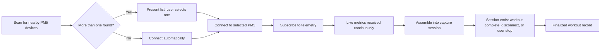
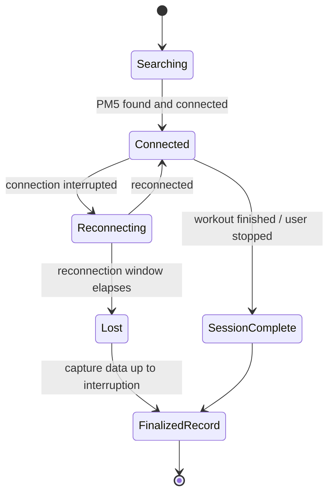

# Concept2 Mobile Metrics Capture

## Background

### The Concept2 PM5

The **Concept2 PM5** is the onboard performance monitor fitted to current-generation Concept2 rowing ergs, SkiErgs, and BikeErgs. It is the only Concept2 monitor generation that supports **Bluetooth Low Energy (BLE)**, and Concept2 publishes an official communication specification (the *PM CSAFE Communication Definition*) describing how external software can talk to it over BLE. That specification was independently researched and condensed in this repository (see `research\Concept2 PM CSAFE Communication Definition\concept2-pm-csafe-spec-research.md`).

### Two integration surfaces

The research identified **two distinct BLE integration surfaces** exposed by the PM5:

- **A telemetry-streaming surface** — a BLE service that pushes live workout data (time, distance, pace, power, stroke metrics, heart rate, etc.) to any subscribed listener, with no need to speak the underlying CSAFE protocol.
- **A command/control surface (CSAFE tunnel)** — a bidirectional channel for *configuring* workouts on the PM5 remotely (e.g., pre-loading a target distance or interval structure), which requires implementing the full CSAFE frame protocol (state machine, checksums, byte-stuffing, multi-packet reassembly).

### Scope decision: telemetry only

This document proposes a mobile app scoped **exclusively to the telemetry-streaming surface**: connecting to a PM5 over Bluetooth and capturing the live workout metrics it broadcasts. Remote workout configuration (the command/control surface) is explicitly **out of scope**.

No implementation details (SDKs, code structure, platform-specific APIs) are covered in this document — those belong to a follow-on design document once this proposal is approved.

## Terminology

| Term | Definition |
|------|------------|
| PM5 | Concept2's "Performance Monitor 5" — the onboard computer/display on current-generation Concept2 rowing ergs, SkiErgs, and BikeErgs, and the only generation with Bluetooth support. |
| CSAFE | "Communications Specification for Fitness Equipment" — a vendor-neutral wire protocol for commanding/configuring fitness equipment. Not used by this proposal's scope, but relevant context for why a simpler path exists. |
| BLE | Bluetooth Low Energy — the wireless standard the PM5 uses for its telemetry and command surfaces. |
| Telemetry-streaming surface | The PM5's BLE service that pushes live workout metrics to any subscribed app, without requiring the app to send commands or manage device state. |
| Capture session | The app's assembled record of one complete workout, spanning from the start of telemetry reception to the point the workout ends, the connection is lost, or the user stops capture. |

## Goals

1. **Discover and connect to a Concept2 PM5 over Bluetooth with no wired connection or manual data entry.** A user should be able to open the app near a powered-on PM5 and establish a connection without cables, pairing codes, or typing in numbers by hand.

2. **Correctly identify a specific PM5 when multiple units are nearby.** In a room with several ergs, the app must let the user pick (or automatically resolve) the correct machine rather than connecting to an arbitrary one.

3. **Capture the full range of live workout metrics the PM5 broadcasts.** This includes, at minimum, elapsed time, distance, pace, power, stroke rate, calories, and heart rate (when a heart-rate belt is paired to the PM5).

4. **Capture a complete session record, not just a live snapshot.** The app should reflect an entire rowing session from start to finish, so the resulting data represents the whole workout rather than whatever happened to be on screen at one moment.

5. **Behave predictably under real-world Bluetooth conditions.** Connection drops, out-of-range moments, and PM5 power-state changes (e.g., the monitor going to sleep) should be handled without crashing the app or silently losing already-captured data.

6. **Never use the PM5's command/control surface to configure or control the machine.** The app only subscribes to telemetry the device already broadcasts; it does not send commands, change workout settings, or otherwise take control of the erg.

## Proposal

### Overview

The app's job is narrow: find a PM5, listen to what it's already broadcasting, and assemble that stream into a usable record of one workout session. It never configures the machine — it only listens. The app targets **both iOS and Android**.

### Device discovery & selection

The app scans for nearby Bluetooth devices that identify themselves as Concept2 PM5 units. If exactly one is found, the app can connect to it directly; if several are found — expected in a gym with multiple ergs in the same room — the app presents them to the user so the correct machine can be chosen deliberately rather than guessed.

### Metric subscription (read-only by design)

Once connected, the app subscribes to the PM5's telemetry stream and receives the metrics named in the Goals section (elapsed time, distance, pace, power, stroke rate, calories, heart rate) as they update live. The app never uses the PM5's command/control surface to configure or control the machine — the ordinary protocol-level handshake needed just to start receiving telemetry doesn't count as equipment control. This is a deliberate boundary, not just a feature choice: it keeps the app's responsibility to "observe and record," which is a fundamentally smaller and safer problem than "observe and control."

### Capture session lifecycle

A **capture session** begins when the app connects and starts receiving telemetry, and continues until one of three things happens: the PM5 reports the workout as finished, the Bluetooth connection is lost, or the user manually ends the capture. Rather than treating each incoming metric update as an isolated event, the app assembles updates across the whole session into one continuous record — so the end result represents the entire workout, not a single point-in-time reading.

### Session ownership & storage

A capture session belongs to whichever member is currently logged into the app on the subscribing device — there is no separate step of assigning a session to a person after the fact; ownership is determined by who's logged in when the session starts. The finalized workout record is persisted locally on that same subscribing device (e.g., the phone's local storage) rather than transmitted to a backend service at this stage.

### Connection resilience

Real gym conditions mean connections will occasionally drop — a user steps out of range, the PM5 goes to sleep, or a Bluetooth radio hiccups. The app should represent connection state clearly (searching, connected, reconnecting, lost) and should not discard telemetry already captured earlier in the session just because the connection was later interrupted.

### Boundaries & known gaps

- **No write access.** As stated above, this proposal deliberately excludes any command/control capability. This is a hard boundary, not an implementation detail.
- **Firmware-dependent metrics.** The underlying research noted that not every metric is available on every PM5 firmware version. The app should be expected to tolerate a partial metric set gracefully rather than assume every listed metric is always present — the precise fallback behavior is left to the follow-on design document (see Open Questions).

## Open Questions

1. **What should the app do when a PM5's firmware doesn't expose all expected metrics?** Some telemetry fields are only available on newer PM5 firmware, so different units (or the same unit before/after an update) may expose a different metric set. Open sub-questions: should the app detect and adapt per-unit, how should missing metrics be surfaced (label "unavailable," omit, or warn), and should a minimum firmware version be required at all?

2. **How long should "Reconnecting" last before giving up, and how should the resulting data gap be handled?** The timing threshold before declaring a session "Lost" is undefined, affecting both UX and data integrity. For the gap itself, one candidate approach: compare the PM5's current cumulative reading against the app's last-captured value and reconcile the difference, rather than leaving a gap or a visible jump — still just a candidate, not a decided policy.

3. **Can more than one phone/app subscribe to the same PM5 telemetry stream at once?** E.g., a coach display and a member's phone listening simultaneously. Not ruled out technically, but the desired behavior isn't decided.

4. **Where is the phone during a workout, and must the app stay active in the foreground?** A member can't hold a phone mid-row, so it likely sits nearby for the session. Whether it must stay open/awake or can capture reliably while idle/locked is undecided — and matters, since a suspended app could silently truncate a session (Goals 4, 5).

5. **How does a member know which scanned PM5 matches the machine they're sitting at?** The PM5 advertises only a serial number (e.g., "PM5 430000012"), which doesn't identify itself among visually identical ergs. Possible directions include a proximity/signal-strength heuristic or a physical label mapping each station to its serial — undecided.

## Appendices

### Appendix A: Alternatives Considered

**Manual / self-reported metrics entry**
Instead of automated capture, members type their own workout numbers (distance, time, etc.) into the app after finishing.
- *Pros:* zero device-integration work; works with any erg regardless of connectivity.
- *Cons:* unreliable and error-prone; adds friction right after a workout; produces no live, per-stroke, or continuous data — only whatever the member remembers or reads off the display.
- *Not chosen because:* it fails Goals 3 and 4 outright (full metric range, complete session record) and defeats the purpose of building a capture mechanism at all.

**Wired connection (USB)**
The PM5 also supports a direct USB connection, which the underlying research confirmed is a fully documented alternative transport.
- *Pros:* generally more reliable than wireless; no BLE range or interference concerns; simpler physical pairing model (plug in, done).
- *Cons:* requires a physical cable tethering the phone to a fixed erg station; incompatible with a member freely carrying a phone; doesn't scale to a room of people moving between machines.
- *Not chosen because:* it directly contradicts Goal 1 (no wired connection).

**Full CSAFE command/control tunnel**
Rather than limiting scope to telemetry, the app could implement the PM5's full bidirectional CSAFE protocol, gaining the ability to both capture data and configure workouts remotely.
- *Pros:* opens the door to future capabilities, like pre-loading a workout onto the machine from the app; a single integration surface would cover both directions of communication.
- *Cons:* substantially more complex (frame protocol, state machine, checksums, multi-packet reassembly); introduces write access to the device, which carries real risk of unintentionally altering someone's workout; far more than is needed just to capture metrics.
- *Not chosen because:* it is disproportionate to this proposal's goal and was explicitly ruled out by the telemetry-only scope decision in the Background. It remains a candidate for a separate, future proposal if remote workout configuration is ever needed.

### Appendix B: Telemetry Metrics Reference

The Goals section lists the minimum metric set (elapsed time, distance, pace, power, stroke rate, calories, heart rate). The underlying research found the PM5's telemetry surface actually offers a broader range of live data than that minimum, organized loosely into these categories:

- **Live workout status** — elapsed time, distance, current workout/interval type and state
- **Pace & effort** — speed, stroke rate, current pace, power (watts), heart rate
- **Calorie & split averages** — running totals and per-split averages for calories, pace, and power
- **Per-stroke biomechanics** — individual stroke drive length/time, recovery time, peak/average force, work per stroke
- **Split/interval summaries** — per-split or per-interval elapsed time, distance, rest time, and split number
- **End-of-workout summary** — a consolidated record emitted once a workout finishes (date/time, totals, averages, min/max heart rate)

This broader set is not required to satisfy this proposal's Goals, but is available if a future design iteration wants to capture more than the stated minimum.
