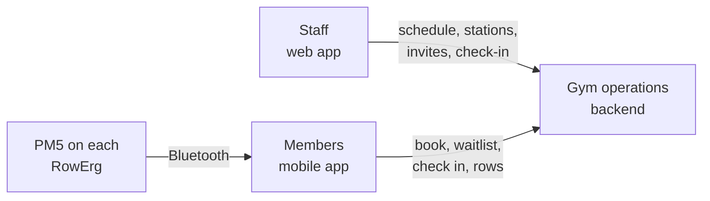
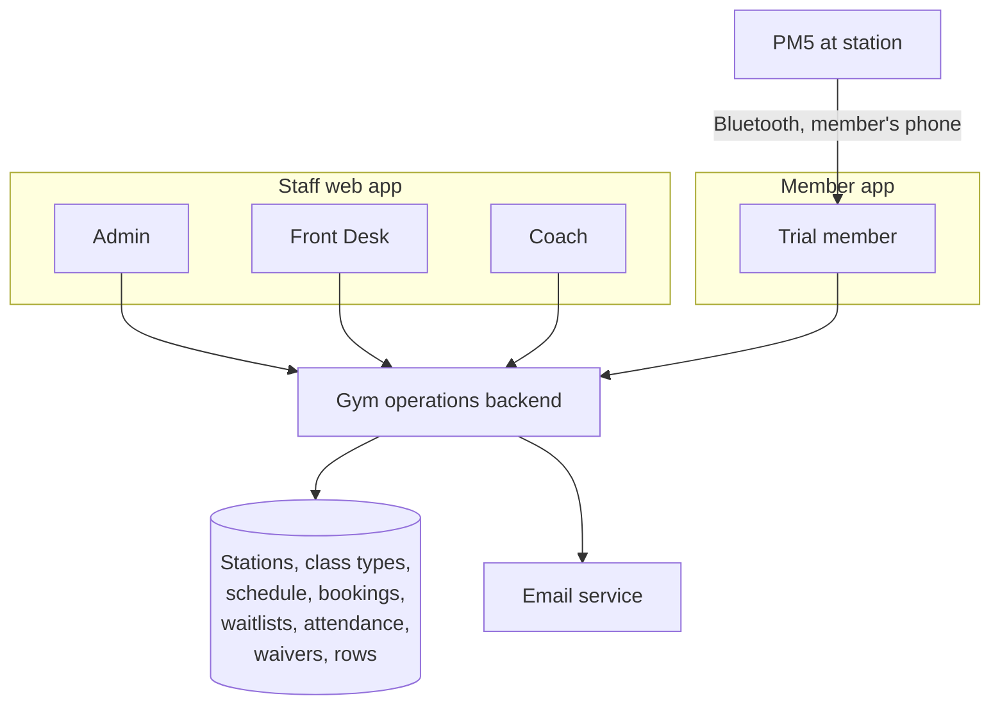
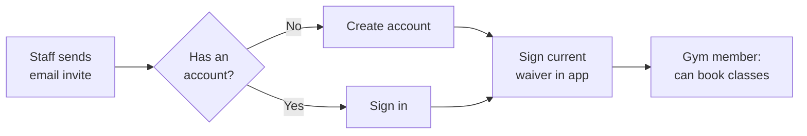
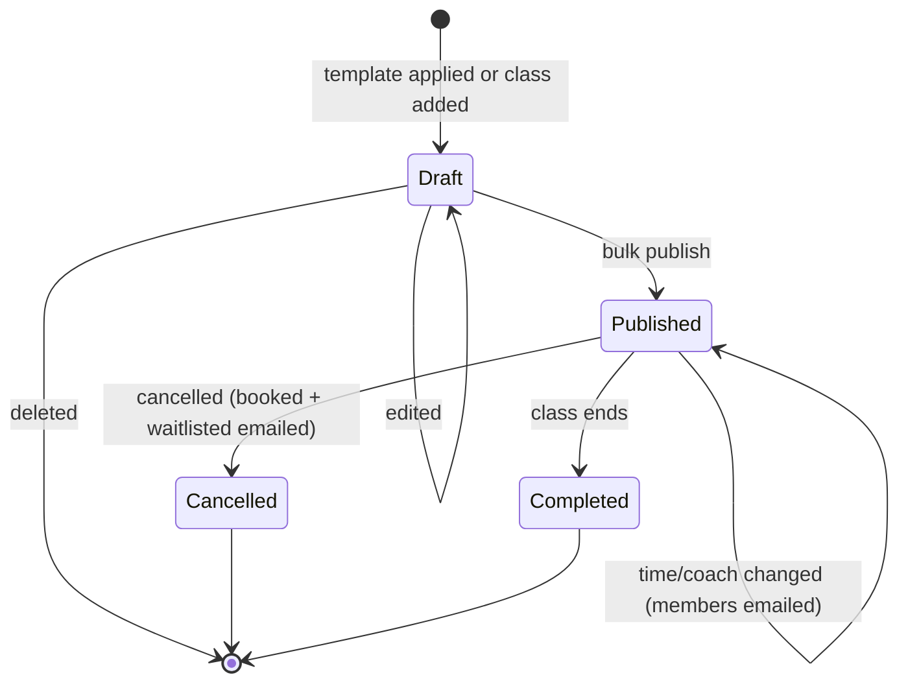
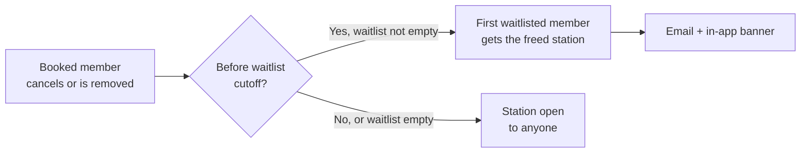
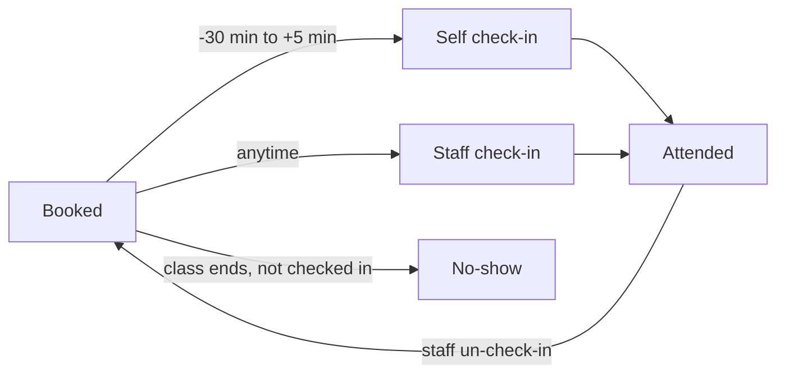
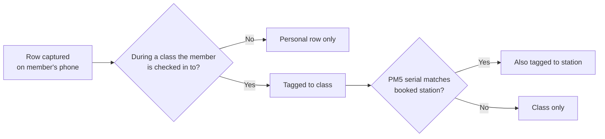

# Fitness Junkie Gym Operations

## Background

Fitness Junkie is a planned single-location gym built around small group classes on **Concept2 RowErg** rowing machines plus free weights (dumbbells). Each RowErg has a **PM5** monitor that broadcasts workout data over Bluetooth; dumbbells are not connected and are not tracked by any app. The gym will open as a **free, invite-only, volunteer-style trial** — no memberships, pricing, or payments.

A public **member mobile app** already exists as a personal rowing log: people create an account, connect their phone to a PM5, and record rows to their workout history. It knows nothing about the gym itself.

To open its doors, the gym needs software to run classes: publish a schedule, let invited members book a specific RowErg, manage waitlists, record who actually attended, and collect a liability waiver. This document proposes that **gym operations** system: a staff web app plus gym features added to the member app.

Today, members connect their own phone to a PM5 whenever they row. That remains how rows are captured in the gym for now, but it is a stopgap. A PM5 accepts **only one Bluetooth app connection at a time**, and the long-term direction is a **room hub**: a gym-owned device connects to every PM5 in the room during class and records each erg's data to the account of the member at that station. Members would still connect individually to RowErgs elsewhere. The room hub is being designed in a separate, parallel effort and is out of scope here, but gym operations must lay its foundation by knowing who booked which station and which PM5 sits there.

## Terminology

| Term | Definition |
|------|------------|
| Concept2 RowErg | Concept2's indoor rowing machine; the only connected equipment in scope. Also called an "erg". |
| PM5 | Concept2's Performance Monitor 5 — the onboard monitor on a RowErg that broadcasts workout data over Bluetooth Low Energy. Identified by a serial number (e.g. "PM5 430000012"). |
| Station | A numbered RowErg position in the gym room, mapped to one PM5 serial. The unit of class capacity. |
| Trial | The free, invite-only, volunteer-style launch period before memberships and payments exist. |
| Member app | The existing public mobile app used as a personal rowing log, extended with gym features by this proposal. |
| Room hub | The planned gym-owned device that connects to every PM5 in the room during class and records each erg's data to the member booked at that station. Designed separately; out of scope for this document. |
| Staff web app | The browser-based app used by Admin, Front Desk, and Coach roles to run the gym. |
| Admin / Front Desk / Coach | The three fixed staff roles. See [Staff roles](#staff-roles). |
| Coach console | A planned dedicated in-class tool for coaches, arriving alongside the room hub. Out of scope here. |
| Waiver | The digital liability waiver members sign in the member app before booking. Versioned; a new version must be re-signed. |
| Class type | A reusable class definition (name, duration, description, difficulty, alias, "what to bring / expect" note) that scheduled classes are created from. |
| Weekly template | A saved week of classes (day, time, class type, coach) that an Admin can apply to any week to create draft classes. |
| Draft class | A scheduled class not yet visible to members. Created by applying a template or added by hand. |
| Published class | A class visible to members and bookable (subject to schedule release rules). |
| Schedule release rules | An Admin setting controlling how far ahead published classes become bookable. Default during the trial: no limits. |
| Member cap | An Admin-adjustable upper limit on the number of trial members; a loose guardrail. |
| Waitlist promotion | Automatically giving a freed spot (and its station) to the first person on a class's waitlist. |
| Waitlist cutoff | The number of minutes before class after which waitlist promotion stops and freed spots are open to anyone. |
| Late-cancel cutoff | An Admin setting: the point before class after which a cancellation counts as a late cancel. |
| Late cancel | A booking cancelled after the late-cancel cutoff. |
| Check-in | Recording that a booked member attended a class — by the member in the app (30 minutes before to 5 minutes after start) or by staff at any time. |
| No-show | A member who was booked into a class but was not checked in. |
| Un-check-in | A staff action reversing a check-in for a member who checked in remotely but didn't attend. |

## Goals

1. **Admins can build and publish a month of classes in minutes.** Recurring weekly patterns — including alternating weeks — can be set up once and reused, and one-off changes to a day or a week are quick.

2. **Only invited people who have signed the current waiver can book classes.** The trial stays small and controlled, and the gym has a signed waiver on record for every member who books a class.

3. **Members can book a specific RowErg station, and freed spots are refilled automatically.** Members pick their own station, a full class has a first-come, first-served waitlist, and the waitlist fills cancellations without staff involvement until shortly before class.

4. **Attendance is recorded accurately.** For every class, staff can tell who was booked, who attended, who didn't show up, and who cancelled late — including correcting members who checked in remotely but never arrived.

5. **Rows captured during a class are linked to that class and station.** A member's class history reflects the rows they did in class, without any manual tagging.

6. **Each station is reliably mapped to its PM5.** The system knows which PM5 serial sits at which numbered station at all times, so that the future room hub can attribute each erg's data to the member booked at that station.

7. **Staff access matches staff responsibilities.** Admins, front-desk staff, and coaches can each do what their job requires and nothing more.

8. **Trial policies can be tightened without a new release.** If the trial grows or waitlists become unmanageable, admins can change limits and cutoffs from the web app.

## Proposal

### Overview

Build an in-house gym operations system made of a **staff web app**, gym features added to the existing **member app**, and a shared backend. Staff use the web app to manage stations, class types, the schedule, members, and attendance. Members use the app to accept an invite, sign the waiver, book a station, join waitlists, and check in. Rows members capture on their phones during class are linked to the class and station automatically.

The system is built in-house rather than using an off-the-shelf gym-management platform: without billing, those platforms' main strength doesn't apply, and owning stations and bookings is exactly what the future room hub needs to attribute each erg's data to the right member.

### Apps

- **Staff web app** — used by Admin, Front Desk, and Coach roles on a desktop or a tablet at the front desk. Coaches use it until a dedicated coach console arrives alongside the room hub.
- **Member app** — the existing public mobile app, extended with gym features that appear only for invited members.

### Staff roles

Three fixed roles. One person can hold more than one. There are no custom permission profiles.

| Role | Can do |
|---|---|
| **Admin** | Everything, including: staff accounts; settings (member cap, schedule release rules, waitlist cutoff, late-cancel cutoff); waiver versions; stations; class types; schedule templates and **all schedule editing** (creating, editing, publishing, and cancelling classes, changing coach). |
| **Front Desk** | Members and invites; bookings, waitlists, check-in / un-check-in, and station moves for any class. Read-only schedule. |
| **Coach** | For their own classes: roster, check-in / un-check-in, station moves. Read-only schedule. Edit their own bio and photo. |

### Membership: invite-only trial

- **One account per person.** Gym membership is a status on the member's existing member-app account, so their workout history, lifetime meters, and self-declared start meters carry over. People who aren't gym members keep using the app as a personal rowing log.
- **Invites by email.** Admin or Front Desk invite people by email address, whether or not they already have an account. Accepting the invite and signing the waiver grants gym access.
- **Member cap.** A simple guardrail against the trial being flooded, adjustable by Admin in the web app. It is deliberately kept loose; invite-only is the real control.
- Staff can deactivate and reactivate members.

### Waiver

- A digital liability waiver is signed in the member app when accepting an invite. The system records the typed name, timestamp, and waiver version.
- Admin manages versioned waiver text. Publishing a new version requires members to re-sign before their next booking.
- Staff can see who has signed which version.
- The waiver's wording is a legal task for the owners, not an engineering one.

### Stations

- One room with a fixed layout of **numbered RowErg stations**, each mapped to its PM5 serial. A physical label on each erg shows the station number and serial, so members and staff can tell which PM5 is at which station.
- Stations are spaced between 1 and 2 meters apart — enough floor space beside each erg for dumbbell and floor work such as a floor chest press with elbows out wide. Weights and floor spots are not tracked.
- **Class capacity = number of in-service stations.**
- Admin can mark a station out of service (e.g. a broken erg) and update its PM5 serial if an erg or monitor is swapped.

### Class types

- Name, duration (30, 45, or 60 minutes), description, difficulty, and an optional alias (e.g. "90's theme workout").
- An optional free-text **"what to bring / expect"** note (e.g. "Bring water; we'll use 10–25 lb dumbbells"), shown to members when booking and on the class detail screen. There is no structured equipment list.

### Schedule management (Admin only)

- **Weekly templates.** A template defines a week of classes (day, time, class type, coach). Templates are saved and can be applied to any week at will — Template A for several weeks in a row, or alternating patterns such as weeks 1 and 3 with Template A and weeks 2 and 4 with Template B.
- **Applying a template only adds draft classes**, skipping exact duplicates. It never changes or removes existing classes, especially published ones.
- **Easy day and week editing.** Admins can edit, add, or remove classes for a single day or a whole week in one view.
- **Bulk publish.** Drafts are published together.
- **Published classes** change only by an explicit edit or cancel:
  - Cancelling a class emails everyone booked or waitlisted.
  - Changing a class's coach or time emails booked members. A time change lets members cancel without it counting as a late cancel.
- **Schedule release rules** (Admin setting) control how far ahead published classes become bookable — e.g. "14 days in advance" or a monthly batch release. **The trial default is no limits:** published classes are bookable immediately. The setting exists so the policy can be tightened if waitlists become unmanageable.

### Booking and waitlist

- Members see published classes, book one, and **pick a specific station** on a simple room map. They can switch to another free station until class starts.
- There is no limit on the number of bookings a member holds during the trial.
- **Waitlist.** When a class is full, members can join its first-in, first-out waitlist. When a spot frees up, the first person on the waitlist is automatically given that spot (the freed station) and notified. Automatic promotion stops **a set number of minutes** before class (Admin setting); after that, freed spots are open to anyone.
- **Cancelling.** Members can cancel a booking or leave a waitlist. Cancellations after a **late-cancel cutoff** (Admin setting) are recorded as late cancels.
- **Staff changes.** Admin and Front Desk (any class) and Coaches (their own classes) can remove a member from a class, which reopens the spot, and move members between stations.

### Check-in and attendance

- **Member self-check-in** in the app is available from **30 minutes before start to 5 minutes after start**. There is no location check.
- **Staff check-in** has no time window: staff can check members in, or **un-check-in** members who checked in remotely but didn't show up, at any time.
- **No-shows** (booked but not checked in) and late cancels are tracked per member and shown to staff only. There are **no automatic penalties** during the trial; staff handle repeat cases personally. The data will also support no-show policies if the gym later moves to a paid model.

### Notifications

- **Email**, plus an **in-app banner** for the same events: invites, waitlist promotions, class cancellations, and coach or time changes.
- No SMS and no push notifications.

### Rows linked to classes

- A row captured on a member's phone during the scheduled time of a class they are checked in to is automatically tagged to that class.
- If the PM5's serial matches the member's booked station, the row is also tagged to that station.
- This gives members a real class history now, and tests the station-to-PM5 mapping the room hub will rely on.

### Coach profiles

- Name, photo, short bio, and certifications, shown to members when booking.
- Contact details visible to staff only.
- Class history is built automatically from past classes.

### Member app changes

- **Landing page:** next class (with the check-in button during its window), last class, and today's classes.
- **My schedule:** upcoming classes; book and pick a station; switch station; join or leave a waitlist; cancel.
- **Invite acceptance and waiver signing.**

### Out of scope

- The room hub, live class displays, and a coach console.
- Gamification (experience points, levels, achievements).
- Push notifications and SMS.
- Location-based check-in.
- Booking limits (available as an Admin setting, but off by default).
- Tracking of dumbbells or other equipment.
- Bulk booking and booking on behalf of another member.
- Anything payment-related: memberships, pricing, billing, no-show charges, coach pay.

## Open Questions

1. **What are the trial's starting values for the Admin settings?** The member cap, the waitlist cutoff (minutes before class after which freed spots stop going to the waitlist), and the late-cancel cutoff are all adjustable, but each needs a sensible launch value. Schedule release rules already default to "no limits."

2. **How should a waitlisted member who is promoted shortly before class be treated if they don't show up?** Promotion is announced by email and an in-app banner only. A member promoted a few minutes before the cutoff may not see it in time, and would then be recorded as a no-show for a class they didn't knowingly book. Options include exempting late promotions from no-show counts, or requiring the member to confirm a promotion.

3. **What happens to existing bookings when a station goes out of service or a member is deactivated?** Marking a station out of service reduces capacity, but members may already be booked on it. Deactivating a member leaves their future bookings and waitlist places behind. Should these be cancelled automatically (freeing spots for the waitlist), moved to another free station, or flagged for staff to handle?

4. **What happens to members' existing bookings when a new waiver version is published?** Members must re-sign before their next booking, but they may already hold bookings made under the old version. Should they keep those bookings, be blocked from checking in until they re-sign, or lose them?

5. **How should edge cases in linking rows to classes work?** A row is linked to a class if it is captured during the class's scheduled time while the member is checked in. Undecided:
   - A row that starts before class or runs past its end.
   - A member who is checked in by staff after they've already rowed (should earlier rows be linked retroactively?), or un-checked-in afterwards (should links be removed?).
   - A row whose PM5 serial doesn't match the booked station — the member sat at a different erg. Should the row be tagged to the actual station, to the booked one, or flagged for staff?

6. **Should the schedule prevent overlapping classes?** There is one room, so two classes at the same time would share the same stations. Should the system block overlapping classes, or just warn the Admin? The same question applies to a coach assigned to two overlapping classes.

7. **Should members be prevented from booking overlapping classes?** With no booking limits during the trial, a member could hold bookings in two classes that overlap in time.

8. **Do invites expire, and can they be revoked?** Outstanding invites may count toward the member cap in practice. An expiry period and a way for staff to revoke or resend invites would keep this tidy.

9. **What happens to gym records when a member deletes their account?** The member app is public, so it must support account deletion. Attendance, no-show, waiver-signature, and booking records may need to be kept for the gym's records (especially signed waivers) or anonymized. The retention policy needs a decision, likely with legal input.

10. **Can minors join the trial?** If under-18s may be invited, the waiver likely needs a parent or guardian signature, which the in-app signing flow does not currently cover.

## Appendices

### Appendix A: Alternatives Considered

**Buy an off-the-shelf gym-management platform** (e.g. Mindbody, Glofox, Wodify, PushPress)
- *Pros:* scheduling, booking, waitlists, and check-in already exist; faster to launch.
- *Cons:* billing — their main strength — isn't needed during a free trial; stations, bookings, and attendance would live in a third-party system, making the room hub depend on that vendor's API for per-station attribution.
- *Not chosen because:* the value doesn't justify the dependency while there is no billing.

**Paper waiver at the front desk, or a third-party e-signature service**
- *Pros:* paper needs no engineering; e-signature services are legally robust.
- *Cons:* paper relies on staff ticking a box and is easy to lose; a third-party service adds a separate account and flow outside the app.
- *Not chosen because:* in-app signing with version tracking is simple and blocks booking until signed.

**Automatic no-show penalties, or not tracking no-shows**
- *Pros:* penalties deter no-shows automatically; not tracking is simplest.
- *Cons:* penalties feel heavy-handed for volunteers; not tracking loses data the gym will want later.
- *Not chosen because:* tracking without penalties lets staff handle repeat cases personally and keeps the data.

**Check-in via QR code, front-desk kiosk, staff only, or a location check**
- *Pros:* stronger proof that the member is physically present.
- *Cons:* QR codes and kiosks need hardware or posters; staff-only check-in creates a queue; location checks add engineering effort and fail indoors.
- *Not chosen because:* app self-check-in within a short window, plus staff check-in and un-check-in, is good enough for a trial.

**SMS notifications**
- *Pros:* more likely to be seen quickly, which matters for last-minute waitlist promotions.
- *Cons:* paid provider, US business-texting registration (A2P 10DLC), and opt-in handling.
- *Not chosen because:* email plus in-app banners is enough for a small trial.

### Appendix B: Admin Settings Reference

| Setting | Purpose | Trial default |
|---|---|---|
| Member cap | Loose guardrail on the number of trial members | To be decided (Open Question 1) |
| Schedule release rules | How far ahead published classes become bookable | No limits |
| Waitlist cutoff | Minutes before class after which waitlist promotion stops | To be decided (Open Question 1) |
| Late-cancel cutoff | Point before class after which a cancellation counts as late | To be decided (Open Question 1) |
| Waiver version | Current waiver text members must have signed to book | Initial version from the owners |
