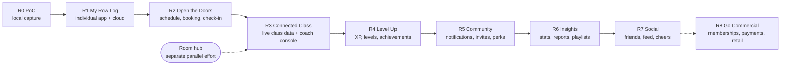

# Fitness Junkie — Release Plan (Draft)

Date: 2026-09-28
Status: Draft for discussion
Sources:
- `documents\BRDs\01 - Project Overview.md` (the "BRD")
- `documents\proposals\concept2-mobile-metrics-capture.md` (the "Capture proposal")
- `documents\proposals\fitness-junkie-gym-operations.md` (the "Gym operations proposal", detailing R2)

## Purpose

The BRD describes a large, all-in-one gym platform. This document slices it into a sequence of releases that start with a small, individually useful app and grow into the full gym experience. Each release is shippable on its own and delivers value to real users.

## Scope Framing

These constraints apply to every release below and override the broader language in the BRD:

- **One gym concept.** A single type of gym. Multi-branch / multi-gym management is parked (see [Parked & Out of Scope](#parked--out-of-scope)).
- **Equipment is fixed and known:**
  - **Concept2 RowErg with PM5 monitor** — the only connected equipment. Other Concept2 machines (SkiErg, BikeErg) are out of scope.
  - **Free weights (dumbbells of various sizes)** — not connected; they produce no telemetry and are **not tracked by any app** (web or mobile).
- **Volunteer-style trial at launch.** No membership plans, pricing, or payments. Members and coaches take part free of charge; everything money-related is deferred to [Release 8 — "Go Commercial"](#release-8--go-commercial-deferred).
- **Consequences:** there is one device type to integrate with (the PM5, over BLE, rowing only) — by the member app from R1, and by the room hub once it's ready (see [In-Class Capture: Room Hub](#in-class-capture-room-hub)). There is no structured "needed equipment" list, and a BRD "spot" is simply a numbered RowErg **station**. Stations are spaced between 1 and 2 meters apart so the room isn't crowded and each attendee has floor space next to their erg for dumbbell and floor work (e.g. a floor chest press with elbows out wide).

## Starting Point (Release 0 — done)

A proof of concept of the Capture proposal exists: a mobile app that discovers a PM5, subscribes to its telemetry (read-only), assembles a capture session, and stores it locally on the phone. This gives confidence that the product is viable for an individual user.

## In-Class Capture: Room Hub

**Key constraint:** a PM5 accepts only one Bluetooth app connection at a time (a BLE heart-rate strap can still pair alongside it). Sources: [Concept2 help — error 24290](https://concept2help.zendesk.com/hc/en-us/articles/28983360383245-My-PM5-is-displaying-error-code-24290), [ErgZone PM5 troubleshooting](https://help.erg.zone/article/207-pm5-troubleshooting), [Concept2 forum](https://www.c2forum.com/viewtopic.php?t=196272). This answers Capture proposal Open Question 3 ("can more than one phone subscribe?") — **no**.

**Direction:** the **room hub** is the eventual way rows are captured in class. It is a gym-owned device that connects to every PM5 in the room during class and records each station's data to the account of the member booked at that station. The room hub is being designed in a **separate, parallel effort** outside this plan; R3 adopts it once it's ready.

**How members' phones fit in:**

| Where the member rows | Before the room hub (R1–R2) | After the room hub (R3 onward) |
|---|---|---|
| **In class at the gym** | *Stopgap:* the member connects their own phone to their station's PM5 (R1 style); R2 links the row to the class and station. | The room hub captures the row; members don't connect their phones to class ergs. |
| **Anywhere else** (home, another gym, open rowing) | Member connects their own phone to the PM5 (R1 style). | Unchanged — members keep connecting their own phone. |

So individual phone connection is **permanent** for rowing outside class, and a **stopgap** only for in-class capture.

**Alternative not chosen — phone relay:** each member's phone would connect to its PM5 and stream live to the backend for room displays. It needs no gym hardware, but every member would have to bring a phone, keep the app open and awake, and rely on each phone's network for live data. The room hub gives one reliable, gym-managed data path, works for members without phones, and fits the station → PM5 mapping naturally. Note that the stopgap above is *not* a phone relay: it only records rows to the member's own history and feeds no live displays.

## Release Roadmap at a Glance

R3 also depends on the parallel room hub effort being ready. R4 depends on R3 data but could start in parallel with late R3 work. R6 and R7 are largely independent of each other and can be reordered. R8 is deferred: it can be pulled forward whenever the trial ends, and only depends on R2.

---

## Release 1 — "My Row Log" (Individual MVP)

**Goal:** Turn the PoC into a real product an individual can use on any RowErg — before the gym exists. Builds an early community and validates the data model that everything else depends on.

**Audience:** Public — anyone with a RowErg can download the app and use the personal log. Gym features arrive in R2 and require an invite.

**Release implications of going public:** app-store listings, privacy policy, account deletion, and a basic support channel are needed from R1.

**In scope**
- Member account: sign up, sign in, basic profile (name, preferred name, avatar).
- Production-quality PM5 capture from the member's own phone (from the Capture proposal). This is the permanent way members capture rows outside class, and the in-class stopgap until the room hub. It resolves the proposal's open questions:
  - Firmware / partial-metric handling (OQ1).
  - Reconnect timeout and gap reconciliation (OQ2).
  - Foreground/locked-phone behavior (OQ4).
- Workout records synced to a backend (not just local storage), with offline capture and later upload.
- Rowing performance history: distance, time, pace/split, power, stroke rate, calories, heart rate.
- Lifetime meters rowed, including **"start meters"** (self-declared prior meters from the BRD's member registration).
- Manual entry of a dumbbell/strength session (date, duration) so non-rowing work appears in history. No weight/rep tracking yet.

**Explicitly not in this release:** gym, classes, booking, coaches, gamification.

**Exit criteria**
- A user can complete a full row on a PM5 and see it in their history on another device.
- No captured data lost across connection drops in field testing.

---

## Release 2 — "Open the Doors" (Gym Operations MVP)

**Goal:** Everything the gym needs to open and run free, invite-only trial classes. In class, members still capture rows by connecting their own phone to their station's PM5 (the R1-style stopgap until the room hub), and those rows are now linked to the class they happened in.

**Audience:** Admins, front-desk staff, coaches, invited trial members.

**Details:** see the gym operations proposal, `documents\proposals\fitness-junkie-gym-operations.md`.

**In scope**
- Built in-house: a **staff web app** (Admin, Front Desk, Coach roles) plus gym features in the R1 member app.
- Invite-only trial membership on the member's existing R1 account, with a loose, Admin-adjustable member cap.
- Digital, versioned liability waiver signed in the app before booking.
- One room of numbered RowErg stations spaced 1–2 m apart, each mapped to its PM5 serial; no equipment tracking.
- Class types with an optional "what to bring / expect" note.
- Admin-only scheduling with saved weekly templates (including alternating weeks), easy day/week editing, and bulk publish.
- Booking with station selection; FIFO waitlist with automatic promotion until shortly before class.
- Member self-check-in from 30 min before to 5 min after start; staff check-in / un-check-in anytime; no-shows and late cancels tracked with no penalties.
- Email and in-app banner notifications.
- Rows captured on a member's phone during a class automatically linked to that class (and station). Stopgap behavior, superseded by the room hub in R3.
- Station → PM5 serial mapping kept accurate — the foundation the room hub relies on.
- Basic coach profiles.
- Admin settings to tighten trial policies later (booking window, cutoffs); defaults are permissive.

**Explicitly not in this release:** the room hub (separate parallel effort), live class displays, coach console, gamification, push notifications, SMS, location-based check-in, equipment tracking, bulk booking, delegation, anything payment-related (R8).

**Exit criteria**
- Admin can build and publish a month of classes from saved weekly templates, including an alternating-week pattern.
- Invited members can accept, sign the waiver, book stations, join waitlists, and check in; attendance, no-shows, and late cancels are recorded accurately.
- Rows captured during classes are correctly linked to the class (and station where serials match).

---

## Release 3 — "Connected Class"

**Goal:** The in-class experience that differentiates the gym: every RowErg's data is captured automatically for the member at that station, and the room sees it live.

**Audience:** Coaches, members in class.

**Depends on:** the room hub from the separate parallel effort, and R2's station → PM5 serial mapping and station bookings.

**In scope**
- Adopt the room hub for in-class capture, replacing the R2 stopgap: members no longer connect their phones to class ergs during class, and R2's phone-row-to-class linking is retired for in-class rows. Outside class, members keep connecting their own phones (R1 style).
- Automatic attribution: results from a station's PM5 are recorded to the account of the member booked at that station (BRD "reports the data… and assigns the results to the member in the designated spot").
- Coach class console (tablet), replacing the staff web app for in-class work: start/end class, see roster, move members, remove members.
- HIIT interval timers with sound cues for work/rest.
- Exercise list per class (rowing intervals + free-text dumbbell/floor exercises; equipment itself is not tracked).
- Room displays: timers, meters per member, average split, class totals.
- Coach basics (in the console / staff web app): my upcoming classes, my previous class, set exercises for upcoming classes.
- Member app: per-class results in class history.

**Explicitly not in this release:** achievement pop-ups (R4), playlists (R6), friends and activity feed (R7), remote workout configuration of PM5s (see Parked).

**Exit criteria**
- A full class of RowErgs captured by the room hub and attributed correctly with no manual correction in field testing.
- Room display updates live throughout a class.

---

## Release 4 — "Level Up" (Gamification v1)

**Goal:** The BRD's main differentiator — leveling and achievements — built on the class and workout data from R1–R3. Rewards are non-monetary (XP, badges, bragging rights); discount-based rewards wait for R8.

**In scope**
- Experience points from attended classes (class duration × difficulty) and from achievements.
- Logarithmic leveling curve; member "experience level" on the landing page.
- Achievement engine for count-based and streak-based rules across the data verticals available so far: class type, duration, coach, advance booking, cancellations, meters, average split, station used.
- Achievement catalog with badge art and funny notes; each achievement earned once.
- Member achievement board (earned + progress toward next); latest achievements on landing page.
- Coach achievements (e.g. "Unstoppable" — 100 classes coached) and coach achievement board.
- Live in-class achievement notifications on room displays.
- Examples deliverable now: Powerhouse, Where Everybody Knows Your Name, Down the Mississippi, Unstoppable. Lucky Number and Comfort Zone ship with XP rewards in place of their BRD retail discounts until R8.

**Exit criteria**
- Achievement rules can be added/tuned without an app release.
- Backfill: members are awarded achievements earned from historical data (R1–R3).

---

## Release 5 — "Community"

**Goal:** Keep members engaged and coming back.

**In scope**
- Push notifications: class reminders, schedule-opening reminders, waitlist promotions; notification preferences.
- Announcements: blast to all members; conversations with one or several members.
- Suggestion box (one-way, anonymous) — member app to gym.
- Invite a member / referral tracking (enables "Influencer", counting invitees who join and attend rather than buy a membership). While the trial is invite-only, member referrals go to staff for approval before an invite is sent.
- Favorite a coach (enables coach "Inspiring Figure").
- Bulk booking (with limits) and delegation (book on behalf of another member).
- Level-based perks, e.g. early booking windows for higher levels (builds on R2's schedule release rules).
- Theme preferences.

---

## Release 6 — "Insights"

**Goal:** Help the gym and coaches understand how classes are going.

**In scope**
- Gym stats dashboard: class history, attendance, member counts.
- Coach history: class reports, members per class.
- Class playlist management (Spotify/Tidal — licensing for commercial/public use must be checked first).

---

## Release 7 — "Social"

**Goal:** An in-app social network for registered members and coaches, modeled on the Untappd beer-tracking app: connect with friends, see what they've been doing, and cheer them on. Nothing is posted to external social media platforms.

**In scope**
- **Friends:** send, accept, decline, and cancel friend requests; remove a friend; find people by name/username, from a class roster you attended, or by scanning a friend's in-app QR code. Friendships are mutual (both sides must accept).
- **Activity feed:** a feed of friends' activity — completed rows and classes (with stats such as meters, time, average split), achievements earned, level-ups, and personal bests.
- **Reactions and comments:** a one-tap "cheer" (Untappd's "toast") and comments on friends' activity, with in-app notifications when your activity gets a cheer or comment.
- **Friend profiles:** a friend's level, achievement board, lifetime meters, recent classes, and personal bests; side-by-side stat comparison.
- **Friends leaderboards:** weekly/monthly meters, number of classes, and best 2 km / 5 km times among your friends.
- **Class buddies:** see which friends are booked into a class, both when booking and on the landing page.
- **Privacy controls:** choose who sees your activity (friends only / nobody), hide individual workouts, choose who can send you friend requests, and block or report a user.
- **Moderation:** gym staff can review reported comments or users and remove content or suspend social access.
- **Social achievements:** e.g. "Town Crier" reworked for in-app use (50 comments or cheers given), and friend-count or "row with a friend" achievements.

**Explicitly not in this release:** posting to or reading from external social media platforms (see [Parked & Out of Scope](#parked--out-of-scope)), direct messaging between members, public (non-friend) profiles.

---

## Release 8 — "Go Commercial" (deferred)

**Goal:** Move from the volunteer-style trial to a paying gym. Deferred until the trial has proven the experience; can be pulled forward at any point after R2.

**In scope**
- Membership types and costs; buy, pause, cancel, and restart a membership.
- Payment method management and auto-pay agreement signing (via a third-party payment processor — no card data stored by us).
- Member app: upcoming payments, manage membership.
- No-show charges tied to check-in.
- Special promotions; achievement rewards as membership discounts (e.g. "Influencer" 50% off next month).
- Coach payment: member-per-class history for pay, payment history, tax/W2 information (strongly recommend a payroll provider integration rather than storing tax IDs ourselves).
- Income per gym in the stats dashboard.
- Retail POS: catalog, sales, history/reports, barcode scanner, member self-checkout; achievement rewards as retail discounts (e.g. "Lucky Number", "Comfort Zone").
- Transition plan for trial members (grandfathering, trial history carried over).

---

## Parked & Out of Scope

| Item (BRD) | Decision | Reason |
|---|---|---|
| Creating gyms / multi-branch central management | Parked | Single gym for now. Keep a `gym` concept in the data model so it isn't a rewrite later. |
| Security cameras, emergency actions | Out of scope | Use off-the-shelf security systems; not app functionality. |
| Health app integration (Apple Health / Google Fit) | Parked (candidate after R4) | Nice-to-have; low dependency. |
| Remote workout configuration of PM5s (CSAFE command/control) | Parked (candidate after R3) | Excluded by the Capture proposal; could later let coaches push a class's intervals to every RowErg. |
| SkiErg, BikeErg, other brands / machine types | Out of scope | RowErg (PM5) + dumbbells only. |
| External social media (linking gym/coach handles, posting on the gym's behalf, engagement metrics, in-gym social media wall, coach live social board, class hashtags) | Out of scope | Social features stay inside the app (R7). |
| Weight/rep tracking for dumbbells | Parked | No telemetry; manual entry adds friction. Revisit if members ask for it. |

## Open Decisions

1. **Leveling curve and XP formula** — exact numbers for R4.
2. **Social defaults (R7):** is activity shared with friends by default (opt-out) or hidden until the member opts in? Can coaches be friended like members, or only followed?
3. **R2 default setting values:** initial member cap, waitlist auto-promotion cutoff (minutes), and late-cancel cutoff. Other R2-specific questions are tracked in the Gym operations proposal's Open Questions.

## Decisions Log

| # | Decision | Outcome |
|---|---|---|
| D1 | Build vs. buy for R2 scheduling/booking | Build in-house. |
| D2 | R2 apps | Staff web app (Admin, Front Desk, Coach) + member mobile app. |
| D3 | Trial membership | Invite-only, loose member cap adjustable by Admin. |
| D4 | Waiver | Digital, in-app at invite acceptance, versioned, re-sign on change. |
| D5 | Stations | One room, fixed numbered RowErg stations spaced 1–2 m apart; no equipment tracking. |
| D6 | Equipment list | Replaced by optional free-text "what to bring / expect" note on class types. |
| D7 | Booking limits | None during the trial; Admin-configurable schedule release rules exist, default off. |
| D8 | Waitlist | FIFO auto-promotion into the freed station; stops X minutes before class. |
| D9 | No-shows / late cancels | Tracked, staff-visible only, no automatic penalties during the trial. |
| D10 | Check-in | Member self-check-in in the app from −30 to +5 min, no location check; staff can check in / un-check-in anytime. |
| D11 | Station selection | Member picks a station on a room map; staff can move members. |
| D12 | R2 notifications | Email + in-app banners; no SMS. |
| D13 | R2 workout data | Stopgap: rows captured on members' phones are auto-linked to the checked-in class (and station if PM5 serial matches); superseded by the room hub in R3. |
| D14 | Staff roles | Admin / Front Desk / Coach; only Admin edits the schedule. |
| D15 | Coach profiles | Name, photo, bio, certifications; contact staff-only. |
| D16 | Scheduling | Saved weekly templates applied to any week (supports alternating weeks); easy day/week editing. |
| D17 | Applying templates | Only adds drafts; never alters published classes. |
| D18 | In-class capture | Room hub is the eventual approach, designed in a separate parallel effort and adopted in R3. Members' own phone connection is permanent outside class and a stopgap in class until then. Phone relay not chosen. |
| D19 | Accounts | One account; gym membership is a status on the R1 account. |
| D20 | R1 availability | Public; gym features require an invite. |
