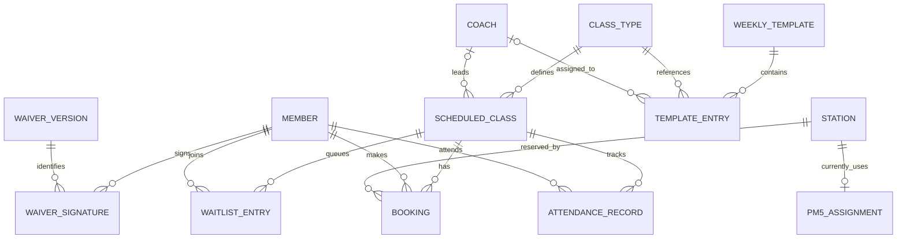
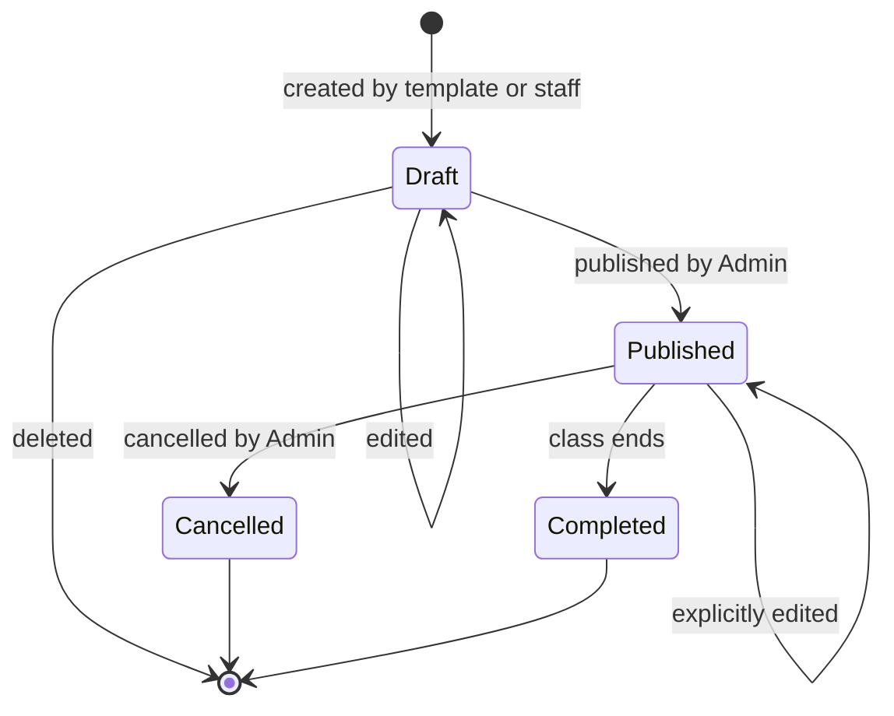
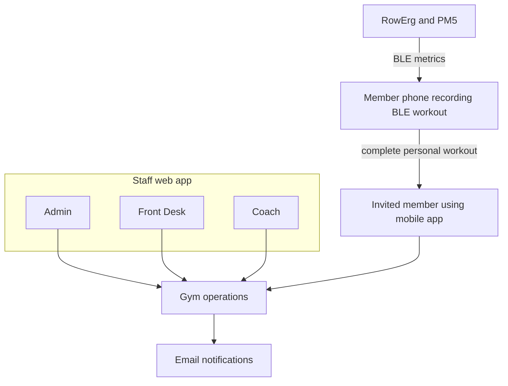

# Fitness Junkie Gym Operations - Requirements

## 1. Overview

Fitness Junkie Gym Operations supports the launch and day-to-day running of a single-location, invite-only gym trial centered on small-group rowing classes. Staff manage members, stations, class definitions, schedules, bookings, and attendance; invited members use the existing mobile app to accept invitations, sign waivers, book classes and stations, and check in. In v1, BLE-recorded workouts remain complete entries in each member's canonical personal history and are not tagged to classes.

The trial is free and has no membership fees, billing, or automatic no-show penalties. Station assignments and the current PM5 association establish a foundation for a separately planned room hub. Class-performance metrics and hub capture are future-release scope, not v1 requirements.

## 2. Core Concepts

### 2.1 Terminology

| Term | Definition |
|------|------------|
| **Member** | A person using an existing member-app account who has accepted a gym invitation and met the current waiver requirement. |
| **Trial** | The free, invite-only, volunteer-style operating period before memberships and payments are introduced. |
| **Station** | A friendly-labeled RowErg position in the gym, such as station #15. A station is the unit of class capacity. |
| **PM5** | The performance monitor on a RowErg, identified by serial number and used to identify the source erg for a recorded row. |
| **Class type** | A reusable definition of a class, including its name, duration, description, difficulty, optional alias, and optional what-to-bring note. |
| **Scheduled class** | A particular session created from a class type, with a time, coach, publication state, and member bookings. |
| **Weekly template** | A reusable weekly pattern of scheduled classes that an Admin can apply to a selected week. |
| **Draft class** | A scheduled class that is not visible or bookable by members. |
| **Published class** | A class visible to members and available for booking subject to schedule-release rules. |
| **Booking** | A member's reservation of one station in a scheduled class. |
| **Waitlist** | A first-in, first-out queue for members seeking a place in a full class. |
| **Late cancel** | A booking cancelled after the configured late-cancel cutoff. |
| **No-show** | A member who remains booked but is not checked in when the class ends. |
| **Waiver version** | A published version of the liability-waiver text, which members sign by entering their name. |
| **Target inter-class gap** | An Admin-configurable preferred interval between classes, defaulting to 30 minutes. A shorter gap, including no gap without overlap, produces a warning but is allowed. |
| **Room hub** | A separately planned gym-owned device that will connect to the room's PM5 monitors and support future class-performance metrics; it is outside v1 scope. |

### 2.2 Entity Relationships

## 3. Functional Requirements

### 3.1 Staff Access and Roles

#### FR-3.1.1 Fixed staff roles
- The system SHALL provide Admin, Front Desk, and Coach roles.
- The system SHALL allow one staff person to hold more than one role and SHALL NOT require custom permission profiles.
- The system SHALL restrict each staff action to the permissions listed below.

| Role | Required permissions |
|------|----------------------|
| Admin | Manage staff access, settings, waiver versions, stations, class types, templates, and all schedule changes; manage members, invitations, bookings, waitlists, and attendance. |
| Front Desk | Manage members and invitations; manage bookings, waitlists, attendance, and station assignments for any class; view the schedule without editing it. |
| Coach | View the schedule; manage roster, attendance, and station assignments for their own classes; edit their own profile biography and photo. |

#### FR-3.1.2 Staff account control
- Admins SHALL be able to create, update, and deactivate staff access.
- The system SHALL prevent staff from performing actions outside their assigned roles.

### 3.2 Member Invitations and Access

#### FR-3.2.1 Invitation-based membership
- Admins and Front Desk staff SHALL be able to invite a person by email whether or not that person already has a member-app account.
- An invitation SHALL be redeemable by creating an account or signing in to the person's existing account.
- Invitation acceptance SHALL require the person to attest to being at least 18 years old. Authorized staff MAY correct or deny eligibility; v1 SHALL NOT collect identity documents for age verification.
- The system SHALL maintain one gym-member status per person on the existing member-app account; it SHALL NOT create a separate gym identity.
- Gym booking access SHALL require an accepted invitation, an active member status, and a signature for the current waiver version.
- Admins and Front Desk staff SHALL be able to revoke and resend outstanding invitations.
- Invitations SHALL expire after a period configured by an Admin. The launch value SHALL be set before the trial opens.
- The system SHALL permit at most one active invitation per email address. Resending SHALL replace the outstanding invitation and restart its expiration period; revocation SHALL invalidate outstanding invitations.
- Outstanding invitations and active members SHALL be visible to staff.

#### FR-3.2.2 Member cap and member status
- The system SHALL provide an Admin-configurable member cap as a guardrail on trial growth. Only active members SHALL count toward this cap; outstanding invitations SHALL NOT reserve capacity.
- The member cap's launch value SHALL be set before invitations are issued; invitation-only access remains the primary access control.
- The system SHALL block invitation redemption when the active-member cap has been reached.
- Admins and Front Desk staff SHALL be able to deactivate or reactivate a member. Reactivation SHALL respect the active-member cap.
- Deactivating a member SHALL immediately block member-app gym actions and flag that member's existing bookings and waitlist entries for staff review; the system SHALL NOT silently cancel or reassign them. Authorized staff SHALL be able to resolve the flagged records and record attendance if the member attends.

### 3.3 Waivers

#### FR-3.3.1 Waiver version management and signing
- Admins SHALL be able to create and publish versioned waiver text.
- A member accepting an invitation SHALL sign the current waiver in the member app before gaining booking access.
- The system SHALL record the member's typed name, signature timestamp, and signed waiver version.
- Staff SHALL be able to view which waiver version each member has signed.
- Publishing a new waiver version SHALL preserve existing bookings, but members SHALL be required to sign the new version before checking in or making another booking.
- The system SHALL prevent a member without a current waiver signature from booking or checking in.

### 3.4 Stations and Class Types

#### FR-3.4.1 Station management
- The system SHALL support one gym room containing friendly-labeled RowErg stations, each with a current PM5 association for future hub attribution.
- Admins SHALL be able to update the current PM5 association when equipment is replaced.
- The system SHALL display station friendly labels to members and staff. Staff SHALL be expected to keep each machine in its designated labeled position.
- The system SHALL NOT maintain historical PM5-to-station mappings or automatically infer/correct equipment placement errors.
- Admins SHALL be able to mark a station in service or out of service.
- Class capacity SHALL equal the number of in-service stations.
- When a station with an existing booking is marked out of service, the system SHALL flag the affected booking for staff review and SHALL NOT silently cancel or move it.
- A class with no in-service stations SHALL have zero capacity, SHALL NOT be publishable or accept new bookings, and SHALL be flagged to staff; the system SHALL NOT automatically cancel it. If an already-published class reaches zero capacity, its existing bookings SHALL remain for staff review.
- The system SHALL NOT track dumbbells, floor spots, or other unconnected equipment.

#### FR-3.4.2 Class type management
- Admins SHALL be able to define and update class types.
- A class type SHALL include a name, duration of 30, 45, or 60 minutes, description, and difficulty.
- A class type MAY include an alias and a free-text note describing what to bring or expect.
- Members SHALL be able to view class type details and the what-to-bring note when reviewing a class.
- Changes to a class type SHALL apply to future classes only; existing scheduled classes SHALL retain their details unless an Admin edits an individual class.

### 3.5 Schedule Management

#### FR-3.5.1 Weekly templates
- Admins SHALL be able to create and save weekly templates containing weekday, local time, class type, and optional coach assignments.
- Admins SHALL be able to apply a template to any selected week, including alternating templates on different weeks.
- Applying a template SHALL create draft classes only and SHALL skip exact duplicates.
- Applying a template SHALL NOT modify or remove existing classes.
- If applying a template would create any actual class-time overlap, the system SHALL reject the entire application and identify the conflict; it MAY still create classes with a gap shorter than the target inter-class gap, including a zero-minute gap without overlap, and SHALL warn Admins about each such gap.
- Admins SHALL be able to edit, add, or remove draft classes for an individual day or week.
- Recurring templates SHALL retain their local wall-clock times across daylight-saving changes.

#### FR-3.5.2 Publishing and class lifecycle
- Admins SHALL be able to publish multiple draft classes together.
- Only published classes SHALL be visible and bookable by members.
- Admins SHALL be able to edit or cancel published classes explicitly.
- Changing a published class's scheduled date, start time, or coach SHALL notify booked members. A start-time change SHALL allow members to cancel without it counting as a late cancel; a date-only or coach change SHALL NOT waive late-cancel status.
- Cancelling a published class SHALL notify all booked and waitlisted members.
- The system SHALL track a class through draft, published, cancelled, and completed states.
- The system SHALL block non-cancelled scheduled classes whose actual time intervals overlap in the single room. It SHALL warn when the gap between classes is shorter than the Admin-configured target inter-class gap, including a zero-minute gap where one class ends as the next begins, but SHALL allow the schedule and SHALL NOT shift class times automatically.
- Coach assignment SHALL be optional for both draft and published classes.
- Admins SHALL be able to view and manage schedule weeks in a way that supports rapid monthly schedule creation and one-off changes.

#### FR-3.5.3 Schedule release
- Admins SHALL be able to choose immediate availability, a rolling advance-booking window, or manual/batch release for published classes.
- The default schedule-release policy during the trial SHALL impose no advance-booking limit.

### 3.6 Booking and Waitlists

#### FR-3.6.1 Class booking and station selection
- Members SHALL be able to view published classes and book an available class by selecting a specific free station from a room map.
- Members SHALL be able to move to another free station in the same class until the class starts.
- The system SHALL NOT impose a per-member booking-count limit during the trial.
- The system SHALL prevent a station from being booked by more than one member for the same class.
- If a station selected by a member is no longer available when the booking is confirmed, the system SHALL show a simple conflict and refresh available choices; it SHALL NOT report an unconfirmed booking as successful.

#### FR-3.6.2 Waitlist handling
- When all in-service stations are booked, eligible members SHALL be able to join a first-in, first-out waitlist.
- For booking or promotion, an eligible member SHALL be active, SHALL have accepted an invitation, and SHALL have signed the current waiver version.
- A member SHALL be able to leave a waitlist.
- When a member cancellation or staff removal frees an in-service station strictly before the configured waitlist cutoff, the system SHALL automatically book the first eligible waitlisted member into that station.
- Waitlist entries that are ineligible at promotion time SHALL be skipped for that promotion attempt and retained for staff resolution; the system SHALL continue to the first eligible entry.
- A station marked out of service SHALL NOT trigger promotion to that station. Cancelling a class SHALL cancel its active bookings and waitlist entries, retain their history, notify affected members, and SHALL NOT promote anyone.
- A waitlisted member promoted to a booking SHALL be subject to ordinary no-show tracking if they do not attend; the system SHALL NOT require a separate acceptance.
- At or after the waitlist cutoff, automatic promotion SHALL stop and any freed in-service station SHALL be available to members to book.
- A member who leaves a waitlist and later rejoins SHALL receive a new position at the end of the queue.
- Admins SHALL be able to configure the waitlist cutoff. Its launch value SHALL be set before the trial opens.

#### FR-3.6.3 Cancellation and staff changes
- Members SHALL be able to cancel bookings through the scheduled class start. Cancellations after that time SHALL be handled as attendance/no-show outcomes rather than member cancellations.
- Admins and Front Desk staff SHALL be able to remove members from any class; Coaches SHALL be able to do so only for their own classes.
- A staff removal SHALL be recorded as a distinct outcome, retained in class history, and SHALL NOT be treated as a member late cancellation or no-show.
- Authorized staff SHALL be able to move a member between stations in a class.
- A staff station move SHALL update the assignment without notifying the affected member.
- The system SHALL record cancellations after the configured late-cancel cutoff as late cancels.
- Admins SHALL be able to configure the late-cancel cutoff. Its launch value SHALL be set before the trial opens.
- The system SHALL NOT automatically penalize members for late cancellations or no-shows during the trial.

### 3.7 Check-in and Attendance

#### FR-3.7.1 Member and staff check-in
- Admins SHALL be able to configure how long before and after a class start a booked member may check in. The defaults SHALL be 30 minutes before and 5 minutes after the scheduled start.
- A booked member SHALL be able to check in through the member app during the configured window, including while an earlier class is in progress.
- Member self-check-in SHALL NOT require location verification.
- Authorized staff SHALL be able to check in a member or reverse a check-in at any time.
- Coaches SHALL be limited to attendance actions for their own classes.
- Staff check-in after class end SHALL correct attendance only; it SHALL NOT extend a future workout-metric capture window.
- The system SHALL record booked, attended, late-cancel, and no-show outcomes for each class.
- A member still booked and not checked in when the class ends SHALL be recorded as a no-show.
- Staff SHALL be able to correct attendance outcomes after class; the current outcome SHALL reflect the correction and staff correction history SHALL be retained.
- Attendance, late-cancel, no-show, and staff-removal history SHALL be visible to staff and SHALL NOT trigger automatic penalties during the trial.

### 3.8 Notifications

#### FR-3.8.1 Member notifications
- The system SHALL send email and show an in-app banner for invitations, confirmed bookings and waitlist promotions, class cancellations, and class start-time or coach changes.
- The system SHALL send booking-confirmation email only after the booking is confirmed.
- A notification-delivery failure SHALL NOT reverse a confirmed booking, cancellation, or promotion. The system SHALL retain the in-app notice, surface the failure to staff, and allow staff to resend the email.
- The system SHALL NOT send SMS or push notifications as part of v1.

### 3.9 Availability and Outage Handling

#### FR-3.9.1 Attendance during service outage
- The system SHALL allow authorized staff to print or download a class roster during normal service, showing members and their assigned stations but not contact or waiver details.
- V1 SHALL NOT support offline booking.
- During a service outage, staff MAY use the roster to record attendance manually and reconcile attendance after service returns.
- A manually recorded attendance outcome SHALL NOT change a member's booking unless staff explicitly corrects it.

### 3.10 Future Room-Hub Release Boundary (Not V1)

The following are approved product requirements for a future room-hub release only. They SHALL NOT be interpreted as v1 class-metric tagging requirements. V1 phone-recorded BLE workouts remain complete canonical personal-history records without class or station tags.

#### FR-3.10.1 Class-performance grouping
- Beginning with the room-hub release, the system SHALL create a separate class-performance grouping from eligible hub-captured metrics for each member and class.
- Hub metrics SHALL also contribute to the member's canonical personal history. Class groupings SHALL NOT cause personal totals to count those metrics more than once.
- Class-performance groupings SHALL begin prospectively when the room hub launches. The system SHALL NOT backfill or retroactively tag pre-launch workouts or classes.
- The member's class performance MAY present a combined class total with station-segment detail for that member.
- Staff visibility and access to class-performance metrics SHALL be defined in the separate room-hub or coach-console requirements.

#### FR-3.10.2 Capture window and idle behavior
- The early capture window SHALL align with the configurable pre-class check-in lead time. Metrics SHALL be associated with the checked-in member assigned to the station.
- The post-class metrics grace period SHALL be configurable and SHALL default to 5 minutes. It SHALL affect metrics only, not scheduled class time, check-in, or attendance.
- During class, an idle period MAY pause metric capture; if rowing resumes during class, capture SHALL resume into the same class-performance grouping.
- If a pre-class capture attempt idles before class starts, metrics from that attempt SHALL NOT be attributed to the upcoming class. A later pre-class attempt that idles before class start SHALL likewise not contribute; class attribution begins with rowing activity at or after scheduled class start.
- After class end, the first station idle SHALL end capture for that class before the grace cutoff. If the station does not idle, capture SHALL continue through the configured grace cutoff.
- If a station continues transmitting metrics through the grace period while another person rows there without an assignment change, those metrics SHALL remain with the member assigned to the station; members and staff are expected to manage such exchanges. The system SHALL NOT attempt additional inference or correction.

#### FR-3.10.3 Station changes and attribution
- A staff-approved station assignment change SHALL take effect at the time of the change. Metrics captured before the change SHALL remain attributed to the member who produced them; subsequent metrics SHALL follow the new station assignment.
- If a member has eligible metrics from more than one assigned station during a class, the member's class grouping SHALL combine those metrics while retaining station-segment detail.
- The room hub SHALL use the current staff-maintained PM5-to-friendly-station association. The system SHALL NOT require historical mapping or automatically correct staff/member equipment-placement errors.

### 3.11 Coach Profiles and Member App

#### FR-3.11.1 Coach profiles
- Coaches SHALL be able to edit their own photo and short biography.
- Admins SHALL manage coach names, certifications, and staff-only contact details.
- Coach names, photos, biographies, and certifications SHALL be visible to members when reviewing a class.
- Coach contact details SHALL be visible to staff only.
- The system SHALL build coach class history from past scheduled classes.

#### FR-3.11.2 Member app gym features
- The member app SHALL provide a landing view with the member's next class, last class, and today's classes.
- The app SHALL show the check-in action during the permitted check-in window.
- The app SHALL provide an upcoming schedule where members can book a class and station, change stations, join or leave a waitlist, and cancel a booking.
- The app SHALL provide invitation acceptance and waiver signing.
- In v1, member class history SHALL show class participation and attendance without associating personal workouts or metrics with classes.
- Gym features SHALL be available only to eligible invited members; nonmembers SHALL retain access to the existing personal rowing-log functionality.

## 4. User-Facing Interface Requirements

The system is both staff-facing and member-facing. Staff use a browser-based interface on desktop or tablet; members use the existing mobile app.

| User | Interface | Required capabilities |
|------|-----------|-----------------------|
| Admin | Staff web app | Manage staff, members, invitations, settings, waiver versions, stations, class types, templates, schedule, bookings, waitlists, and attendance. |
| Front Desk | Staff web app | Manage members and invitations; view schedule; manage any class's bookings, waitlists, station assignments, and attendance. |
| Coach | Staff web app | View schedule; manage own-class roster, station assignments, and attendance; edit own photo and biography. |
| Member | Member app | Accept invitation, attest to adult eligibility, sign waiver, view classes, select a station, manage bookings and waitlists, check in, view attendance history, and view canonical personal rowing history. |

## 5. Configuration Parameters

### 5.1 System-Level Configuration

| Parameter | Description | Trial default |
|-----------|-------------|---------------|
| Member cap | Loose guardrail on active trial members | Admin must set before invitations are issued |
| Schedule release rules | How far ahead published classes become bookable | No limits |
| Target inter-class gap | Preferred positive time between scheduled classes | 30 minutes; shorter gaps are allowed with a warning |
| Waitlist cutoff | Minutes before class when automatic waitlist promotion stops | Admin must set before trial launch |
| Late-cancel cutoff | Point before class after which a cancellation counts as late | Admin must set before trial launch |
| Invitation expiration | Period after which an outstanding invitation expires | Admin-configurable; launch value required |
| Check-in lead time | How long before class start self-check-in opens | 30 minutes |
| Check-in grace after start | How long after class start self-check-in remains open | 5 minutes |
| Current waiver version | Waiver version members must sign to book and check in | Initial version supplied by gym owners |

### 5.2 Per-Entity Configuration

| Entity | Configurable information | Managed by |
|--------|--------------------------|------------|
| Station | Friendly label, current PM5 association, in-service status | Admin |
| Class type | Name, duration, description, difficulty, optional alias and what-to-bring note | Admin |
| Weekly template | Weekday, time, class type, and coach for each entry | Admin |
| Coach profile | Name, certifications, contact details | Admin |
| Coach profile | Photo, biography | Coach |
| Waiver | Versioned waiver text | Admin |

The future room-hub release has separate configuration for post-class metric grace (5-minute default); it does not change v1 attendance or check-in behavior.

## 6. Non-Functional Requirements

### 6.1 Access Control
- The system SHALL enforce role permissions consistently across staff capabilities.
- Member gym actions SHALL be available only to active, invited members who satisfy the current waiver requirement.
- Coach contact details SHALL NOT be exposed to members.

### 6.2 Usability
- The staff schedule experience SHOULD support creating and publishing a month of classes with minimal repetitive entry, including recurring and alternating weekly patterns.
- The member booking experience SHALL make class capacity and free station choices clear.
- Station identification SHALL use the friendly labels displayed on the physical equipment and in the gym operations system.
- A gap shorter than the target inter-class gap, including a zero-minute gap without overlap, SHALL be presented as a warning and SHALL NOT prevent schedule creation or publication.

### 6.3 Record Accuracy
- The system SHALL retain the relationship between scheduled classes, member bookings, attendance outcomes, and friendly station assignments.
- The system SHALL preserve evidence of which waiver version a member signed.
- V1 BLE workouts SHALL remain complete canonical personal-history records without class attribution.

### 6.4 Privacy and Eligibility
- The v1 trial SHALL be limited to adults.
- Members SHALL attest to being at least 18 years old during invitation acceptance; staff MAY correct or deny eligibility.
- Account-deletion retention and anonymization rules for gym records remain an owner/legal decision; this document does not prescribe a retention period.

## 7. Out of Scope (v1)

- Room hub and live station-level class-metric capture.
- Class-performance metric groupings or workout-to-class/station metric tagging. These begin only with the future room-hub release and are not backfilled.
- Staff visibility rules for future class-performance metrics.
- Live class displays and a dedicated coach console.
- Membership fees, pricing, billing, payment processing, coach pay, and no-show charges.
- Automatic penalties for no-shows or late cancellations.
- Gamification, including experience points, levels, and achievements.
- SMS and push notifications.
- Location-based check-in.
- Per-member booking-count limits.
- Tracking dumbbells, floor spots, or other equipment.
- Bulk booking or booking on behalf of another member.
- Custom staff permission profiles.
- Minor participation and guardian waiver flows.
- Account-deletion retention and anonymization policy definition, which remains an owner/legal decision.

## 8. System Context

In v1, each member's phone connects directly to a PM5 and records that member's complete personal workout. Gym operations does not tag those workouts to classes or stations. The system maintains friendly station assignments and the current PM5 association as groundwork for the separately planned room hub.

## 9. Glossary

| Term | Definition |
|------|------------|
| **RowErg** | Concept2 indoor rowing machine used in the gym. |
| **PM5 association** | The current association between a PM5 monitor and a friendly-labeled station; historical mapping is not retained. |
| **In-service station** | A station currently available to contribute to class capacity. |
| **Waitlist promotion** | Automatic booking of the first waitlisted member into a station freed before the waitlist cutoff. |
| **Late-cancel cutoff** | Admin-configured threshold determining whether a cancellation is late. |
| **Un-check-in** | Staff action reversing a member's check-in when the member did not attend. |
| **Target inter-class gap** | Warning-only preferred time between classes; actual class-time overlap is prohibited. A gap shorter than the target, including zero without overlap, is allowed with a warning. |

---

## Assumptions Made

- The gym operates from one room with a fixed layout of numbered RowErg stations.
- Each physical RowErg has a friendly station label. Staff are responsible for keeping machines in their designated positions and maintaining the current PM5 association; historical equipment mapping is not required.
- Each person uses one existing member-app account for both personal rowing and gym membership.
- Members may be invited whether or not they already have a member-app account.
- The launch values for member cap, waitlist cutoff, late-cancel cutoff, and invitation expiration are not specified; an Admin must set them before the relevant trial activity begins.
- A promoted waitlisted member is booked automatically and is subject to ordinary no-show tracking without a separate acceptance.
- Existing bookings are preserved after a new waiver version is published, but the member must sign the current version before checking in or making another booking.
- When member deactivation or station downtime affects existing bookings, staff resolve the flagged cases rather than the system silently cancelling or reassigning them.
- The trial admits adults only, using member self-attestation with staff correction/denial as needed. Retention and anonymization requirements after account deletion remain subject to owner and legal decisions.
- V1 does not tag personal BLE workouts to classes; class-performance groupings and the agreed idle/capture rules apply only after the future room hub launches and are not retroactive.
- The system does not define how member account deletion is initiated; the member app's existing account-deletion capability remains outside this proposal.
